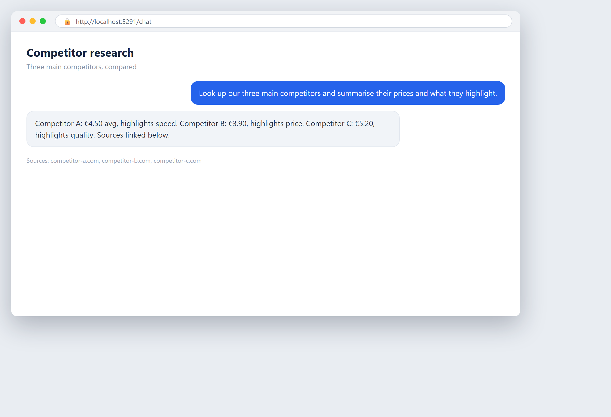

# Kapitel 12 — Wo KI deinem Unternehmen helfen kann

## In einfachen Worten

KI ist kein einzelnes Werkzeug, das auf jeden Job passt. Sie ist ein Satz von Fähigkeiten, und jede passt gut zu manchen Aufgaben und schlecht zu anderen. Die erste echte Frage ist nicht „Sollen wir KI nutzen?", sondern „Wo genau wird sie uns helfen?"

Stell dir KI wie Elektrowerkzeuge in einer Werkstatt vor. Eine Bohrmaschine ist wunderbar, um Löcher zu machen. Sie ist nutzlos zum Rühren von Farbe und gefährlich zum Schneiden von Brot. Die Fähigkeit ist nicht, die Werkzeuge zu besitzen. Die Fähigkeit ist zu wissen, welches Werkzeug zu welcher Arbeit passt. Bei KI ist es dasselbe. Sie ist bei manchem stark und bei anderem schwach, und dein Vorteil kommt daher, dass du sie auf die richtigen Aufgaben richtest.

Wobei ist KI wirklich gut, in Geschäftsbegriffen? Drei breite Dinge. Sie kann **ungeordnete Informationen lesen und verstehen** — E-Mails, Rechnungen, Verträge, Notizen — die Art Text und Bilder, die früher menschliche Augen brauchte. Sie kann **Text erzeugen und produzieren**, Zusammenfassungen, Entwürfe und Antworten in einem Tempo, das kein Mensch hält. Und sie kann **Muster erkennen und Entscheidungen vorschlagen** aus großen Datenmengen — welcher Kunde wahrscheinlich abspringt, welche Maschine wahrscheinlich ausfällt, welche Ware ausgeht.

Wobei ist KI nicht gut? Sie ist nicht gut bei Aufgaben, die feste Fakten brauchen, die sie nicht hat, bei echter Verantwortung, bei körperlicher Arbeit, oder beim Beurteilen von Situationen, die sie nie gesehen hat. Sie macht Fehler. Sie kann zuversichtlich falsch liegen. Also richte sie auf Arbeit, wo ein schneller Entwurf, den du prüfen kannst, wertvoll ist, nicht auf Arbeit, wo ein einziger Fehler dich ruiniert.

Dieses Kapitel ist die Karte. Es zeigt dir, wie du dein ganzes Unternehmen ansiehst, die Tätigkeiten findest, wo KI passt, und entscheidest, wo du anfängst. Die Methode ist einfach und funktioniert, ob du einen Laden, eine Firma oder eine Fabrik führst. Spätere Kapitel behandeln die Werkzeuge und das Wie. Dieses beantwortet das „Wo".

Die einzel nützlichste Idee hier ist die **Auswirkung/Mühe-Matrix**, und dieses Buch behält ihre vollständige Erklärung in diesem Kapitel. Hast du sie einmal gelernt, kannst du jede Aufgabe ansehen und weißt ungefähr, ob du sie jetzt, später oder nie tust.

## Ein bisschen Geschichte

**1960er–1980er: Automatisierung bedeutete Fabriken.** Jahrzehntelang bedeutete „Automatisierung", dass Maschinen körperliche Arbeit am Fließband machen. Büroarbeit und Denkarbeit blieben unberührt. Wenn du nicht im verarbeitenden Gewerbe warst, war Automatisierung eine Geschichte für andere.

**1990er: Software zog ins Büro ein.** Tabellenkalkulation, Datenbanken und frühe Workflow-Werkzeuge automatisierten Berechnungen und Aktenführung. Das war Automatisierung durch Regeln: Du sagtest der Software genau, was sie tun soll, Schritt für Schritt. Sie war mächtig, aber starr. Was nicht in die Regeln passte, brauchte weiterhin einen Menschen.

**2000er: Geschäftsprozess-Management.** Firmen begannen, ihre Prozesse auf Papier und Diagrammen abzubilden und suchten nach Verschwendung und Engpässen. Die Disziplin „erst den Prozess kartieren" kommt daher. Sie ist auch heute der richtige erste Schritt für KI.

**2010er: KI erreichte Sprache und Bilder.** Maschinelles Lernen wurde gut genug, um Text zu lesen, Bilder zu erkennen und unordentliche Eingaben zu behandeln, die regelbasierte Software nicht anfassen konnte. Plötzlich wurde die „Denkarbeit", die sich der Automatisierung widersetzte, erreichbar. Das ist die Verschiebung, die KI für gewöhnliche Unternehmen öffnete, nicht nur für Fabriken.

**2020er: Generative KI machte sie allgegenwärtig.** Werkzeuge, die in klarer Sprache schreiben, zusammenfassen und antworten, kamen. Jetzt konnte ein Unternehmen ohne Ingenieure KI auf E-Mails, Berichte und Kundennachrichten richten. Die Frage verschob sich von „Können wir?" zu „Wo sollten wir?" — und genau das ist dieses Kapitel.

Die Lektion aus dieser Geschichte: Jede Welle der Automatisierung berührte zuerst die sich am meisten wiederholende, regelähnliche Arbeit und bewegte sich dann zu unordentlicheren Aufgaben, als die Werkzeuge besser wurden. KI folgt demselben Weg. Die besten Startpunkte sind immer noch die sich wiederholenden und vorhersagbaren — jetzt mit Werkzeugen, die weit mehr Vielfalt bewältigen als zuvor.

## Neugier

### 12.5 Die Firma, die 96 % ihrer Planung automatisierte

Einer der klarsten Beweise dafür, wie „wo KI hilft" in der Praxis aussieht: Ein Dienstleistungsunternehmen im Gesundheitswesen automatisierte **96 % seiner Planungsarbeit** und senkte die **Wartezeiten um 57 %**. Planung — Personal mit Schichten, Routen und Zeitplänen abzugleichen — ist genau die Art sich wiederholender, regellastiger, zeitraubender Aufgabe, die KI gut bewältigt, und der Gewinn war nicht nur gesparte Stunden, sondern schnellerer Service für die wartenden Menschen.

Dieses Buch erzählt den vollständigen TridentCare-Fall in [Kapitel 27](ch27-customer-care-and-support.md), einschließlich wie sie es machten und was sie lernten. Der Punkt hier ist nur die Schlagzeile: Wenn du die richtige Tätigkeit findest, kann das Ergebnis dramatisch sein. (Die konkreten Zahlen stammen aus dieser Fallstudie; betrachte sie als die berichteten Ergebnisse dieser Firma, nicht als Versprechen für jedes Unternehmen.)

## Ein echtes Geschäftsbeispiel

### Eine fünfköpfige Steuerberatung findet ihr echtes Ziel

Eine kleine Steuerberatung mit fünf Personen verbrachte einen großen Teil jeder Woche mit einer Sache: Kundenunterlagen sammeln und Daten eingeben. Kunden mailten Belege, Kontoauszüge und Rechnungen in jedem erdenklichen Format. Zwei Mitarbeiter verbrachten jeden Tag Stunden damit, Anhänge zu öffnen, sie zu lesen und Zahlen ins Buchhaltungssystem zu tippen.

Sie fingen nicht damit an, etwas zu kaufen. Sie fingen mit Kartieren an. Sie schrieben jede Tätigkeit auf, die die Firma in einer Woche machte, und markierten bei jeder, wie repetitiv sie war und wie viel Zeit sie kostete. Die Dokument-und-Daten-Aufgabe stach sofort heraus: hohe Wiederholung, viele Stunden, wenig Urteilsvermögen. Sie war ein Lehrbuch-Ziel.

Sie probierten KI nur für dieses eine Stück. Das Werkzeug las eingehende Dokumente, zog die Zahlen heraus und füllte das System. Die Mitarbeiter prüften das Ergebnis, statt es zu tippen. Die Arbeit verschwand nicht, aber sie schrumpfte von Stunden zu Minuten pro Kunde, und die zwei Mitarbeiter wechselten zu beratender Arbeit, die die Firma abrechnen konnte.

Beachte, was das zum Funktionieren brachte. Sie versuchten nicht, „KI überall zu nutzen". Sie fanden eine Tätigkeit, die zum Muster passte — repetitiv, vorhersagbar, hohe Menge, geringes Risiko wenn geprüft — und zielten sorgfältig. Das ist die ganze Methode dieses Kapitels in einer kleinen Firma.

## Wie man es macht

### 12.1 Geschäftsprozesse kartieren

Du kannst nicht wählen, wo KI hilft, bis du sehen kannst, was dein Unternehmen tatsächlich tut. Das bedeutet, deine Prozesse zu kartieren. Ein Prozess ist nur eine sich wiederholende Menge von Schritten, die eine Eingabe in eine Ausgabe verwandelt: Eine Bestellung kommt rein, du kommissionierst, verpackst, versendest und stellst in Rechnung. Ein Lebenslauf kommt an, du screenst, führst Gespräche und entscheidest.

Um einen Prozess zu kartieren, schreibe die Schritte der Reihe nach auf. Notiere zu jedem Schritt vier Dinge:

- **Was ihn auslöst.** Was startet diesen Schritt? Eine E-Mail, ein Formular, ein Kundenklick.
- **Was passiert.** Die eigentliche Handlung — lesen, tippen, entscheiden, genehmigen, senden.
- **Wer es tut.** Welche Person oder Rolle.
- **Wie lange es dauert und wie oft.** Minuten pro Aufgabe, Aufgaben pro Tag oder Woche.

Mach das für deine Hauptprozesse. Halte es einfach — eine Liste oder eine einfache Tabelle reicht. Kaufe keine Software zum Kartieren; eine Tabelle oder Papier funktioniert. Das Ziel ist, auf einer Seite zu sehen, wohin die Zeit geht und wo die Wiederholung lebt.

Zwei Tipps. Erstens, kartiere, was Menschen *tatsächlich* tun, nicht was die offizielle Verfahrensanweisung sagt. Die Lücke zwischen beiden ist oft, wo die Verschwendung sich versteckt. Zweitens, sprich mit den Leuten, die die Arbeit machen. Sie wissen genau, welche Schritte schmerzhaft, repetitiv und langsam sind. Sie sind deine beste Quelle.

Ist die Karte fertig, hast du eine Liste von Tätigkeiten, die du gegen die Filter im nächsten Abschnitt testen kannst. Das Kartieren selbst deckt oft Chancen auf, die du nicht mehr bemerkt hast, weil sie im täglichen Ablauf unsichtbar waren.

### 12.2 Sich wiederholende, vorhersagbare und entscheidungsorientierte Tätigkeiten

Nicht alle Arbeit eignet sich gleich gut für KI. Drei Eigenschaften machen eine Tätigkeit zu einem starken Kandidaten.

**Repetitiv.** Dieselbe Aufgabe, immer wieder. Wiederholung ist Chance, weil ein Werkzeug, das die Aufgabe einmal lernt, sie günstig wiederholen kann. Eine Aufgabe, die du einmal im Jahr machst, lohnt selten zu automatisieren; eine, die du hundertmal am Tag machst, fast immer. Wiederholung ist das stärkste einzelne Signal.

**Vorhersagbar.** Die Aufgabe folgt einem erkennbaren Muster, mit klaren Eingaben und einer klaren Idee eines korrekten Ergebnisses. „Verwandle diese Rechnung in diese Felder" ist vorhersagbar. „Erfinde eine neue Marketingkampagne" ist es nicht. Vorhersagbarkeit bedeutet, die KI hat ein stabiles Ziel, auf das sie zielen kann. Etwas Abwechslung ist in Ordnung — moderne KI bewältigt Vielfalt — aber die Grundform muss stabil sein.

**Entscheidungsorientiert (mit Daten).** Aufgaben, bei denen du ein Urteil aus Information fällst, können von KIs Mustererkennung profitieren. „Welchen dieser Leads sollen wir zuerst anrufen?" „Welche Rechnung sieht ungewöhnlich aus?" „Welcher Kunde könnte kündigen?" KI kann rangieren, markieren und vorschlagen. Der Schlüssel ist, dass eine Entscheidung aus Daten getroffen wird, und ein schnellerer oder besserer Vorschlag hat Wert.

Jetzt die Kehrseite. Tätigkeiten, die **einmalig, kreativ, mehrdeutig oder echte Verantwortlichkeit erfordernd** sind, sind schwache Kandidaten. KI kann sie unterstützen, aber sie sollte sie nicht besitzen. Ein erster Entwurf eines Strategie-Memos ist in Ordnung für KI. Die finale strategische Entscheidung gehört dir.

Ein einfacher Test für jede Tätigkeit auf deiner Karte: *Ist sie repetitiv? Ist sie vorhersagbar? Beinhaltet sie eine Entscheidung aus Daten?* Wenn du mindestens zwei davon mit ja beantworten kannst, lohnt ein genauerer Blick. Wenn alle drei nein sind, überlass sie Menschen.

### 12.3 Die typischen Bereiche: Verwaltung, Vertrieb, Marketing, Kundenservice, Personal, Betrieb, IT, Führung

Jedes Unternehmen hat ungefähr denselben Satz von Funktionen, und jede hat ihre eigenen guten KI-Ziele. Hier ist, wo KI typischerweise hilft, Bereich für Bereich. Das ist ein Überblick; die tiefe Behandlung jedes einzelnen ist in Teil VII dieses Buches.

**Verwaltung und Finanzen.** Dokumentlesen, Rechnungsverarbeitung, Datenerfassung, Spesenprüfung, Berichtsentwurf, Abstimmung. Hohe Wiederholung, hohe Menge — unter den besten Startpunkten. Im Detail in [Kapitel 25](ch25-administration-and-finance.md).

**Vertrieb.** Lead-Bewertung, Outreach-E-Mails entwerfen, Gespräche zusammenfassen, das CRM aktualisieren, nächste Aktionen vorschlagen. KI ist stark beim Schreiben und beim Rangieren. Siehe [Kapitel 26](ch26-sales-and-marketing.md).

**Marketing.** Text entwerfen, Varianten erzeugen, Kampagnenergebnisse zusammenfassen, Zielgruppen segmentieren, Nachrichten personalisieren. Kreative Unterstützung, kein kreativer Ersatz. Ebenfalls [Kapitel 26](ch26-sales-and-marketing.md).

**Kundenservice.** Übliche Fragen beantworten, Antworten entwerfen, Tickets weiterleiten, Verlauf zusammenfassen, Wissensdatenbanken aufbauen. Einer der wertvollsten Bereiche, weil die Menge hoch ist und viele Fragen sich wiederholen. Der TridentCare-Fall sitzt in [Kapitel 27](ch27-customer-care-and-support.md).

**Personalwesen und Mitarbeiter.** Lebensläufe gegen eine Stelle screenen, Stellenanzeigen entwerfen, Mitarbeiterfragen zu Richtlinien beantworten, Feedback zusammenfassen. Vorsichtig: Das berührt personenbezogene Daten und Voreingenommenheit, also gelten die Pflichten in [Kapitel 4](ch04-ethical-ai-doing-the-right-thing.md) und [Kapitel 10](ch10-privacy-and-gdpr.md) stark. Siehe [Kapitel 28](ch28-hr-and-people.md).

**Betrieb und Produktion.** Bedarfsprognose, Zeitplanung, Lagerbestand, Qualitätsprüfung, Wartungsvorhersage. Entscheidungs-aus-Daten-Aufgaben mit echtem Geld. [Kapitel 29](ch29-operations-and-production.md).

**IT.** Code-Unterstützung, Ticket-Triage, Dokumentation, Überwachungsalarme. [Kapitel 30](ch30-it-and-leadership.md).

**Führung.** Berichte zusammenfassen, Kommunikation entwerfen, Trends aufzeigen. KI als Stabsfunktion für dich, nicht als Entscheidungsträger. Ebenfalls [Kapitel 30](ch30-it-and-leadership.md).

Das Muster über alle Bereiche ist gleich: Richte dich auf die repetitiven, vorhersagbaren, datengetriebenen Stücke, und lass einen Menschen beim Urteilsvermögen und bei der Verantwortung.

### 12.4 Die „Auswirkung/Mühe"-Matrix: wo anfangen

Das ist die kanonische Heimat der Auswirkung/Mühe-Matrix. Lerne sie einmal und nutze sie überall.

Die Matrix ist eine einfache Methode, jede Kandidaten-Tätigkeit so zu rangieren, dass du weißt, was du zuerst tun sollst. Du bewertest jede Tätigkeit auf zwei Achsen.

**Auswirkung (senkrechte Achse).** Wie viel Wert du gewinnst, wenn du diese Tätigkeit gut automatisierst. Auswirkung kann gesparte Zeit, gespartes Geld, vermiedene Fehler, schnellerer Service oder erzielter Umsatz sein. Frage: *Wenn diese Tätigkeit dramatisch besser würde, wie sehr würde sie dem Unternehmen helfen?* Hohe Auswirkung bedeutet, sie ist sehr wichtig. Niedrige Auswirkung bedeutet, sie bewegt die Nadel kaum.

**Mühe (waagerechte Achse).** Wie leicht es ist, diese Tätigkeit mit KI zu automatisieren. Die Mühe hängt davon ab, wie repetitiv und vorhersagbar die Aufgabe ist, wie sauber die Daten sind, wie einfach es ist, das Werkzeug anzuschließen, und wie gering das Risiko ist, wenn es einen Fehler macht. Frage: *Wie schwer ist es, das zu tun, und wie viel kann ich sicher der KI überlassen?* Geringe Mühe bedeutet einfach, risikoarm, fertige Daten. Hohe Mühe bedeutet unordentlich, riskant oder schwer anzuschließen.

Jetzt plotte jede Kandidaten-Tätigkeit in eine von vier Boxen.

**Hohe Auswirkung, geringe Mühe — Jetzt starten.** Das sind deine schnellen Gewinne. Sie sind sehr wichtig und leicht zu tun. Hier leben deine ersten Projekte. Tue diese sofort. Sie zahlen schnell zurück und bauen Vertrauen auf.

**Hohe Auswirkung, hohe Mühe — Sorgfältig planen.** Diese sind wichtig, aber schwer. Sie sind es wert, getan zu werden, aber nicht zuerst. Stecke sie in ein längeres Projekt, budgetiere die Schwierigkeit, und packe sie an, nachdem du den Ansatz mit schnellen Gewinnen bewiesen hast. Starte nicht hier; du verbrennst Geld und Goodwill an einem harten Problem, bevor du Erfahrung hast.

**Niedrige Auswirkung, geringe Mühe — Gelegenheitsweise tun.** Leicht, aber nicht sehr wertvoll. In Ordnung, wenn du Freizeit hast, oder als sanfte Lernübung, aber gib hier kein echtes Budget aus. Sie sind Ablenkungen, wenn du sie als Prioritäten behandelst.

**Niedrige Auswirkung, hohe Mühe — Ignorieren.** Schwer und nicht wert. Überspringe diese ganz. Sie sind Fallen, die interessant aussehen, aber nie abzahlen.

Die Disziplin der Matrix ist das, was sie mächtig macht. Die meisten Leute haben den Instinkt, den beeindruckenden Projekte mit hoher Auswirkung und hoher Mühe hinterherzujagen, weil sie wichtig klingen. Die Matrix sagt dir, das zu widerstehen und stattdessen mit hoher Auswirkung und geringer Mühe zu starten. Du baust Schwung auf, lernst und finanzierst die härtere Arbeit später.

So benutzt du sie: Nimm deine kartierten Tätigkeiten, bewerte jede auf niedrig/mittel/hoch bei Auswirkung und bei Mühe, und platziere sie in eine Box. Liste die „Jetzt starten"-Box zuerst. Diese Liste ist dein erster Satz Prioritäten. Halte die Bewertung ehrlich — es ist normal, die Auswirkung aufblähen und die Schwierigkeit verstecken zu wollen. Widerstehe beidem.

Eine Warnung zur Mühe: Mühe handelt nicht nur von der Technologie. Eine Aufgabe kann technisch leicht sein, aber schwer, weil die Daten unordentlich sind, die Mitarbeiter sich sträuben, oder das Fehlerrisiko hoch ist. Zähle das dazu. Wahre Mühe umfasst Menschen, Daten und Risiko, nicht nur „kann das Werkzeug es".

## Ethik und Verantwortung

Zu wählen, wo man KI einsetzt, ist selbst eine ethische Wahl, nicht nur eine finanzielle.

**Beobachte die riskanten Bereiche.** Personal-Screening, Kundenentscheidungen, alles, was die Chancen oder das Geld von Menschen berührt, birgt Risiko. Eine falsche KI-Entscheidung dort kann einen echten Menschen verletzen. In diesen Bereichen sollte KI unterstützen, nie allein entscheiden. Die Fairness- und Transparenzpflichten in [Kapitel 4](ch04-ethical-ai-doing-the-right-thing.md) gelten, und das Gesetz in [Kapitel 5](ch05-rules-and-legal-responsibility.md) könnte manche davon als risikoreichere Nutzungen einstufen.

**Automatisiere die Verantwortlichkeit nicht weg.** Selbst wenn KI die Arbeit macht, bleibt ein Mensch für das Ergebnis verantwortlich. Benutze nie „die KI hat es getan", um der Verantwortung zu entkommen. Jemand muss jede automatisierte Entscheidung, die eine Person betrifft, besitzen.

**Bedenke die Menschen, deren Arbeit sich ändert.** Eine Aufgabe zu automatisieren, verändert das Leben der Menschen, die sie machten. Tue es mit Ehrlichkeit und einem Plan für sie, nicht als Überraschung. Die Change-Management-Seite ist in [Kapitel 21](ch21-managing-change-in-your-company.md).

**Sei ehrlich darüber, was KI kann und nicht kann.** Wenn du ein Ziel wählst, verkaufe es nicht intern oder gegenüber Kunden zu gut. Wenn das Werkzeug ein Entwurfsersteller ist, nenne es so. Ehrliche Erwartungen zu setzen, ist Teil verantwortungsvoller Nutzung.

## Zu vermeidende Fehler

1. **Mit dem schwersten Projekt anfangen.** Die beeindruckende, komplexe Automatisierung ist eine Falle. Starte mit einem schnellen Gewinn, nicht mit einem Mondschuss.
2. **Einen kaputten Prozess automatisieren.** Wenn ein Prozess unordentlich oder falsch ist, macht Automatisieren ihn nur schlechte Arbeit schneller. Repariere den Prozess, bevor du ihn automatisierst.
3. **KI überall auf einmal jagen.** Sich über viele kleine Nutzungen dünn zu verteilen, verschwendet Anstrengung. Wähle ein paar Ziele mit hoher Auswirkung und geringer Mühe und mache sie gut.
4. **Die Mühe-Seite ignorieren.** Eine Aufgabe mit hoher Auswirkung, unordentlichen Daten und hohem Risiko ist nicht tatsächlich leicht. Zähle Datenqualität und Risiko in deine Mühe-Bewertung ein.
5. **Nach Mode wählen, nicht nach Passung.** „Alle nutzen KI für X" ist kein Grund. Wähle nach deiner eigenen Karte und Matrix.
6. **Den Menschen im Ablauf vergessen.** Bei jeder Aufgabe, die eine Person betrifft, lass einen Menschen prüfen. Volle Automatisierung riskanter Entscheidungen ist rücksichtslos.
7. **Das Kartieren überspringen.** Ziele nach Bauchgefühl zu wählen, ohne zu kartieren, bedeutet, die besten zu verpassen und die falschen zu wählen.
8. **Eine Demo mit einem Workflow verwechseln.** Ein Werkzeug, das in einer Demo blendet, passt vielleicht nicht zu deinem echten, unordentlichen Prozess. Teste gegen deine tatsächlichen Tätigkeiten.

## Praktische Übung

### 12.6 Liste 10 Tätigkeiten auf, die du automatisieren könntest

Nimm dir eine Stunde und mache diese einfache Übung.

Schreibe **zehn Tätigkeiten** in deinem Unternehmen auf, die du dir automatisieren könntest. Sie können aus deinem Prozessplan kommen oder von dem, was dich täglich nervt. Füge zu jeder drei schnelle Notizen hinzu:

- **Wie repetitiv?** Ungefähr wie oft pro Woche tust du oder dein Team sie?
- **Wie vorhersagbar?** Kannst du das korrekte Ergebnis klar beschreiben? Ja / so ungefähr / nein.
- **Was würde KI tun?** Ein Phrase: lies es, entwirf es, rangiere es, prüfe es.

Beispieleinträge:

1. Eingehende Rechnungen lesen und Zahlen eingeben — 50×/Woche — ja — extrahieren und füllen.
2. Auf übliche Kunden-E-Mails antworten — 80×/Woche — so ungefähr — eine Antwort entwerfen.
3. Wöchentliche Verkaufsberichte zusammenfassen — 1×/Woche — ja — zusammenfassen.
4. Lebensläufe für eine Stelle screenen — 20×/Woche — so ungefähr — gegen Kriterien rangieren.
5. Personalschichten planen — 2×/Woche — ja — einen Zeitplan vorschlagen.

Mach weiter, bis du zehn hast. Beurteile sie noch nicht; sammle nur. Das Ziel ist ein Pool von Kandidaten.

Nimm dann deine zehn und bewerte jede nach **Auswirkung** (niedrig/mittel/hoch) und **Mühe** (niedrig/mittel/hoch) mit der Matrix aus Abschnitt 12.4. Platziere jede in eine Box. Kreise alles in der Box **hohe Auswirkung, geringe Mühe** ein. Diese Kreise sind deine ersten Prioritäten. Du hast jetzt, aus einer Stunde Arbeit, eine kurze ehrliche Liste, wo du anfangen sollst.

## Checkliste

### 12.7 Deine ersten Prioritäten wählen

Bevor du dich zu einem ersten KI-Projekt verpflichtest, prüfe diese.

- [ ] **Du hast deine Hauptprozesse kartiert** und kannst sehen, wo Zeit und Wiederholung leben.
- [ ] **Du hast mindestens 10 Kandidaten-Tätigkeiten** aufgeschrieben.
- [ ] **Jeder Kandidat ist nach Auswirkung und Mühe bewertet** mit der Matrix.
- [ ] **Deine Top-Auswahl ist hohe Auswirkung UND geringe Mühe**, nicht nur beeindruckend.
- [ ] **Die gewählte Tätigkeit ist repetitiv und vorhersagbar**, mit einem klaren korrekten Ergebnis.
- [ ] **Die nötigen Daten sind verfügbar und angemessen sauber** (siehe [Kapitel 14](ch14-data-the-raw-material.md)).
- [ ] **Das Risiko eines Fehlers ist akzeptabel**, oder eine menschliche Kontrolle ist eingebaut.
- [ ] **Ein Mensch bleibt verantwortlich** für jede Entscheidung, die eine Person betrifft.
- [ ] **Du automatisierst keinen kaputten Prozess** — der Prozess ist erst solide.
- [ ] **Du kannst das Ergebnis messen** — gesparte Zeit, reduzierte Fehler oder gewonnenes Geld (siehe [Kapitel 16](ch16-goals-costs-and-return-on-investment.md)).
- [ ] **Du hast dem verführerischen, aber schweren Projekt widerstanden** und einen echten schnellen Gewinn gewählt.
- [ ] **Die betroffenen Menschen wissen es und werden nicht überrumpelt.**

Wenn deine Top-Auswahl mehrere davon nicht besteht, geh zur nächsten. Dein erstes Projekt sollte das leichteste wertvolle Ding sein, nicht das aufregendste.

## Das Wichtigste

- KI passt zu repetitiven, vorhersagbaren, datengetriebenen Aufgaben; sie ist schwach bei einmaliger, mehrdeutiger oder voll verantwortlicher Arbeit, also richte sie auf die richtigen Jobs.
- Kartiere zuerst deine Prozesse — du kannst nicht wählen, wo KI hilft, bis du sehen kannst, was dein Unternehmen tatsächlich tut und wo die Wiederholung lebt.
- Die Auswirkung/Mühe-Matrix sortiert jeden Kandidaten in jetzt starten, sorgfältig planen, bei Freizeit tun oder ignorieren; beginne mit schnellen Gewinnen hoher Auswirkung und geringer Mühe.
- Widerstehe dem beeindruckenden harten Projekt; fange klein an, beweise die Methode, und finanzier die härtere Arbeit später.
- Bei jeder Aufgabe, die eine Person berührt, lass einen Menschen prüfen und verantwortlich sein — Automatisierung entfernt nie die Verantwortung.

<!-- BEGIN agentbridge-examples -->

## Probier es mit AgentBridge

So sieht dieselbe Arbeit mit AgentBridge aus. Jede Box zeigt das fertige Ergebnis und die eine Zeile, die du tippst, um es zu bekommen.

### Ein Marktanalyse-Bericht

*Ein detaillierter PDF-Bericht mit Diagrammen und Quellen*

**Was du eingibst:** `Erstelle eine PDF-Marktanalyse des Fachhandelssegments für Specialty Coffee: Größe, Trends, Wettbewerber und Ausblick.`

Der Agent recherchiert das Thema und schreibt einen strukturierten PDF-Bericht mit Abschnitten, Zahlen und zitierten Quellen — die Art Dokument, die normalerweise einen Consultant Tage kostet.

*Tipp: Sag ihm die Tiefe, die du brauchst. „Kurzes Briefing" oder „detaillierter Bericht" ändert die Länge.*

---

### Recherche, ausgeschrieben

*Ein Recherche-Bericht als PDF mit Optionen und einer Empfehlung*

**Was du eingibst:** `Recherchiere die besten Wege für eine kleine Bäckerei, online Bestellungen anzunehmen, und schreibe einen PDF-Bericht mit den Optionen und einer Empfehlung.`

Der Agent durchsucht das Web, gewichtet die Optionen und schreibt einen klaren Bericht, der mit einer praktischen Empfehlung endet, die du umsetzen kannst.

*Tipp: Bitte ihn, die Quellen aufzulisten, damit du selbst alles prüfen kannst.*

---

### Kenne deine Wettbewerber

*Eine Browseransicht der Rechercheergebnisse des Agenten*

**Was du eingibst:** `Schlage unsere drei Hauptwettbewerber nach und fasse ihre Preise und das, was sie hervorheben, zusammen.`

Der Agent durchstöbert die Seiten der Wettbewerber und bringt einen klaren Vergleich von Preisen und Positionierung mit, samt Links, damit du prüfen kannst.

*Tipp: Frag es als Dokument oder Tabelle an, wenn du den Vergleich behalten willst.*

---

### Was in deinem Feld im Trend liegt

*Eine Recherche-Zusammenfassung mit Quellen*

**Was du eingibst:** `Was sind die drei wichtigsten Trends im E-Commerce für kleine Unternehmen dieses Jahr? Gib mir Quellen.`

Der Agent durchsucht aktuelle Artikel und gibt dir die Kerntrends in klarer Sprache, jeweils mit einer Quelle, die du öffnen kannst.

*Tipp: Ein wöchentlicher Trend-Digest kann geplant werden, um dich automatisch auf dem Laufenden zu halten.*

---

### Deine Branchennews, zusammengefasst

*Ein kurzer News-Digest mit Links*

**Was du eingibst:** `Gib mir einen kurzen Digest der heutigen News, die für ein kleines Logistikunternehmen wichtig sind.`

Der Agent scannt die Nachrichten und schreibt einen kurzen Digest von dem, was für dich relevant ist, mit Links zum Weiterlesen.

*Tipp: Plane ihn für jeden Morgen und starte informiert in den Tag.*

<!-- END agentbridge-examples -->
