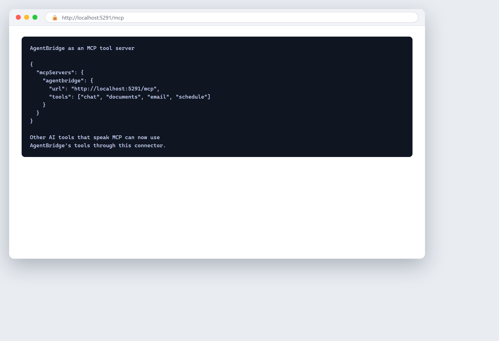

# Kapitel 19 — KI an Systeme anschließen, die du bereits nutzt

## In einfachen Worten

Dein Geschäft läuft bereits auf Software: das System, das deine Kunden verfolgt, die E-Mail, die du beantwortest, die Tabellen, in denen du lebst, das Buchhaltungsprogramm, aus dem du Rechnungen schreibst. KI ist am nützlichsten, wenn sie sich in diese bestehenden Systeme einsteckt, statt in einer Ecke zu sitzen und nichts zu tun. Dieses Kapitel handelt von dieser Verbindung — wie KI mit den Werkzeugen spricht, die du schon hast.

Die Schlüsselidee ist die **Integration**: eine Verbindung, die es einem Stück Software erlaubt, einem anderen automatisch Informationen weiterzugeben. Wenn deine KI deine Kundenliste lesen, eine Antwort in deinem Postfach entwerfen und eine Notiz zurück in deine Aufzeichnungen schreiben kann, wird sie zu einem echten Helfer. Wenn sie sich mit nichts verbinden kann, ist sie nur ein cleveres Chat-Fenster, in das du kopieren und einfügen musst.

Eine gute Analogie ist die Klempnerei. Ein neuer Wasserfilter ist nutzlos, wenn er nicht an deine Rohre angeschlossen ist. Der Wert kommt von der Verbindung, nicht vom Filter allein. Integrationen sind die Rohre, die KI in deine tägliche Arbeit fließen lassen. Deine Aufgabe ist zu verstehen, welche Rohre existieren, welche du selbst anschließen kannst, und wann du einen Klempner brauchst.

Dieses Kapitel schaut sich die gängigen Systeme an, die KI verbindet — Management-Software, CRM, E-Mail, Tabellen. Es gibt Beispiele einfacher Automatisierungen, die du dir vorstellen kannst. Es erklärt, was eine **API** in klaren Worten ist (sie ist einfacher, als sie klingt). Es sagt dir, wann du es selbst tun kannst und wann du einen Techniker rufen solltest. Und es warnt dich vor den Fallen: Abhängigkeiten, die dich blockieren, und die Wartung, die jede Verbindung braucht.

Das Versprechen: verbundene KI spart jeden Tag echte Zeit. Die Warnung: eine schlechte Verbindung kann Dinge kaputtmachen oder dich fangen. Tu es mit einer Karte und einem Plan.

## Ein bisschen Geschichte

**1960er–1970er: Programme, die miteinander sprechen.** Frühe Geschäftssoftware musste Daten austauschen — ein Warenwirtschaftssystem, das ein Buchhaltungssystem speiste. Ingenieure bauten die ersten Verbindungen zwischen Programmen, oft von Hand, mit Dateien in vereinbarten Formaten. Integration wurde aus purer Notwendigkeit geboren.

**1990er: Enterprise-Integration wird ein Beruf.** Als Firmen viele Systeme gleichzeitig betrieben, wurde das Verbinden ein ganzes Feld. Werkzeuge mit langen Namen — Middleware, Enterprise Application Integration — versuchten, die zentrale Drehscheibe zu sein, die alles verband. Es war mächtig, teuer und brauchte meist Spezialisten.

**2000er: die API-Wirtschaft.** Software begann, saubere, dokumentierte Türen für andere Software zu öffnen. Diese Türen heißen APIs. Plötzlich konnte eine kleine Firma sich mit großen Diensten verbinden — Karten, Zahlungen, Messaging — ohne sie selbst zu bauen. Eine ganze Wirtschaft verbundener Software entstand.

**2010er: No-Code und der Bürger-Integrator.** Werkzeuge wie Zapier und Make ließen Nicht-Programmierer beliebte Apps per Zeigen und Klicken verbinden. Du konntest sagen „wenn ein neuer Lead in meinem Formular eingeht, füge ihn meinem CRM hinzu und maile mich", ohne Code zu schreiben. Der „Bürger-Integrator" — ein Geschäftsleute, die ihre eigenen Verbindungen baut — wurde real.

**2020er: KI als der neue Verbinder.** KI-Werkzeuge gewannen die Fähigkeit, über ihre eigenen APIs über Systeme hinweg zu lesen, zu schreiben und zu handeln. Jetzt kann die KI diejenige sein, die verbindet: dein Postfach lesen, deine Aufzeichnungen aktualisieren, deine Antworten entwerfen. Die Klempnerei wurde schlauer, und das Bedürfnis, sie zu verstehen, wuchs genauso schnell.

Der Bogen: von handgebauten Datei-Verbindungen zu einer Welt, in der Software erwartet, verbunden zu sein. Die Verbindung ist kein Luxus mehr; sie ist, wo der Wert lebt.

## Neugier

### Das Memo, das die Welt verband

Im Jahr 2002 schickte der CEO von Amazon, Jeff Bezos, ein heute berühmtes internes Memo an seine Engineering-Teams. Die Details sind in der Tech-Geschichte weithin berichtet. Der Kernbefehl war knapp: Von nun an musste jedes Team seine Daten und Funktionen über eine saubere, dokumentierte Schnittstelle — eine API — teilen, und nichts sonst. Kein direkter Zugriff auf die Datenbank eines anderen Teams. Keine Hintertür-Abkürzungen. Wenn ein Team etwas von einem anderen Team wollte, musste es über die veröffentlichte Schnittstelle fragen, oder es selbst bauen.

Der Grund war nicht Ordnungsliebe. Es war, Amazon schnell und flexibel zu machen. Wenn jeder Teil der Firma durch eine saubere Tür erreichbar war, konnten Teams ihre eigenen Systeme ändern, ohne alle anderen kaputtzumachen, und neue Dienste konnten schnell auf alten aufgebaut werden.

Diese Disziplin wird weithin als Grundlage dessen angesehen, was **Amazon Web Services (AWS)** wurde — die Cloud-Plattform, die heute einen riesigen Anteil des Internets antreibt. Eine Regel darüber, wie Software innerhalb einer Firma mit Software spricht, wurde eines der größten Technologie-Geschäfte der Erde.

Die Lektion für ein kleines Unternehmen ist im Kleinen dieselbe: **Saubere, dokumentierte Verbindungen machen dich flexibel; chaotische Abkürzungen machen dich fragil.** Wenn du KI an deine Systeme anschließt, baue saubere Verbindungen, keine Hintertür-Hacks. Das saubere Rohr von heute ist die Freiheit, für die du dich morgen danken wirst.

## Ein echtes Geschäftsbeispiel

*Das Folgende ist eine illustrative Zusammenstellung gängiger realer Muster, keine einzelne namentliche Firma.*

Eine kleine Hausverwaltungs-Firma lief auf drei Systemen, die nicht miteinander sprachen: ein CRM mit Mieterkontakten, ein gemeinsames Postfach für Wartungsanfragen und eine Tabelle, die Reparaturjobs verfolgte. Jede Anfrage bedeutete, Details von Hand aus dem Postfach in die Tabelle zu kopieren, dann ins CRM. Das Personal verbrachte Stunden am Tag mit Kopieren-Einfügen, und Details rutschten durch die Ritzen.

Sie verbanden die drei mit einer einfachen Automatisierung. Wenn eine Wartungs-E-Mail eintraf, las eine KI sie, zog den Mieter-Namen, die Immobilie und das Problem heraus und erstellte automatisch eine Zeile in der Tabelle. Sie entwarf auch eine Antwort an den Mieter mit Bestätigung der Anfrage. Ein Mensch prüfte den Entwurf und drückte Senden. Die CRM-Notiz wurde von derselben Automatisierung hinzugefügt.

Das Ergebnis war keine Magie — es war Klempnerei. Die Stunden Kopieren-Einfügen verschwanden größtenteils. Weniger Anfragen gingen verloren, weil dieselbe Automatisierung alles, was sie nicht klar lesen konnte, für einen Mensch markierte. Die Firma ersetzte kein Personal; sie entfernte den langweiligen Teil ihres Tages, damit sie mehr Immobilien ohne mehr Leute bewältigen konnten.

Die Lektion: Der Gewinn kam vom Verbinden bereits existierender Systeme, nicht vom Kaufen von etwas Neuem und Dramatischem.

## Wie man es macht

### 19.1 Management-Software, CRM, E-Mail, Tabellen

Das sind die vier Systeme, die die meisten Firmen bereits betreiben, und die vier, die KI am häufigsten verbindet.

- **Management-Software (ERP).** Ein System, das den Kern deines Geschäfts betreibt — Warenbestand, Aufträge, Produktion, Finanzen. ERP steht für Enterprise Resource Planning. KI kann Berichte daraus lesen, ungewöhnliche Zahlen markieren oder Zusammenfassungen entwerfen.
- **CRM.** Steht für **Customer Relationship Management** — das System, das deine Kunden, Leads und jede Interaktion mit ihnen hält. KI kann Antworten an Leads entwerfen, Anrufe protokollieren und die Historie eines Kunden ziehen, damit du schneller antwortest.
- **E-Mail.** Das Postfach ist, wo die meiste Kleinunternehmen-Arbeit lebt. KI kann hier sortieren, zusammenfassen und Antworten entwerfen. Das ist oft die wertvollste einzelne Verbindung.
- **Tabellen.** Das universelle Werkzeug. KI kann sie ausfüllen, lesen und aus anderen Quellen aktualisieren.

Fang dort an, wo der Schmerz am größten ist. Für die meisten kleinen Firmen sind das E-Mail und das CRM. KI an diese zwei anzuschließen gibt die größte tägliche Erleichterung. Versuche nicht, alles auf einmal zu verbinden — wähle das eine, das am meisten wehtut, und fang dort an.

### 19.2 Beispiele einfacher Automatisierungen

Konkrete Beispiele helfen dir, dir vorzustellen, was möglich ist. Jedes davon ist eine kleine, gängige Verbindung:

- **Postfach zu CRM.** Eine neue Anfrage-E-Mail erstellt automatisch einen Lead in deinem CRM, mit den Angaben des Absenders ausgefüllt.
- **Formular zu Tabelle.** Ein Kunde füllt ein Web-Formular; die Antworten landen automatisch in einer Tabellenzeile, und die KI markiert die Anfrage nach Typ.
- **E-Mail zu Antwort-Entwurf.** KI liest eine Standard-Anfrage und schreibt einen Antwort-Entwurf in dein Postfach; du prüfst und sendest.
- **Dokument zu Aufzeichnung.** KI liest eine Rechnung als PDF und schreibt Betrag, Datum und Lieferant in dein Buchhaltungssystem.
- **Meeting zu Notizen.** KI verwandelt ein aufgezeichnetes Meeting in eine Zusammenfassung und Aufgabenpunkte und legt sie ab, wo dein Team sie sehen kann.
- **Ticket zu Warnung.** KI liest eingehende Support-Nachrichten und markiert die verärgerten oder dringenden zuerst für einen Menschen.

Beachte das Muster: KI liest von einem Ort, tut etwas Nützliches und schreibt an einen anderen, mit einem menschlichen Check, wo es zählt. Das ist die Form fast jeder guten Automatisierung.

### 19.3 Wann du einen Techniker brauchst

Du kannst eine überraschende Menge selbst mit No-Code-Werkzeugen tun. Aber manche Jobs brauchen einen Profi. Wisse, was was ist.

**Du kannst es wahrscheinlich selbst tun**, wenn: die Apps beliebt sind (also No-Code-Konnektoren existieren), die Daten einfach sind, die Automatisierung klein ist und ein Fehler billig ist. Point-and-Click-Werkzeuge decken hier viel ab.

**Ruf einen Techniker, wenn:**

- **Die Verbindung Geld, rechtliche Aufzeichnungen oder sensible Daten berührt.** Ein Fehler hier ist teuer oder gefährlich.
- **Die Systeme alt oder maßgeschneidert sind** und keinen fertigen Konnektor haben.
- **Du eine zuverlässige, immer aktive Verbindung brauchst**, die nicht ausfallen darf.
- **Sicherheit im Spiel ist** — eine Verbindung zu Kundendaten bedeutet, die Zugriffskontrolle richtig hinzubekommen (siehe [Kapitel 20](ch20-implementing-ai-securely.md)).
- **Du nicht verstehst, was du verbindest.** Verbinde nie, was du nicht erklären kannst.

Ein Techniker ist kein Eingeständnis des Versagens. Es ist der richtige Anruf für die riskanten oder komplexen Teile, so wie du für die Hauptleitung den Klempner rufst und den Wasserhahn selbst reparierst.

### 19.4 APIs und Integrationen einfach erklärt

Eine **API** klingt technisch, aber die Idee ist einfach. Eine API ist ein **Menü, das ein Stück Software einem anderen anbietet.** Es ist eine Liste von Dingen, die du es zu tun bitten darfst, und wie du bitten musst.

Denk an eine Restaurantküche. Du gehst nicht hinein und fängst an zu kochen. Du schaust die Speisekarte an, bestellst aus dem Angebotenen, und die Küche bringt es. Die Speisekarte ist die API. Sie sagt dir, was du anfordern kannst („die Details dieses Kunden", „eine neue Zeile hinzufügen", „diese E-Mail senden") und wie du es anforderst. Du kannst nichts abseits der Karte bestellen, und du fasst die Küche nie direkt an.

Warum das für KI zählt: Wenn ein System eine API hat, kann eine KI dieses Menü nutzen, um Daten sicher und vorhersehbar zu lesen und zu schreiben. Wenn ein System keine API hat, ist das Verbinden dazu schwer oder unmöglich. Wenn du also Software auswählst, ist eine gute Frage: **Hat sie eine API?** Wenn ja, kann KI sie wahrscheinlich verbinden. Wenn nein, sitzt du vielleicht fest.

Eine **Integration** ist die Verbindung, die du mit einer oder mehreren APIs baust — der Akt, das Menü eines Systems an die Bedürfnisse eines anderen anzuschließen. Die API ist die Tür; die Integration ist der Flur, den du hindurch baust.

Zwei klare Begriffe, die du hören wirst:

- **Lesezugriff** — die KI kann Daten ansehen, aber nicht ändern. Sicherer.
- **Schreibzugriff** — die KI kann Daten ändern. Mächtiger, riskanter. Gib Schreibzugriff nur, wo du ihn brauchst.

### 19.5 Abhängigkeiten und Blockaden vermeiden

Jede Verbindung erzeugt eine **Abhängigkeit** — eine Sache verlässt sich jetzt auf eine andere. Abhängigkeiten sind normal, aber zu viele, oder die falschen, können dich blockieren.

Achte auf diese Fallen:

- **Ein einzelner Ausfallpunkt.** Wenn eine Verbindung bricht und dein ganzer Workflow stoppt, ist das ein fragiler Einzelpunkt. Habe einen Rückfallpfad: eine Art, es von Hand zu tun, wenn die Verbindung stirbt.
- **Eine Kette von Abhängigkeiten.** Wenn A B braucht, B C braucht, C D braucht, stoppt ein gebrochenes Glied alles. Halte Ketten kurz.
- **Eine Abhängigkeit von einem Werkzeug, das verschwinden kann.** Wenn du dich mit einem kleinen Dienst verbindest, der einstellt, stirbt deine Automatisierung. Ziehe stabile, etablierte Werkzeuge vor.
- **Lock-in durch Integration.** Wenn alle deine Systeme auf eine Weise verdrahtet sind, die nur ein Anbieter versteht, wird das Verlassen schwer. Halte Verbindungen sauber und dokumentiert, damit du später umverdrahten kannst. (Lock-in ist in [Kapitel 9](ch09-third-party-services-and-shadow-ai.md) behandelt.)
- **Undokumentierte Verbindungen.** Eine Verbindung, deren Funktionsweise niemand kennt, ist eine Zeitbombe. Dokumentiere jede Verbindung.

Die Regel: **Baue saubere, kurze, dokumentierte Verbindungen mit einem manuellen Rückfallpfad.** Die Amazon-Memo-Lektion erneut — saubere Türen, keine Hintertür-Hacks.

### 19.6 Wartung und Updates

Eine Verbindung ist nicht „einstellen und vergessen". Sie ist ein lebendiges Ding, das Pflege braucht.

- **Systeme ändern sich.** Dein CRM aktualisiert sich, dein E-Mail-Anbieter ändert ein Format, eine API bekommt eine neue Version. Wenn eine Seite sich ändert, kann die Verbindung brechen.
- **Stille Ausfälle.** Eine Verbindung kann still aufhören zu funktionieren, und Daten hören auf zu fließen, ohne dass jemand es merkt. Prüfe, dass Daten tatsächlich ankommen.
- **Neue Fälle tauchen auf.** Die Automatisierung bewältigte die gängigen Fälle; eine neue Art Anfrage kommt und sie weiß nicht, was zu tun ist. Prüfe, was ihr fehlt.
- **Sicherheits-Updates.** Verbindungen zu Daten brauchen im Laufe der Zeit ihre Zugriffs-Prüfung, besonders wenn Leute kommen und gehen.

Plane Wartung: Weise jemanden zu, die Verbindungen zu beaufsichtigen, sie regelmäßig zu prüfen und Brüche schnell zu beheben. Baue eine einfache Warnung — wenn einen Tag lang keine Daten fließen, sollte jemand es wissen. Ein wenig Pflege hindert die Klempnerei am Überlaufen.

## Ethik und Verantwortung

KI an deine Systeme anzuschließen bedeutet, sie an echte Personendaten anzuschließen. Das trägt Verantwortung.

**Verbinde mit Einwilligung und Sorgfalt.** Wenn KI Kunden-E-Mails oder Aufzeichnungen lesen wird, wisse, was du verbindest und ob es erlaubt ist. Achte die Privatsphäre-Regeln (siehe [Kapitel 10](ch10-privacy-and-gdpr.md)).

**Mindestzugriff.** Gib der KI nur den Zugriff, den sie braucht. Wenn sie nur lesen muss, gib ihr kein Schreiben. Wenn sie nur einen Ordner braucht, gib ihr nicht das ganze Laufwerk. Das begrenzt den Schaden, wenn etwas schiefgeht.

**Halte einen Menschen beim Senden.** Für alles, was einen Kunden erreicht, sollte ein Mensch prüfen, bevor es hinausgeht. Automatisierung, die allein auf kundengerichteten Nachrichten handelt, kann echten Schaden anrichten.

**Dokumentiere für Rechenschaft.** Wenn etwas schiefgeht, musst du wissen, was die Automatisierung tat und warum. Eine dokumentierte Verbindung ist eine rechenschaftspflichtige.

**Verbinde nicht, was du nicht erklären kannst.** Wenn du nicht in klaren Worten sagen kannst, was eine Verbindung mit wessen Daten tut, solltest du sie nicht bauen. Komplexität, die du nicht verstehst, ist Risiko, das du nicht kontrollieren kannst.

Baue Verbindungen so, wie du möchtest, dass deine eigenen Daten gehandhabt werden.

## Zu vermeidende Fehler

**Alles auf einmal verbinden.** Versuchen, am ersten Tag jedes System zu verdrahten. Wähle das eine, das am meisten wehtut, und fang dort an.

**Keine Karte.** Verbinden, ohne zu wissen, was du hast und wie es verknüpft ist. Zeichne zuerst die Karte.

**Hintertür-Hacks.** Schnelle, undokumentierte Abkürzungen, die später brechen und dich fangen. Baue stattdessen saubere Türen.

**Zu viel Zugriff.** Der KI Schreibzugriff auf alles geben, wenn sie nur eines lesen muss. Nutze Mindestzugriff.

**Kein Rückfallpfad.** Eine Verbindung, die, wenn sie bricht, den ganzen Workflow ohne manuellen Plan stoppt. Habe immer einen Rückfallpfad.

**Stille Ausfälle ignorieren.** Annehmen, die Verbindung funktioniere, weil sich niemand beschwerte. Prüfe, dass Daten tatsächlich ankommen.

**Kein Wartungsplan.** Es verdrahten und weggehen. Verbindungen brauchen Pflege.

**Sich mit einem Werkzeug verbinden, das verschwinden kann.** Auf einem wackeligen Dienst aufbauen, der verschwinden mag. Ziehe stabile Werkzeuge vor.

**KI allein auf Kundennachrichten handeln lassen.** Kein menschlicher Check bei dem, was einen Kunden erreicht. Halte einen Menschen beim Senden.

**Undokumentierte Verbindungen.** Niemand weiß, wie die Verbindung funktioniert. Dokumentiere jede einzelne.

**Personalwechsel vergessen.** Den Zugriff nicht aktualisieren, wenn Leute kommen oder gehen. Prüfe den Zugriff regelmäßig.

## Praktische Übung

### 19.7 Übung: eine Karte deiner Firmensysteme

Du kannst nicht verbinden, was du nicht sehen kannst. Zeichne eine Karte der Systeme, auf denen dein Geschäft läuft.

**Schritt 1 — Liste jedes System.** Schreib jede Software auf, die dein Geschäft täglich nutzt: CRM, E-Mail, Buchhaltung, Tabellen, Warenwirtschaft, Terminplanung, Website-Formulare, Chat-Werkzeuge. Lass nichts aus.

**Schritt 2 — Vermerke für jedes vier Dinge:**

- **Was es hält** (welche Daten dort leben).
- **Wer es nutzt** (welche Personen oder Rollen).
- **Hat es eine API?** (Prüf die Anbieter-Seite oder frag; markiere ja / nein / unbekannt.)
- **Wie sensibel sind die Daten?** (Niedrig / mittel / hoch.)

**Schritt 3 — Zeichne die aktuellen Verbindungen.** Zeichne auf Papier Linien zwischen Systemen, die heute bereits Daten weitergeben, auch wenn ein Mensch sie per Kopieren-Einfügen trägt. Markiere, welche Verbindungen manuell sind.

**Schritt 4 — Finde den Schmerz.** Kreise die manuellen Verbindungen ein, die am meisten Zeit fressen oder die meisten Fehler verursachen. Das sind deine besten Automatisierungs-Kandidaten.

**Schritt 5 — Markiere das Risiko.** Vermerke für jeden Kandidaten die Sensibilität. Hochsensible Verbindungen brauchen einen Techniker und einen menschlichen Check; niedrigsensible kannst du selbst versuchen.

**Schritt 6 — Wähle eine.** Wähle die einzelne schmerzhafteste, risikoärmste Verbindung als deine erste Integration. Pilotiere sie (siehe [Kapitel 18](ch18-your-first-pilot-project.md)).

Halte die Karte auf einer Seite. Aktualisiere sie, wenn sich Systeme ändern. Die Karte ist dein Plan und deine Verteidigung gegen blindes Verbinden.

## Checkliste

### 19.8 Integrations-Checkliste

Bevor du KI an ein System anschließt, und danach, prüfe jedes Kästchen.

- [ ] **Ich habe eine Karte all meiner Systeme und welche Daten jedes hält.**
- [ ] **Ich weiß, welche Systeme eine API haben und welche nicht.**
- [ ] **Ich weiß, wie sensibel die Daten in jedem System sind.**
- [ ] **Ich wählte die schmerzhafteste, risikoärmste Verbindung, um zuerst zu verbinden.**
- [ ] **Ich nutzte eine saubere, dokumentierte Verbindung, keinen Hintertür-Hack.**
- [ ] **Ich gab der KI nur den Zugriff, den sie braucht (Mindestzugriff).**
- [ ] **Ich kenne den Unterschied zwischen Lese- und Schreibzugriff und nutzte Schreiben nur, wo nötig.**
- [ ] **Ein Mensch prüft alles, was einen Kunden erreicht.**
- [ ] **Ich habe einen manuellen Rückfallpfad, wenn die Verbindung bricht.**
- [ ] **Ich prüfte, dass die Verbindung stabil ist und kein einzelner Ausfallpunkt.**
- [ ] **Ich baute eine Möglichkeit, stille Ausfälle zu erkennen (Warnung, wenn keine Daten fließen).**
- [ ] **Ich dokumentierte, wie die Verbindung funktioniert und wer sie wartet.**
- [ ] **Ich wies jemanden zu, die Verbindung zu warten und zu beaufsichtigen.**
- [ ] **Ich prüfte den Zugriff für aktuelles Personal und werde ihn bei Personalwechsel prüfen.**
- [ ] **Ich führte die Verbindung als Pilot durch, bevor ich ihr voll vertraute.**

Wenn ein Kästchen leer ist, ist die Verbindung nicht bereit. Fülle es zuerst. Eine verbundene KI ist ein mächtiger Helfer; eine blind verbundene ist eine Verbindlichkeit.

## Wichtige Kernpunkte

- KIs Wert kommt vom Verbinden mit den Systemen, die du bereits betreibst — die Verbindung ist die Klempnerei, und der Wert fließt durch sie.
- Eine API ist einfach ein Menü, das eine Software einem anderen anbietet; wenn ein System eine API hat, kann KI es wahrscheinlich verbinden, also frage „Hat es eine API?", wenn du Software wählst.
- Nutze Mindestzugriff — gib der KI nur, was sie braucht, ziehe Lesen dem Schreiben vor, und halte einen Menschen bei allem, was einen Kunden erreicht.
- Baue saubere, kurze, dokumentierte Verbindungen mit einem manuellen Rückfallpfad; Hintertür-Hacks und stille Ausfälle sind die Fallen, die dich brechen.
- Verbindungen sind lebendige Dinge, die Wartung, Überwachung und Zugriffs-Prüfungen brauchen — richte sie ein und geh nie weg.

<!-- BEGIN agentbridge-examples -->

## Teste es mit AgentBridge

So sieht dieselbe Aufgabe mit AgentBridge aus. Jede Box zeigt das fertige Ergebnis und die eine Zeile, die du eingibst, um es zu bekommen.

### Einen Lieferanten prüfen, bevor du dich bindest

*Eine Due-Diligence-Zusammenfassung eines Lieferanten*

**Was du fragst:** `Recherchiere diesen Lieferanten und sag mir seinen Ruf, wie lange es ihn schon gibt, und alle Warnsignale.`

Der Agent sammelt, was öffentlich verfügbar ist, und gibt dir ein ausgeglichenes Bild mit Quellen, damit du mit offenen Augen entscheidest.

*Tipp: Bitte sie aufzulisten, was sie nicht finden konnte, damit du weißt, wo du weiter graben musst.*

---

### Eine Bestellung in deinem System prüfen

*Ein Bestellstatus aus dem Geschäftssystem*

**Was du fragst:** `Wie ist der Status von Bestellung 4821?`

Der Agent schlägt die Bestellung in deinem verbundenen System nach und sagt dir ihren Status in klaren Worten — kein Menü-Durchsuchen.

*Tipp: Das funktioniert, sobald dein Geschäftssystem verbunden ist. Siehe das Verbindungs-Kapitel des Buches.*

---

### Derselbe Assistent in deinem Browser

*Der AgentBridge-Web-Chat in einem Browserfenster*

**Was du fragst:** `(browser) Entwirf eine Dankesnotiz an unsere Stammkunden.`

Öffne die Web-Adresse und chatte im Browser. Dieselben Werkzeuge, dieselben Dokumente, dieselbe Erinnerung — nur ein anderes Fenster.

*Tipp: Praktisch, wenn du an einem anderen Rechner bist, aber trotzdem deinen eigenen Assistenten willst.*

---

### Stecke es an deine eigenen Werkzeuge

*Die HTTP-API lässt andere Programme den Assistenten nutzen*

**Was du fragst:** `POST /v1/chat/completions  { "model": "default-agent", "messages": [...] }`

Deine eigenen Programme können den Assistenten über eine Standard-Web-API aufrufen, so wie sie jeden Online-Dienst aufrufen würden. Eine Integration, viele Nutzungen.

*Tipp: Das ist für den technischen Schritt — das Verbindungs-Kapitel des Buches führt dich hindurch.*

---

### Andere KI-Werkzeuge daran anschließen

*AgentBridge über MCP mit anderen KI-Werkzeugen verbunden*

**Was du fragst:** `(MCP) Verbinde AgentBridge als Werkzeug-Server.`

Andere KI-Anwendungen können AgentBridge-Werkzeuge über den MCP-Standard nutzen, sodass dein gesamtes Toolkit zusammenarbeitet.

*Tipp: MCP ist zum Verbinden von Werkzeugen; für den täglichen Gebrauch ist der Chat alles, was du brauchst.*

<!-- END agentbridge-examples -->
