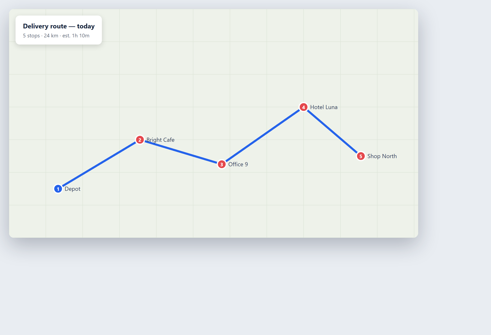

# Kapitel 29 — Operations und Produktion

## In einfachen Worten

Das operative Geschäft ist der Motor eines Unternehmens. Es umfasst alles, was Eingaben in Ausgaben verwandelt: ein Produkt herstellen, es bewegen, die Maschinen am Laufen halten, die Qualität prüfen und die Menschen schützen. Die Produktion ist der Teil des operativen Geschäfts, der die Sache tatsächlich herstellt. Wenn der Motor gut läuft, bekommen die Kunden, was sie bestellt haben — pünktlich und ohne Fehler. Wenn er stottert, spürt das alles, was danach kommt.

Stell dir dein operatives Geschäft wie eine Werkshalle vor, egal ob du Widgets herstellst oder Dienstleistungen lieferst. Maschinen laufen, Waren bewegen sich, Menschen arbeiten, und immer kann etwas ein wenig schiefgehen — eine Maschine, die bald ausfällt, eine Charge mit einem Fehler, eine Lieferung, die sich verspätet, ein Arbeiter an einem gefährlichen Ort. Ein guter Betreiber sieht diese Dinge früh. KI hilft, indem sie alles gleichzeitig beobachtet und die kleinen Signale meldet, die ein müdes menschliches Auge übersieht.

Dieses Kapitel behandelt vier Aufgaben: vorausschauende Wartung (Maschinen reparieren, bevor sie kaputtgehen), Qualitätskontrolle (Fehler automatisch erkennen), Logistik (Waren und Informationen effizient bewegen) und Arbeitssicherheit (Menschen aus der Gefahrenzone fernhalten). Jede davon ist eine Stelle, an der ein kleines Unternehmen Verschwendung reduzieren, die Qualität steigern und seine Leute schützen kann.

Vorher eine ehrliche Idee: KI im operativen Geschäft ist ein *Beobachter und Helfer*, kein Autopilot, der die Halle allein steuert. Sie nimmt wahr, sagt voraus und schlägt vor. Ein Mensch entscheidet weiterhin, wann eine Linie gestoppt wird, wann eine Charge verworfen wird und wann jemand nach Hause geschickt wird, weil es nicht sicher ist. Die Methode, um zu beurteilen, ob sich irgendetwas davon auszahlt, findest du in [Kapitel 16 — Ziele, Kosten und Return on Investment](ch16-goals-costs-and-return-on-investment.md); dieses Kapitel zeigt dir, was du automatisieren kannst und wie. Um zu sehen, wo das operative Geschäft auf der Wirkung-Aufwand-Karte für dein ganzes Unternehmen liegt, schau dir [Kapitel 12 — Wo KI deinem Unternehmen helfen kann](ch12-where-ai-can-help-your-business.md) an.

## Ein wenig Geschichte

**1900er–1950er: die Fließbandfertigung und die vorbeugende Wartung.** Die moderne Produktion begann mit dem laufenden Fließband, das die Arbeit in kleine, wiederholbare Schritte zerlegte. Dazu kam die *vorbeugende* Wartung — die Gewohnheit, eine Maschine nach einem festen Zeitplan zu warten, wie das Öl eines Autos alle paar tausend Meilen zu wechseln, ob es nötig war oder nicht. Das reduzierte Ausfälle, verschwendete aber Wartung an Maschinen, die in Ordnung waren.

**1960er–1980er: Automatisierung und Qualitätskontrolle.** Fabriken fügten automatisierte Maschinen und eine formale Qualitätskontrolle hinzu — Produkte anhand eines Standards prüfen und das Gute vom Schlechten trennen. Statistische Qualitätsmethoden fingen Fehler in Chargen. Das steigerte die Qualität, verließ sich aber weiterhin auf Menschen zum Prüfen und auf feste Regeln für die Wartung der Maschinen.

**1990er: Sensoren und die digitale Lieferkette.** Günstige Sensoren ermöglichten es Maschinen, ihren eigenen Zustand zu melden — Temperatur, Vibration, Laufstunden. Lieferketten wurden digital, mit Software, die Waren vom Lieferanten bis zum Kunden verfolgte. Zum ersten Mal konnte ein Betreiber auf einem Bildschirm sehen, was in der Halle und quer durch die Lieferkette geschah. Aber die Daten wurden meist von Hand gelesen.

**2000er: Maschinelles Lernen sagt den Ausfall voraus.** Maschinelles Lernen — Software, die Muster aus vielen Beispielen lernt — veränderte die Wartung. Statt nach einem festen Zeitplan zu warten, konntest du aus Sensordaten lernen, wann eine Maschine *tatsächlich* kurz vor dem Ausfall stand. Ein langsam ansteigendes Vibrationsmuster, das ein Mensch nicht spüren konnte, wurde eine klare Warnung Tage im Voraus. Das war die Geburt der *vorausschauenden* Wartung.

**2010er: Computer Vision prüft die Qualität.** Computer Vision — KI, die liest, was eine Kamera sieht — begann, Produkte automatisch zu prüfen. Eine Kamera konnte einen Riss, einen Kratzer oder ein fehlendes Teil schneller und gleichmäßiger erkennen als ein menschlicher Prüfer, und ohne müde zu werden. Die Qualitätskontrolle wechselte vom Stichprobenziehen zum Prüfen jedes einzelnen Stücks.

**2020er: Agenten steuern den Arbeitsablauf.** Große Sprachmodelle und KI-Agenten — Software, die eine ganze Aufgabe übernimmt und sie über mehrere Schritte durchführt — steuern nun Teile des operativen Arbeitsablaufs selbst: eine Anfrage lesen, Daten aus Backend-Systemen holen und den nächsten Schritt ausführen. Das SOK-Finance-Beispiel unten ist genau das: KI-Agenten, die den täglichen Service-Betrieb eines Finanzdienstleistungszentrums abwickeln, mit Menschen, die Aufsicht führen.

Der Bogen: von festen Zeitplänen über manuelle Prüfung zu Sensordaten, zu KI, die vorhersieht und sieht, bis hin zu Agenten, die handeln. Jeder Schritt verlagerte das Beobachten und die Routinearbeit auf Software und überließ den Menschen das Entscheiden und Eingreifen.

## Neugier

### 29.5 Das Servicezentrum, das KI-Agenten an die vorderste Front stellte

Wenn wir „Operations und Produktion" hören, stellen wir uns eine Fabrik vor. Aber das operative Geschäft bedeutet auch das Servicezentrum, das ein Unternehmen am Laufen hält — der Ort, wo Anfragen eintreffen und jemand schnell darauf reagieren muss.

SOK Finance in Finnland betreibt ein Servicezentrum namens Palveluässä, das Finanzbuchhaltungs- und Gehaltsservices für die S Group bereitstellt — ein kundeneigenes finnisches Netzwerk von Handels- und Dienstleistungsunternehmen mit rund 2.000 Filialen. Jeden Tag treffen Anfragen ein: „Schick mir eine Kopie dieser Rechnung", „Ändere das Fälligkeitsdatum dieser Zahlung." Routine, hohes Volumen und zeitkritisch.

Die Neugier liegt darin, was das Unternehmen damit angestellt hat. Statt mehr Leute einzustellen, um dieselben Anfragen zu beantworten, setzten sie KI-*Agenten* an die vorderste Front, um die Routineanfragen zu erledigen, damit das menschliche Personal sich auf die Fälle konzentrieren konnte, die Urteilsvermögen erforderten. Dieser Wandel — von Menschen, die jede Anfrage erledigen, zu Agenten, die die Routine machen, und Menschen, die Aufsicht führen — ist dieselbe leise Revolution, die in der Werkshalle stattfand, nun angewandt auf ein Servicezentrum. Die ganze Geschichte mit der echten Quelle findest du unten.

## Ein echtes Geschäftsbeispiel

**SOK Finance: KI-Agenten steuern den Servicezentrum-Arbeitsablauf.**

SOK Finance betreibt das Servicezentrum Palveluässä, das Finanzbuchhaltungs- und Gehaltsservices für die S Group bereitstellt, ein kundeneigenes finnisches Netzwerk von Handels- und Dienstleistungsunternehmen mit etwa 2.000 Filialen. Das Servicezentrum bearbeitet einen stetigen Strom von Routineanfragen aus dem gesamten Netzwerk — Dinge wie die Bitte um eine Kopie einer Rechnung oder die Änderung eines Zahlungsziels. Jede Anfrage ist klein, aber zusammen ergeben sie eine große, repetitive Arbeitslast, die schnell und einheitlich bewältigt werden muss.

Laut einer Pressemitteilung von CGI (Helsinki, 23. April 2026) hat CGI eine **Multi-Agenten-KI-Lösung auf Basis von AWS Bedrock** für SOK Finance entworfen, implementiert und eingeführt und damit KI in den produktiven Live-Einsatz in der Finanzverwaltung und im Kundendienst gebracht. Eine „Multi-Agenten"-Lösung bedeutet, dass mehrere KI-Agenten zusammen an einer Aufgabe arbeiten, wobei jeder einen Schritt übernimmt. In diesem Fall verarbeiten die Agenten eingehende Kundendienst-Nachrichten, rufen die benötigten Daten aus Backend-Systemen ab und führen Teile des Prozesses automatisch aus.

Die Mitteilung beschreibt die Lösung als deutliche Beschleunigung von Routineprozessen wie **Anfragen nach Rechnungskopien und Änderungen von Zahlungszielen** sowie als Verbesserung von Effizienz und Einheitlichkeit im Vergleich zur früheren manuellen Bearbeitung. CGI war verantwortlich für das Design, die Implementierung, die Einführung und die Integration mit den wichtigsten Systemen von SOK Finance.

Zwei Dinge fallen auf. Erstens verschiebt sich die Rolle des Menschen vom *Erledigen jeder Anfrage* zum *Beaufsichtigen der Agenten und Bearbeiten der Ausnahmefälle*. Die Agenten nehmen die Routine; die Menschen nehmen das Ungewöhnliche und das Sensible. Zweitens ist der Gewinn die Einheitlichkeit ebenso wie die Geschwindigkeit — ein Agent befolgt jedes Mal dieselben sorgfältigen Schritte, während ein müder Mensch an einem geschäftigen Nachmittag schludern könnte.

Ein Hinweis zur Quelle und zu den Zahlen: Die obigen Angaben stammen aus der veröffentlichten Ankündigung von CGI. Die Mitteilung beschreibt die Ergebnisse in qualitativen Begriffen — schnellere Prozesse, bessere Einheitlichkeit — und veröffentlicht keine harte Prozentzahl für eingesparte Zeit oder gesenkte Kosten. Betrachte das Ergebnis als die berichtete Erfahrung des Unternehmens, und denk daran, dass deine eigenen Zahlen von deinem Volumen und deinen Systemen abhängen. Der Punkt des Falls ist das *Muster*: KI-Agenten, die einen Routine-Service-Workflow in der Produktion ausführen, mit Menschen, die Aufsicht führen, im Maßstab eines Netzwerks mit 2.000 Filialen.

## So machst du es

### 29.1 Vorausschauende Wartung

Vorausschauende Wartung bedeutet, eine Maschine *zu reparieren, bevor* sie kaputtgeht, indem der Ausfall aus Daten vorhergesagt wird, statt auf ihn zu warten oder nach einem festen Zeitplan zu warten.

**Der alte Weg und seine Kosten.** Traditionell hattest du zwei Möglichkeiten: eine Maschine laufen lassen, bis sie ausfällt (und für einen ungeplanten Stopp bezahlen), oder sie nach einem festen Zeitplan warten (und Geld für die Wartung von Maschinen verschwenden, die in Ordnung waren). Beides verliert. Ein ungeplanter Ausfall stoppt die Produktion im schlimmsten Moment und kostet weit mehr als eine geplante Reparatur.

**Wie KI vorhersagt.** Du bringst Sensoren an der Maschine an, um Dinge wie Vibration, Temperatur, Klang und Laufstunden zu messen. KI lernt das normale Muster und erkennt die frühen Anzeichen von Ärger — eine Vibration, die langsam ansteigt, eine Temperatur, die etwas heiß läuft. Diese kleinen Veränderungen treten oft Tage vor einem Ausfall auf. Die KI warnt dich rechtzeitig, um die Maschine während eines geplanten Stopps zu reparieren, nicht mitten im Lauf.

**Was es spart.** Die große Ersparnis ist das Vermeiden ungeplanter Ausfallzeiten — der Überraschungs-Ausfall, der alles zum Stillstand bringt. Eine geplante Reparatur an einem Dienstagnachmittag ist günstig; ein Ausfall während deiner größten Bestellung des Monats ist teuer. Vorausschauende Wartung verwandelt das Zweite ins Erste.

**Fang klein an.** Du brauchst nicht auf jeder Maschine Sensoren. Fang mit der einen oder zwei Maschinen an, deren Ausfall am meisten wehtut — dem Engpass, der mit der langen Reparaturzeit, der, der die ganze Linie stoppt. Bring ein paar Sensoren an ihr an und beobachte. Beweis den Wert dort, bevor du ausweitest.

**Der Mensch entscheidet den Stopp.** Die KI meldet das Risiko; ein Mensch entscheidet, wann er die Maschine herunterfährt. Lass das System nicht von selbst die Produktion stoppen, ohne dass ein Mensch die Entscheidung bestätigt. Die Warnung ist der Wert; die Entscheidung bleibt menschlich.

### 29.2 Qualitätskontrolle

Qualitätskontrolle bedeutet zu prüfen, dass ein Produkt seinem Standard entspricht, und Fehler zu fangen, bevor das Produkt den Kunden erreicht. KI verändert die Qualitätskontrolle vom *Stichprobenziehen* zum *Prüfen jedes Stücks*, und von *müden Augen* zu *gleichmäßigen*.

**Computer Vision prüft.** Eine Kamera plus KI kann jedes Produkt auf der Linie betrachten und einen Riss, einen Kratzer, ein fehlendes Teil, ein falsches Etikett oder eine schlechte Naht erkennen. Sie prüft jedes Stück, nicht nur eine Stichprobe, und sie wird nicht müde oder gelangweilt. Ein menschlicher Prüfer, der tausende Stücke am Tag kontrolliert, wird Dinge übersehen; die Kamera nicht.

**Einheitlichkeit ist der Gewinn.** Menschen schwanken. Ein Mensch ist morgens schärfer, nach dem Mittagessen langsamer und leicht beeinflusst von dem, was er zuletzt gesehen hat. KI legt denselben Standard an jedes Stück an, den ganzen Tag. Diese Einheitlichkeit ist eine Menge wert in einem Geschäft, in dem ein Fehler, der einen Kunden erreicht, eine Rücksendung, eine Beschwerde oder einen Ruf kostet.

**Fang es früh.** Je früher du einen Fehler fängst, desto günstiger ist er. Ein Fehler, der an der Maschine gefangen wird, die ihn gemacht hat, kostet ein Teil. Derselbe Fehler, der bei der Endmontage gefangen wird, kostet eine Nacharbeit. Vom Kunden gefangen, kostet er eine Rücksendung und Vertrauen. KI an jeder Station fängt Probleme an der Quelle, nicht am Ende.

**Fang mit dem teuren Fehler an.** Versuch nicht, am Anfang alles zu prüfen. Finde den Fehler, der dich am meisten kostet — den, der die meisten Rücksendungen oder Beschwerden verursacht — und setz eine Bildprüfung darauf. Beweis, dass er das teure Problem fängt, dann füge mehr Prüfungen hinzu.

**Behalt einen Menschen für die Ermessensentscheidung.** Die KI kann ein verdächtiges Stück melden; ein Mensch entscheidet, ob es wirklich fehlerhaft ist, besonders bei Grenzfällen. Lass ein Bildsystem keine gute Ware verwerfen, weil es zu streng war. Prüfe die Ausschüsse und stell den Schwellenwert ein.

### 29.3 Logistik

Logistik ist die Bewegung von Waren und Informationen: das richtige Ding zur richtigen Zeit an den richtigen Ort bringen, zu den niedrigsten Kosten. Sie ist ein Puzzle aus Routen, Lagerbestand, Timing und Lieferanten, und KI ist sehr gut bei solchen Puzzles.

**Routen- und Lieferoptimierung.** KI kann Lieferrouten planen, die Meilen, Kraftstoff und Zeit sparen, wobei Verkehr, Lieferfenster und Ladungsgröße berücksichtigt werden. Für ein Unternehmen mit einer Flotte addiert sich selbst eine kleine Ersparnis pro Route schnell über ein Jahr.

**Lager- und Bedarfsprognose.** KI schaut sich deine Verkaufshistorie an und sagt voraus, was du wann brauchen wirst, damit du genug lagerst, ohne übermäßig einzukaufen. Zu wenig Lager bedeutet einen verpassten Verkauf; zu viel bedeutet gebundenes Kapital und Verschwendung. KI balanciert beides, indem sie deine Muster und die Saisonalität lernt.

**Erkenn den Engpass.** KI kann sehen, wo Waren langsamer werden — ein Lieferant, der immer spät ist, ein Lagerschritt, der sich staut, eine Route, die immer drüber läuft. Den Engpass zu sehen ist der erste Schritt, ihn zu beheben. Der ganze Wert liegt darin, die unsichtbare Verzögerung sichtbar zu machen.

**Verbinde die Systeme.** Logistik-KI funktioniert am besten, wenn sie deine Bestellungen, dein Lager und deine Lieferungen zusammen sehen kann. Die KI mit den Systemen zu verbinden, die du bereits nutzt — deine Bestellsoftware, dein Inventar, dein Tracking — macht das Bild vollständig. Die Anleitung für diese Verbindung findest du in [Kapitel 19 — KI mit Systemen verbinden, die du bereits nutzt](ch19-connecting-ai-to-systems-you-already-use.md).

**Behalt einen Menschen für die Ausnahme.** Die KI plant die Routine; ein Mensch handhabt die Überraschung — den Streik, den Sturm, den Lieferanten, der versagt. Lass einen optimierten Plan nicht gegen eine reale Störung laufen, ohne dass ein Mensch bereit ist, ihn zu übersteuern. Der Plan ist ein Ausgangspunkt, keine Zwangsjacke.

### 29.4 Arbeitssicherheit

Arbeitssicherheit bedeutet, Menschen aus der Gefahrenzone fernzuhalten. KI kann nach unsicheren Zuständen und unsicherem Verhalten Ausschau halten und warnen, bevor ein Unfall passiert. Das ist einer der wertvollsten Einsätze von KI, weil das, was sie beschützt, ein Mensch ist.

**Computer Vision hält nach Gefahren Ausschau.** Kameras plus KI können einen Arbeiter ohne die richtige Schutzausrüstung erkennen, eine Person, die in einer gefährlichen Zone steht, eine Pfütze auf dem Boden oder einen blockierten Notausgang. Wenn sie eine sieht, löst sie eine Warnung aus, damit die Gefahr behoben wird, bevor jemand verletzt wird.

**Sag den riskanten Moment voraus.** KI kann lernen, wann Unfälle am wahrscheinlichsten sind — eine bestimmte Schicht, eine bestimmte Maschine, eine bestimmte Tageszeit, wenn Menschen müde sind — und die Beobachtung dann verstärken. Es ist, als hätte man einen Sicherheitsbeauftragten, der nie blinzelt und die ganze Halle auf einmal sieht.

**Eine ernste rechtliche Grenze: lies keine Emotionen.** KI, die die *Emotionen* eines Arbeiters aus seinem Gesicht oder seiner Stimme ableitet, ist am Arbeitsplatz gemäß dem EU AI Act verboten. Sicherheits-Bildanalyse dreht sich um *Gefahren und Ausrüstung*, nicht darum, wie sich ein Arbeiter *fühlt*. Richte die Kamera auf die Halle und die Maschine, nicht auf die Laune der Person. Die vollständige Liste der verbotenen Praktiken findest du in [Kapitel 5 — Regeln und rechtliche Verantwortung](ch05-rules-and-legal-responsibility.md).

**Informiere deine Arbeiter.** Wenn du KI-gestützte Sicherheitsüberwachung einsetzt, die Arbeiter betrifft, musst du deine Arbeiter und ihre Vertretungen informieren, bevor du anfängst, wie es das Gesetz für Hochrisiko-KI am Arbeitsplatz verlangt. Sei offen darüber, was die Kameras beobachten und warum. Geheimhaltung zerstört Vertrauen. Die Hinweisregel für Arbeiter wird in der Neugier dieses Kapitels und in [Kapitel 5](ch05-rules-and-legal-responsibility.md) behandelt.

**Nutze sie zum Schützen, nicht zum Bestrafen.** Sicherheitsdaten sollen den Arbeitsplatz sicherer machen — die Gefahr beheben, den Prozess ändern, das Team schulen. Sie sollen nicht zu einem Werkzeug werden, um Einzelpersonen für jeden kleinen Fehltritt zu disziplinieren. Nutze sie, um Gefahr zu finden und zu entfernen, nicht um eine Anklage gegen einen Arbeiter aufzubauen.

## Ethik und Verantwortung

Das operative Geschäft berührt Sicherheit und Umwelt, daher sind die ethischen Einsätze real und konkret.

**Sicherheitsentscheidungen bleiben menschlich.** Die KI kann vor einer Gefahr warnen, aber ein Mensch entscheidet, wann eine Linie gestoppt oder jemand nach Hause geschickt wird. Lass ein System niemals eine sicherheitskritische Entscheidung ohne einen Menschen im Entscheidungsprozess treffen. Ein falsches „alles klar" kann jemanden verletzen.

**Achte die Privatsphäre und Rechte der Arbeiter.** Kameras und Sensoren am Arbeitsplatz wachen über Menschen. Nutze sie für Sicherheit und operatives Geschäft, nicht für Überwachung. Sag den Arbeitern, was beobachtet wird und warum, und befolge die Privatsphäre-Regeln in [Kapitel 10 — Privatsphäre und DSGVO](ch10-privacy-and-gdpr.md).

**Lies niemals Emotionen.** Emotionserkennung am Arbeitsplatz ist verboten. Halte die Überwachung bei Gefahren und Ausrüstung, niemals bei den Gefühlen eines Arbeiters.

**Schütze operative Daten.** Sensordaten, Produktionspläne und Lieferketten-Aufzeichnungen sind sensibel und wertvoll. Halte sie sicher und, wo es darauf ankommt, innerhalb deiner eigenen Umgebung. Die Sicherheitsgrundlagen findest du in [Kapitel 6 — Cybersicherheit im KI-Zeitalter](ch06-cybersecurity-in-the-ai-era.md), und die Self-Hosting-Option in [Kapitel 8 — Self-Hosting: Behalte deine Daten unter Kontrolle](ch08-self-hosting-keep-your-data-under-control.md).

**Sei ehrlich über die Ergebnisse.** Eine Qualitäts- oder Effizienzzahl, die zu gut aussieht, sollte geprüft werden, bevor du sie berichtest. Berichte die echten Zahlen, einschließlich der Fehlschläge, damit du beheben kannst, was noch kaputt ist.

**Nutze Daten zum Verbessern, nicht zum Bestrafen.** Operative und Sicherheitsdaten sollen die Arbeit für alle besser und sicherer machen. Wenn sie zu einem Stock werden, um Einzelpersonen damit zu verprügeln, vergiften sie den Arbeitsplatz und verbergen die echten Probleme.

## Zu vermeidende Fehler

**Auf den Ausfall warten.** Beim „bis zum Ausfall laufen"-Prinzip bleiben, wenn eine geplante Reparatur günstig und vorhersagbar war. Sag früh voraus und handle.

**Sensoren ohne Plan.** Daten sammeln, die du nie in eine Handlung ummünzt. Fang mit der Maschine an, die am meisten wehtut, und verknüpfe jeden Sensor mit einer Entscheidung.

**Die KI von selbst stoppen oder verwerfen lassen.** Keine menschliche Kontrolle bei einem Linienstopp oder einem Produkt-Ausschuss. Behalt die menschliche Entscheidung.

**Zu strenge Bildprüfungen.** Ein Qualitätssystem, das gute Ware verwirft, weil der Schwellenwert zu eng ist. Prüfe die Ausschüsse und stell es ein.

**Den falschen Fehler prüfen.** Bildanalyse auf ein billiges Problem setzen, während das teure durchrutscht. Ziel zuerst auf den teuren Fehler.

**Ein Plan, der die reale Welt ignoriert.** Einen optimierten Logistikplan gegen eine Störung laufen lassen ohne menschliche Übersteuerung. Halt einen Menschen bereit.

**Emotionserkennung bei der Arbeit.** KI nutzen, um die Gefühle von Arbeitern zu lesen. Es ist verboten und falsch.

**Geheime Überwachung.** Arbeiter nicht informieren, bevor KI-gestützte Sicherheits- oder Betriebsüberwachung beginnt. Das bricht das Gesetz und das Vertrauen.

**Überwachungs-Schleichausweitung.** Sicherheits- und Betriebsdaten nutzen, um Einzelpersonen zu beobachten und zu bestrafen, statt Gefahren zu entfernen.

**Einen kaputten Prozess automatisieren.** Wenn die Linie oder die Lieferkette ein Chaos ist, macht KI daraus ein schnelleres Chaos. Repariere zuerst den Prozess.

**Keine Ausgangsbasis.** Ausfallzeit, Fehlerrate oder Lieferzeit vorher nicht messen, sodass du den Gewinn nicht beweisen kannst. Miss zuerst (siehe [Kapitel 22 — Ergebnisse und ROI messen](ch22-measuring-results-and-roi.md)).

**Die Zahlen überversprechen.** Die Best-Case-Zahl eines Anbieters als dein Ergebnis ausgeben. Nutze deine eigenen gemessenen Zahlen.

## Praktische Übung

### 29.7 Übung: Plane eine operative Automatisierung

Wähle eine operative Aufgabe und plane ihre KI-Unterstützung von Anfang bis Ende, mit Sicherheit und der menschlichen Entscheidung eingebaut.

**Schritt 1 — Wähle die Aufgabe.** Wähle eine: vorausschauende Wartung, Qualitätskontrolle, Logistik oder Arbeitssicherheit. Mach eine, nicht alle.

**Schritt 2 — Definiere das Ziel und die Kennzahl.** Weniger Ausfallzeit? Weniger Fehler? Schnellere Lieferung? Weniger Sicherheitsvorfälle? Wähle eine Zahl zum Messen.

**Schritt 3 — Miss die Ausgangsbasis.** Wie ist diese Zahl jetzt? Stunden ungeplanter Ausfallzeit, Fehlerrate, pünktliche Lieferung, Vorfälle pro Monat. Schreib sie auf.

**Schritt 4 — Finde das teure Ziel.** Identifiziere den einzelnen teuersten Ausfall in dieser Aufgabe — die Maschine, deren Ausfall am meisten wehtut, den Fehler, der am meisten kostet, die Route, die immer spät ist, die Gefahr, die den meisten Schaden anrichtet. Ziel zuerst darauf.

**Schritt 5 — Markiere jeden Schritt.** Markiere für jeden Schritt: **KI macht es** (wahrnehmen, vorhersagen, prüfen, planen), **Mensch prüft es** (die Warnung bestätigen, den Ausschuss kontrollieren) oder **Mensch entscheidet es** (die Linie stoppen, die Charge verwerfen, jemanden nach Hause schicken). Jede sicherheitskritische Entscheidung muss menschlich sein.

**Schritt 6 — Prüfe die rechtliche Grenze.** Wenn die Aufgabe die Überwachung von Arbeitern beinhaltet, bestätige, dass du Gefahren und Ausrüstung beobachtest, nicht Emotionen, und plane, wie du Arbeiter und ihre Vertretungen informieren wirst, bevor du anfängst.

**Schritt 7 — Verbinde die Daten.** Entscheide, welche Systeme die KI sehen muss — Sensoren, Inventar, Tracking — und wie du sie verbinden wirst (siehe [Kapitel 19](ch19-connecting-ai-to-systems-you-already-use.md)).

**Schritt 8 — Start klein und miss.** Lauf es zuerst auf einer Maschine, einer Linie oder einer Route. Vergleiche die Kennzahl mit der Ausgangsbasis. Skaliere nur, was beweist, dass es funktioniert.

Mach eine Aufgabe gut. Die Analyse des teuren Ziels in Schritt 4 ist für sich schon wertvoll — sie zeigt dir, wo dein operatives Geschäft tatsächlich das meiste Geld verliert oder den meisten Schaden anrichtet, was nützlich ist, noch bevor du ein Werkzeug kaufst.

## Checkliste

### 29.8 Checkliste Operations und Produktion

Bevor du eine operative Aufgabe automatisierst, prüfe diese Punkte.

- [ ] **Du hast die Ausgangsbasis gemessen** — Ausfallzeit, Fehlerrate, Lieferzeit, Sicherheitsvorfälle.
- [ ] **Du hast zuerst den teuersten Ausfall ins Ziel genommen**, nicht den leichtesten.
- [ ] **Ein Mensch trifft jede sicherheitskritische Entscheidung** — eine Linie stoppen, eine Charge verwerfen.
- [ ] **Vorausschauende Wartung ist an eine echte Handlung geknüpft**, nicht nur an gesammelte Daten.
- [ ] **Qualitätsprüfungen sind abgestimmt**, damit sie keine gute Ware verwerfen.
- [ ] **Die Logistik-KI kann deine Bestellungen, dein Lager und deine Lieferungen zusammen sehen.**
- [ ] **Ein Mensch kann den optimierten Plan übersteuern**, wenn die reale Welt ihn stört.
- [ ] **Die Sicherheitsüberwachung beobachtet Gefahren und Ausrüstung, niemals Emotionen** (Emotionserkennung ist verboten).
- [ ] **Du hast Arbeiter und ihre Vertretungen informiert**, bevor eine KI-Überwachung begann, die sie betrifft.
- [ ] **Operative Daten werden sicher aufbewahrt**, nicht an öffentliche KI-Dienste gesendet.
- [ ] **Du nutzt Daten, um Gefahren zu entfernen und den Prozess zu verbessern**, nicht um Einzelpersonen zu bestrafen.
- [ ] **Du reparierst den kaputten Prozess, bevor du ihn automatisierst.**
- [ ] **Du berichtest deine eigenen gemessenen Zahlen**, nicht den Best Case des Anbieters.

Wenn ein Kästchen leer ist, liegt das Risiko — für dein Produkt, deine Leute oder dein Vertrauen — weiterhin bei dir. Füll es, bevor du KI in die Nähe der Halle lässt.

## Wichtige Erkenntnisse

- KI im operativen Geschäft ist ein Beobachter und Helfer: sie nimmt wahr, sagt voraus, prüft und plant, während ein Mensch jede sicherheitskritische Entscheidung behält.
- Der SOK-Finance-Fall (eine CGI-Ankündigung) stellte Multi-Agenten-KI auf AWS Bedrock in den Live-Produktivbetrieb eines Servicezentrums, das ein Netzwerk mit ~2.000 Filialen bedient, und beschleunigte Routineanfragen wie Rechnungskopien und Änderungen von Zahlungszielen, mit Menschen, die die Ausnahmefälle beaufsichtigen.
- Vorausschauende Wartung verwandelt einen Überraschungs-Ausfall in eine günstige geplante Reparatur; Bildanalyse-Qualitätskontrolle prüft jedes Stück gleichmäßig, statt mit müden Augen Stichproben zu ziehen.
- Überwache bei der Arbeitssicherheit Gefahren und Schutzausrüstung — niemals die Emotionen der Arbeiter, die der EU AI Act verbietet — und informiere die Arbeiter vor jeder Überwachung, die sie betrifft.
- Ziel zuerst auf den teuersten Ausfall, behalt eine menschliche Übersteuerung für reale Störungen, und miss deine eigene Ausgangsbasis, bevor du irgendeiner Anbieterzahl traust.

<!-- BEGIN agentbridge-examples -->

## Teste es mit AgentBridge

So sieht dieselbe Aufgabe mit AgentBridge aus. Jede Box zeigt das fertige Ergebnis und die eine Zeile, die du eintippst, um es zu bekommen.

### Den Lagerbestand in Ordnung halten

*Ein Inventarblatt mit hervorgehobenen Artikeln mit niedrigem Bestand*

**Was du fragst:** `Erstelle eine Inventar-Tabelle mit Artikel, Menge, Meldebestand und Lieferant, und hebe hervor, was unter dem Meldebestand liegt.`

Der Agent richtet das Inventarblatt ein und markiert die Artikel, die nachbestellt werden müssen. Aktualisiere die Mengen und lass es jederzeit erneut prüfen.

*Tipp: Eine wöchentlich geplante Prüfung kann dir sagen, was du nachbestellen musst, bevor dir der Vorrat ausgeht.*

---

### Eine Lieferroute planen

*Eine Lieferroute über die Haltstellen auf der Karte*

**Was du fragst:** `Plane die beste Route für diese fünf Lieferadressen und zeig sie auf einer Karte.`

Der Agent plotzt die Haltstellen in einer effizienten Reihenfolge auf eine Karte und gibt dir die Entfernung und die geschätzte Zeit. Du folgst der Route und sparst Kraftstoff.

*Tipp: Füge Zeitfenster hinzu („Haltstelle B vor Mittag") und der Agent berücksichtigt sie.*

---

### Ist es auf Lager?

*Eine Live-Bestandsprüfung in Sekunden beantwortet*

**Was du fragst:** `Haben wir Artikel SKU 3391 auf Lager, und wie viele?`

Der Agent prüft den Bestand in deinem System und antwortet mit der Menge, damit du mit Sicherheit zusagen oder absagen kannst.

*Tipp: Kombiniere es mit einer täglich geplanten Warnung bei niedrigem Bestand, um Überraschungen zu vermeiden.*

<!-- END agentbridge-examples -->
