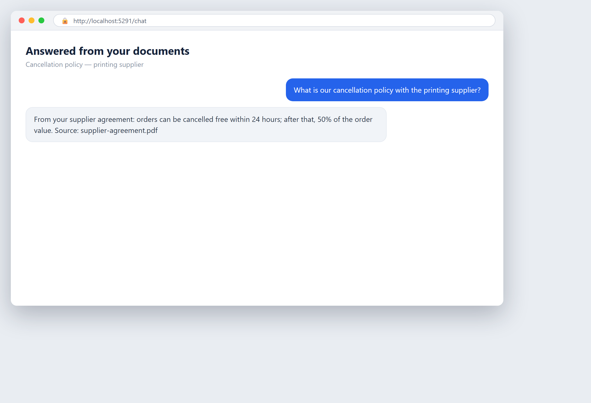
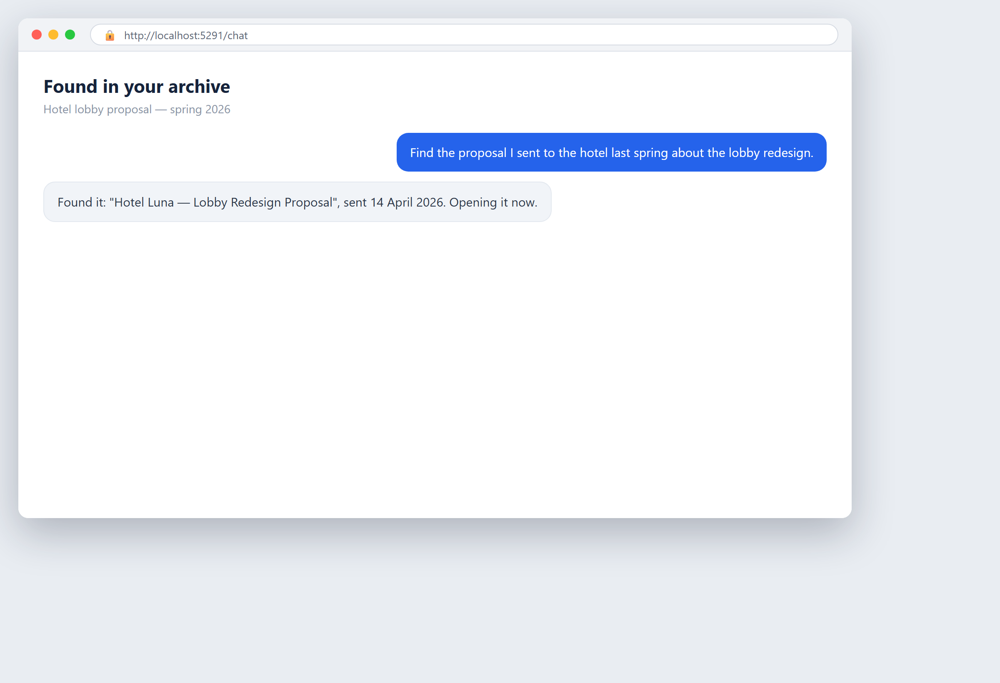
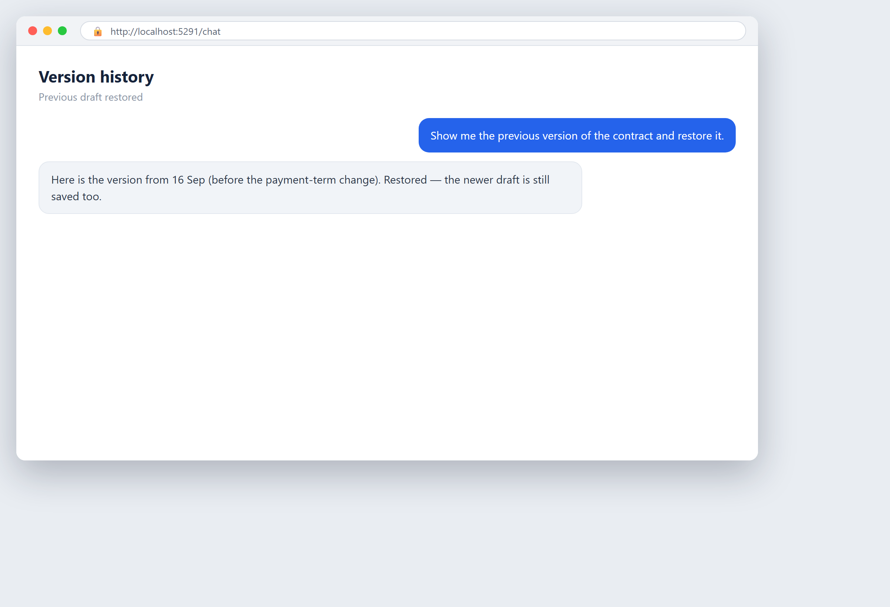

# Chapter 14 — Data: The Raw Material

## In Simple Words

AI does not think on its own. It works on data, the same way a kitchen works on ingredients. The quality of the meal depends on the quality of what you put in. No chef, however skilled, can make a good dish from rotten vegetables. AI is the same: good data in, useful results out; bad data in, useless or harmful results out.

This is the single most important truth about AI that business owners miss. They focus on the model — how smart it is, which brand to buy — and ignore the data it runs on. But the model is only the chef. The data is the food. Most AI projects fail not because the model was weak, but because the data was messy, incomplete, or wrong.

Data, in plain words, is recorded information. Customer names, order histories, invoices, emails, spreadsheets, employee records, website clicks, machine readings — all data. Some of it is tidy, sitting in neat tables. Most of it is messy, scattered across files, inboxes, and paper. Your job is to know what you have, where it is, and whether it is good enough to build on.

This chapter is about treating your data like the valuable raw material it is. It covers what data you have and where it lives, how to tell if it is clean and current, the basic rules for personal data, how to keep it safe, and how to organize it without tearing your whole business apart. The deep legal treatment of privacy is in [Chapter 10](ch10-privacy-and-gdpr.md); this chapter gives you the working basics so you can prepare your data for AI.

A simple image to carry through: before you cook, you check the pantry. You find what you have, throw out what is spoiled, and note what is missing. That is exactly what you do with data before any AI project.

## A Bit of History

**1960s–1970s: data lives in databases.** Businesses stored information in structured databases — neat tables of numbers and short text. This was clean by design, but it covered only a small slice of what the business knew. Most knowledge lived on paper or in people's heads.

**1980s–1990s: spreadsheets and files.** Personal computers spread data everywhere. Spreadsheets, shared drives, email attachments. Data became abundant but scattered and inconsistent. The mess we all know today started here.

**2000s: "big data."** The internet and digital systems produced data at a scale nobody had seen. Companies began talking about "big data" as an asset. But volume without quality created a new problem: oceans of data, little of it reliable.

**2010s: data quality becomes the bottleneck.** As analytics and machine learning grew, a hard truth emerged: most projects spent 80% of their time cleaning data, not modeling it. "Garbage in, garbage out" became the defining lesson of the era. Data preparation, not clever algorithms, was the real work.

**2018: GDPR raises the stakes.** Europe's privacy law made data handling a legal duty, not just a quality issue. Now messy data was not only useless; mishandled personal data was punishable. Data governance became a board topic.

**2020s: generative AI makes data reach matter.** Modern AI can read messy text and images, so it needs less tidy data than old systems. But it still depends on having the right data available and trustworthy. The lesson holds: the model is only as good as what you feed it.

The arc is clear. We went from too little structured data to too much scattered data. The skill never changed: find it, clean it, and know what you can trust.

## Curiosity

### 14.6 The model that wrote Python from 1930s books

Here is a striking fact about how data shapes what a model can do: researchers trained a language model on books from before 1931 only — no computers, no internet, and no programming code, because Python did not exist yet — and it could still write a little Python, by copying the structure of examples placed in front of it.

That experiment, and what it teaches about data and structure, is told in full in [Chapter 3](ch03-the-words-of-ai-without-the-big-words.md), the canonical home for it. The point for this chapter is one line: **what a model can do depends entirely on what it was fed.** Change the data, and you change the capability. That is why your own data is the raw material worth caring about.

## A Real Business Example

### The wholesaler whose "data" was three conflicting spreadsheets

A building-supplies wholesaler believed it had good customer data. When it tried to use AI to forecast which products each customer would order, the project stalled in the first week. The reason was data, not the model.

Customer information lived in three places: an old accounting system, a sales spreadsheet kept by one rep, and a mailing list in an email program. The same customer appeared three times with three different spellings and addresses. Order histories did not match between systems. Half the records had no phone number. The data was not wrong exactly — it was fragmented and inconsistent, which is just as bad.

The fix was not high-tech. They picked one system as the single source of truth for customer records. They merged the duplicates by hand. They set a simple rule: every new customer goes into the one system, once. It took a few weeks of unglamorous work. After that, the forecasting project worked, because for the first time there was one reliable set of data to build on.

The lesson: the AI was ready. The data was not. Most AI projects wait on data, not on tools.

## How to Do It

### 14.1 What data you have and where it is

You cannot use what you cannot find. The first step is a data inventory: a plain list of every place your business keeps information.

Walk through your business and list every data source. Typical ones:

- **Business systems.** Accounting software, CRM, inventory, e-commerce platform, HR system.
- **Files and spreadsheets.** Shared drives, personal laptops, Google Drive, Excel files.
- **Email and messages.** Inboxes, chat tools, saved threads.
- **Paper.** Physical files, signed forms, notes.
- **Web and digital traces.** Website analytics, app logs, customer portal activity.
- **External data.** Supplier feeds, market data, public records.

For each source, note four things: what it holds, who owns it, roughly how much is there, and how current it is. Do not aim for perfection; aim for a map. You want to see the whole landscape so you know where the good data is and where the gaps are.

Expect surprises. Most owners discover data they forgot existed and gaps they assumed were filled. The inventory itself is valuable because it turns a vague sense of "we have data somewhere" into a clear picture.

A good inventory is a table. Keep it simple and update it as you go. It becomes the reference for every future AI project.

### 14.2 Clean, complete, and up-to-date data

Once you know what you have, judge its quality. Good data has three qualities.

**Clean.** Free of errors, duplicates, and inconsistencies. The same customer is not spelled three ways. Numbers are actually numbers, not text. Dates are real dates. Cleaning means fixing or removing the bad records.

**Complete.** Has the fields you need filled in. If you need a customer's region to forecast demand, but half the records have no region, the data is incomplete. Completeness means the important fields are filled.

**Up-to-date.** Reflects reality now, not three years ago. A customer list where half the companies have moved or closed is stale. Stale data leads to wrong conclusions, no matter how clean it looks.

How to check quality without special tools:

- **Spot-check.** Pull 20 records at random and look for errors, duplicates, and blanks. The error rate you see is roughly the error rate you have.
- **Count the blanks.** For the fields you need, what share are empty? High blanks mean low completeness.
- **Check the dates.** When was each source last updated? Old means stale.

You do not need perfect data. You need data that is good enough for the specific task. A rough forecast tolerates more noise than a customer bill. Match the quality bar to the job. But know where you stand before you build.

Cleaning is real work and often tedious. Budget for it. It is the 80% of the project that everyone forgets to plan.

### 14.3 Personal data and GDPR: basic rules

Some of your data is personal data — any information about a living person who can be identified: names, emails, phone numbers, addresses, customer IDs, even an IP address. Personal data carries legal duties, and the full treatment is in [Chapter 10](ch10-privacy-and-gdpr.md). Here are the working basics you need before using it with AI.

**Know what is personal.** Mark, in your inventory, every source that holds personal data. You cannot protect what you have not identified.

**Have a lawful reason.** Under GDPR, you may process personal data only on a valid legal ground — for example, a contract with the person, their consent, or a legitimate interest that does not override their rights. Know which ground you rely on before you feed the data into AI.

**Use only what you need.** Do not pour all your personal data into an AI tool when the task needs only a little. Minimize what you use.

**Watch where it goes.** If you send personal data to a third-party AI service, the data leaves your control and GDPR follows it out the door. The vendor's handling becomes your responsibility. The third-party risks are in [Chapter 9](ch09-third-party-services-and-shadow-ai.md).

**Respect people's rights.** People can ask to see, correct, or delete their data. Your AI use must not make that impossible.

This is a plain guide, not legal advice. For real decisions, especially across borders, consult a data-protection professional. But the habit — mark personal data, know your ground, use the minimum — is yours to build now.

### 14.4 Security, backup, and access

Data is an asset, and assets need protecting. Three basics cover most of the risk.

**Security.** Protect data from attackers and leaks. Use strong passwords and multi-factor authentication, keep systems updated, encrypt sensitive data, and be careful with email attachments and links. The full security picture, including AI-specific threats, is in [Chapter 6](ch06-cybersecurity-in-the-ai-era.md).

**Backup.** Keep copies of your data that are safe from the main system. If a system crashes, is hit by ransomware, or a file is deleted, a backup is the difference between a bad day and losing the business. Follow a simple rule: keep copies in more than one place, back up regularly, and test that you can actually restore. A backup you have never tested restoring is only a hope.

**Access.** Control who can see and change what. Not everyone needs access to everything. Give people the minimum access their role requires. Log who accesses sensitive data. Limiting access limits both accidents and theft.

These three work together. Security keeps outsiders out. Backup saves you when something goes wrong anyway. Access limits the damage any single person or mistake can do. None of them is optional.

A practical habit: back up automatically, check the backup monthly, and review who has access quarterly. Small routines, repeated, prevent disasters.

### 14.5 How to organize data without turning everything upside down

The biggest fear about data work is that it means a huge, disruptive overhaul. It does not. You can improve your data step by step without stopping the business.

**Pick one source of truth per thing.** For each important type of data — customers, products, orders — choose one system to be the official one. Everything else becomes a copy or a view. This single rule fixes most confusion without changing your tools.

**Fix at the point of entry.** The cheapest time to clean data is when it is created. Set simple rules so new records go into the right place, once, with the key fields filled. Stopping new mess beats cleaning old mess forever.

**Do not boil the ocean.** Do not try to clean everything. Clean only the data your first AI projects need. Perfect data you never use is wasted effort. Targeted cleaning that serves a real project is worth doing.

**Standardize a little, not perfectly.** Agree on a few simple formats — how to write a date, a phone number, a customer name — and apply them going forward. You do not need a grand standard, just consistency for the fields that matter.

**Improve as you go.** Treat data quality as a habit, not a project. Each small fix makes the next AI use easier. Over a year, small steady improvements add up to a solid data foundation.

The mindset: you are not rebuilding the house. You are tidying the pantry, one shelf at a time, so the next meal is easier to cook. Start with the shelf your first project needs.

## Ethics and Responsibility

Data carries ethical weight beyond quality and law.

**Personal data is people.** Behind every record is a person with rights and feelings. Handle it with that in mind, not just as a resource to mine. The principles are in [Chapter 4](ch04-ethical-ai-doing-the-right-thing.md).

**Bias lives in data.** If your data under-represents some group, AI trained on it will treat that group badly. A hiring dataset with mostly one kind of candidate will bias the AI the same way. Check whose data is missing, not just whether the data is clean.

**Do not use data people did not expect.** Just because you hold data does not mean you should use it for any purpose. Using customer data in a way they never agreed to breaks trust, even if it is legal. Stay within reasonable expectations.

**Be honest about what you collect and why.** Tell people what data you gather and how you use it. Hidden collection is a breach of trust and often of the law.

**Protect it like it is yours.** A breach harms real people, not just your reputation. Treat security as a duty to the people in your data, not just a box to tick.

## Mistakes to Avoid

### 14.7 Common mistakes with data

1. **Ignoring data until the project fails.** The most common mistake. Check your data before you start, not after it stalls.
2. **Assuming you have data when you have fragments.** Three conflicting spreadsheets is not one dataset. Find the truth first.
3. **Confusing volume with quality.** Lots of data is not good data. A small clean set beats a large messy one.
4. **Not planning the cleaning time.** Data prep is most of the work. Budget for it or the project slips.
5. **No single source of truth.** Multiple "official" versions guarantee confusion. Pick one.
6. **Using personal data without a lawful basis.** A legal risk and a trust risk. Know your ground first.
7. **Sending personal data to third-party AI carelessly.** GDPR follows the data out the door.
8. **Untested backups.** A backup that cannot restore is not a backup. Test it.
9. **Everyone has access to everything.** Wide access means wide risk. Limit it to the role.
10. **Trying to clean everything at once.** Overhaul paralysis. Clean only what your project needs.
11. **Ignoring stale data.** Clean but old data still gives wrong answers. Check the dates.
12. **Forgetting bias in the data.** A gap in who is represented becomes a bias in the output.

## Practical Exercise

### 14.8 Data inventory

Spend an afternoon building a simple data inventory. This is the single most useful preparation you can do for AI.

Make a table with one row per data source. For each, fill in:

- **Source** — the system, file, or place (e.g., "accounting software," "sales spreadsheet," "email inbox").
- **What it holds** — customers, orders, invoices, CVs, etc.
- **Owner** — who is responsible for it.
- **Volume** — roughly how much (rows, files, GB).
- **Personal data?** — Yes / No.
- **Quality** — spot-check 20 records; note blanks, duplicates, errors. Rate clean / mixed / poor.
- **Current?** — when last updated.
- **Single source of truth?** — Yes / No / candidate.

Fill in every source you can find. When done, look at the picture:

- Which sources are clean and current? Those are your best starting material.
- Which hold personal data? Mark them for the GDPR basics in 14.3.
- Where do you have duplicates with no single source of truth? Those are your first cleanup targets.
- What is missing that your first AI project needs? Those are gaps to fill.

This table tells you, honestly, whether you are ready to start an AI project or need to fix data first. Keep it and update it. It is the pantry list for everything you build next.

## Checklist

### 14.9 Data checklist

Before feeding data into any AI project, check these.

- [ ] **You have a data inventory** listing every source and what it holds.
- [ ] **You know where the good data is** and where the gaps are.
- [ ] **You have a single source of truth** for each key type of data.
- [ ] **You have spot-checked quality** and know the error and blank rate.
- [ ] **The data is clean enough for the specific task** you are doing.
- [ ] **The data is up-to-date** and reflects current reality.
- [ ] **You have marked all personal data** in the inventory.
- [ ] **You have a lawful basis** for any personal data you use (see [Chapter 10](ch10-privacy-and-gdpr.md)).
- [ ] **You use only the minimum personal data** the task needs.
- [ ] **You know where the data goes** if a third-party AI service touches it.
- [ ] **Security basics are in place** — strong auth, updates, encryption for sensitive data.
- [ ] **Backups exist, are recent, and have been tested for restore.**
- [ ] **Access is limited** to the roles that need it, with logging on sensitive data.
- [ ] **You are fixing new data at the point of entry**, not just cleaning old data.
- [ ] **You have checked for bias** — whose data is missing?

If a box is empty and your project depends on it, fix that before you build. Good data is not a detail; it is the raw material everything else runs on.

## Key Takeaways

- Data is the raw material of AI: good data in, useful results out; bad data in, useless or harmful results out — the model is only the chef.
- Start with a data inventory: you cannot use what you cannot find, and most owners are surprised by what they have and what is missing.
- Quality means clean, complete, and up-to-date; plan the cleaning time, because it is most of the work everyone forgets.
- Personal data carries legal duties — mark it, know your lawful basis, use the minimum, and remember GDPR follows it to any third-party service.
- You can improve data step by step without an overhaul: pick one source of truth, fix at the point of entry, and clean only what your project needs.

<!-- BEGIN agentbridge-examples -->

## Try it with AgentBridge

Here is how the same job looks with AgentBridge. Each box shows the finished result and the one line you type to get it.

### Ask questions about your own files

*The agent answering from your own documents*

**What you ask:** `What is our cancellation policy with the printing supplier?`

The agent searches your documents area and answers with what your own files actually say, pointing to the source.

*Tip: Keep your business files in the documents area and they become searchable knowledge.*

---

### Find that old document

*A search through your indexed archive*

**What you ask:** `Find the proposal I sent to the hotel last spring about the lobby redesign.`

The agent searches your indexed archive and brings back the document you meant, even when you only half-remember it.

*Tip: The index updates as you add files, so the archive is always current.*

---

### It remembers how you like things

*The agent applying your saved preferences*

**What you ask:** `Make an invoice — you know how I like them.`

The agent remembers your style and settings from before and applies them without you repeating yourself.

*Tip: You can correct it any time; it updates what it remembers.*

---

### Nothing is ever lost

*Version history lets you go back safely*

**What you ask:** `Show me the previous version of the contract and restore it.`

Every version the agent made is kept. You can see the earlier draft and bring it back, so editing is always safe.

*Tip: This is why you can let the agent rewrite things freely — the history protects you.*

<!-- END agentbridge-examples -->
