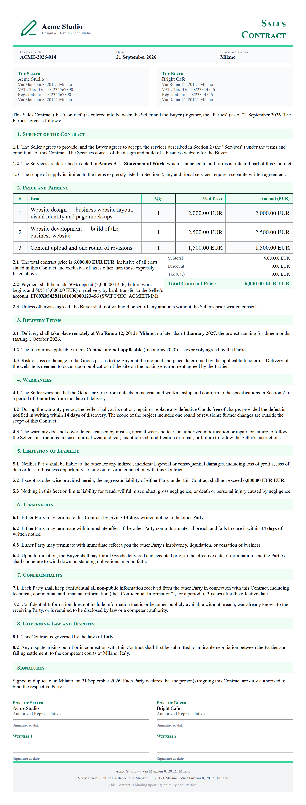

# Chapter 32 — A Professional Practice

*This chapter is a representative composite. It is not one real firm. It combines the common patterns we see in small law and accounting practices that adopt AI. All numbers are illustrative — they show the shape of the decision, not a promise. Replace them with your own.*

## Context

Picture a small commercial law firm. We will call it **Marlowe Legal**. It has twelve lawyers and a handful of support staff. It is not the kind of firm that argues in front of judges. It does paperwork: contracts, leases, company agreements, compliance advice. Clients are other businesses.

The work of such a firm is, at its core, reading and writing. A client sends a long contract and asks, "Is this safe to sign?" A new client calls and needs their matter opened. A standard lease needs to be drafted from the firm's template. At the end of the month, every lawyer writes down the minutes they spent and sends an invoice.

For years, all of this was done by hand. A junior lawyer reads a two-hundred-page contract and writes a summary. A receptionist takes the new-client call and fills a form. A senior lawyer types the same clauses into every lease. At night, everyone tries to remember what they worked on so they can bill it. The firm is profitable and respected. But it spends a great deal of expensive, trained time on work that is repetitive.

A professional practice is different from a shop or a factory in one crucial way. Everything it touches is **confidential**. A client's contract, a merger plan, a dispute file — these are protected by legal privilege, the rule that a client can speak freely to their lawyer without the contents being revealed. This single fact changes how AI can be used, and it is the thread running through this whole chapter.

## The Problem

The firm's problems are the same four leaks as everywhere else, but with a professional twist.

**Document review is slow and costly.** When a client asks the firm to review a contract, a junior lawyer reads every page and writes notes on risky clauses. For a big deal, this takes days. The client pays for those days. The work is careful but repetitive — the same kinds of risky clauses appear again and again, and the firm already knows what to look for. It just takes a long time to look.

**Client intake is inconsistent.** When a new client calls, the information captured depends on who answers. Some get a full picture; others miss a detail that matters later. Important facts fall through the cracks, and the lawyer has to chase them afterward.

**Drafting repeats itself.** The firm has templates, but every new lease or agreement still needs a lawyer to assemble the standard clauses and adjust them. It is reliable but slow, and it is exactly the kind of work that does not need a senior's judgment.

**Billing leaks.** Lawyers bill by the hour, but they are bad at recording every minute. A ten-minute call here, a quick email there — these often go unwritten. At the end of the month, the firm "writes off" hours it actually worked but never billed. Across twelve lawyers, this leak is large. One study of law firms has put typical unbilled time in the range of several percent of all worked hours; treat that as a directional figure, not a precise one. The point stands: the leak is real.

The constraint that sits over all four is confidentiality. Any tool that reads a client's contract must be a tool the firm can trust not to leak that contract. This is not a minor worry. It is the first question, before any other.

## The Solution

Marlowe Legal attacks the four leaks in order of safety, not just size. The rule is simple: start where a mistake is cheap and the data is not sensitive, and move toward the sensitive work only when the tooling is trustworthy.

**Document review that reads first, then the lawyer decides.** The firm uses an AI assistant that reads a contract and produces a first-pass summary: what the agreement does, which clauses are unusual, and which ones deviate from the firm's own standard positions. The junior lawyer no longer reads cold. They read the AI's notes and then verify against the real document. The AI shortlists the risky clauses; the lawyer makes the legal judgment. This is the same "machine drafts, human reviews" pattern that the Elanco case shows in [Chapter 25 — Administration and Finance](ch25-administration-and-finance.md).

**Intake that asks the right questions every time.** A structured intake assistant — a guided form on the website, or a chatbot that asks a fixed set of questions — captures the same facts for every new client. Nothing is missed because a person forgot to ask. The structured information flows straight into the case file. The chatbot side of this is the same technology covered in [Chapter 26 — Sales and Marketing](ch26-sales-and-marketing.md) and [Chapter 27 — Customer Care and Support](ch27-customer-care-and-support.md).

**Drafting assistance for the standard parts.** For routine documents, an AI drafting assistant assembles the standard clauses and proposes the wording. The lawyer reviews and adjusts. The senior lawyer stops typing boilerplate and starts reviewing drafts instead.

**Billing that captures time as it happens.** Instead of reconstructing the day at night, the firm uses a tool that turns activity — emails sent, documents opened, calendar entries — into a draft time entry with a suggested narrative. The lawyer reviews and confirms. The leak narrows because the starting point is a near-complete draft, not a blank page.

In every case, the human stays in charge. In a profession where a wrong answer harms a real client, the AI is a first-pass helper, never the decision-maker.

## The Tools

The tools are ordinary, but the way they are deployed is shaped by confidentiality.

- **A document-review assistant** that reads contracts and flags clauses against a checklist the firm writes itself. This is the same class of document-reading tool that handles invoices in [Chapter 25](ch25-administration-and-finance.md), pointed at legal text.
- **An intake chatbot or guided form** on the firm's website that asks a fixed set of questions and writes the answers into the case-management system.
- **A drafting assistant** for standard clauses and agreements, connected to the firm's templates.
- **A time-capture and billing assistant** that drafts time entries from the day's activity.

How to pick these tools without being dazzled by a demo is covered in [Chapter 17 — Choosing Tools Without Being Fooled](ch17-choosing-tools-without-being-fooled.md). How to connect them to the firm's existing case-management software is in [Chapter 19 — Connecting AI to Systems You Already Use](ch19-connecting-ai-to-systems-you-already-use.md).

**The confidentiality question comes first.** A general chatbot that you paste a client contract into may store that contract, train on it, or expose it. For a law firm, that can break privilege and client duty. The firm must use tools that keep client data private — either a business-grade service with a clear no-training, no-sharing contract, or a model run on the firm's own machines. Self-hosting is explained in [Chapter 8 — Self-Hosting: Keep Your Data Under Control](ch08-self-hosting-keep-your-data-under-control.md). The danger of staff quietly pasting client data into public tools — shadow AI — is the subject of [Chapter 9 — Third-Party Services and Shadow AI](ch09-third-party-services-and-shadow-ai.md). And because client files contain personal data, the privacy rules of [Chapter 10 — Privacy and GDPR](ch10-privacy-and-gdpr.md) apply in full.

## The Costs

Here is an illustrative first-year budget for a firm like Marlowe. These are made-up numbers to show the shape. Use your own.

**Direct costs.**
- Document-review assistant (business-grade, with a confidentiality contract): about €12,000 a year.
- Intake chatbot: about €3,600 a year.
- Drafting assistant: about €4,800 a year.
- Time-capture and billing assistant: about €4,800 a year.
- Setup and integration with the case-management system: about €9,000 one-time.
- Training the lawyers and staff: about €4,000 one-time.

First-year total: roughly **€38,200**. In steady years after, the recurring subscriptions come to about **€25,200**.

**Indirect costs.**
- Lawyers spend time reviewing every AI draft. This is the cost of the safety net, and it must stay.
- The learning dip while everyone adapts.
- The cost of a mistake if a draft is trusted without checking — in a profession, this can be far larger than the subscription. Budget for careful review, not for hope.
- Time spent vetting each tool for confidentiality and compliance before use.

The full method for counting these costs and turning the savings into a return figure is in [Chapter 16 — Goals, Costs, and Return on Investment](ch16-goals-costs-and-return-on-investment.md).

## The Results

After a year, measured against a baseline the firm recorded before starting, the illustrative outcome looks like this. Your numbers will differ. These show what a good fit can look like.

- **Document review sped up.** The junior lawyer's first pass on a long contract dropped from days to hours, because they started from the AI's summary and verified rather than reading cold.
- **Intake became complete.** Every new client now provides the same set of facts. Fewer gaps to chase later.
- **Drafting got faster.** Routine documents took a fraction of the time, because the lawyer reviewed a draft instead of assembling boilerplate.
- **Billing leakage narrowed.** Because time was captured as it happened, fewer worked hours went unwritten. The firm billed more of what it actually did.

The honest caveat: none of this was instant. The document-review assistant gave imperfect summaries at first and needed the firm's checklist tuned. The billing tool produced drafts that lawyers had to correct before trusting. The gains ramped up over weeks, as the learning-curve warning in [Chapter 16](ch16-goals-costs-and-return-on-investment.md) predicts. The firm measured the real numbers after the ramp, not during it.

## Lessons Learned

**Confidentiality is the first constraint, not an afterthought.** In a professional practice, the question is never only "does this tool work?" It is "can this tool be trusted with a client's private file?" Answer that before anything else. Use business-grade tools with a clear no-training contract, or self-host. See [Chapter 8](ch08-self-hosting-keep-your-data-under-control.md) and [Chapter 9](ch09-third-party-services-and-shadow-ai.md).

**The AI drafts; the professional advises.** A lawyer's value is judgment and accountability. The AI shortlists and drafts; the lawyer decides and signs. Never let a draft become advice without a human mind on it.

**Beware the confident wrong answer.** These tools can produce text that sounds right and is wrong — a clause that does not exist, a citation that is made up. In a profession, a fabricated reference is a disaster. Verify every citation and every legal claim against the real source. The reliability problem is covered in [Chapter 2](ch02-ai-explained-simply.md), and the duty to be honest about what AI can and cannot do is in [Chapter 4 — Ethical AI: Doing the Right Thing](ch04-ethical-ai-doing-the-right-thing.md).

**Start with the safe work.** Marlowe began with internal drafting and intake — low risk, not yet the most sensitive client files. It moved toward contract review only once the tooling was trusted. This is the "high ease first" rule from [Chapter 12](ch12-where-ai-can-help-your-business.md).

**Billing AI must be reviewed, both ways.** A time-capture tool can under-record, but it can also over-record or mislabel. Over-billing a client on an AI's guess is an ethical and legal problem. The lawyer reviews every entry. The rules around professional conduct and the EU AI Act's duties are in [Chapter 5 — Rules and Legal Responsibility](ch05-rules-and-legal-responsibility.md).

**Personal data is still personal data.** Client files hold names, addresses, financial details. The privacy duties in [Chapter 10](ch10-privacy-and-gdpr.md) apply to every one of them, no matter how the tool is marketed.

**Measure honestly and expect the ramp.** Record the baseline before you start. Judge the project after the learning curve, not during it.

The professional practice's lesson is the same as every sector's, with one extra guardrail: find the repetitive work, let AI draft and flag, keep a human on the judgment, and measure honestly — and in a profession, never let the tool touch a client's confidential file until you are certain it is safe to.

<!-- BEGIN agentbridge-examples -->

## Try it with AgentBridge

Here is how the same job looks with AgentBridge. Each box shows the finished result and the one line you type to get it.

### Draft a service contract

*A drafted service agreement, ready for review*

**What you ask:** `Draft a service contract between my studio and a client for a 3-month website project at 6,000 euros, with a 50% deposit.`

The agent produces a clear contract with the parties, the scope of work, the payment schedule, and the timeline. It is a starting point you can review and adjust — not legal advice, but a solid draft that saves you hours of blank-page work.

*Tip: Attach your old contract and ask it to follow the same style and clauses.*

<!-- END agentbridge-examples -->
