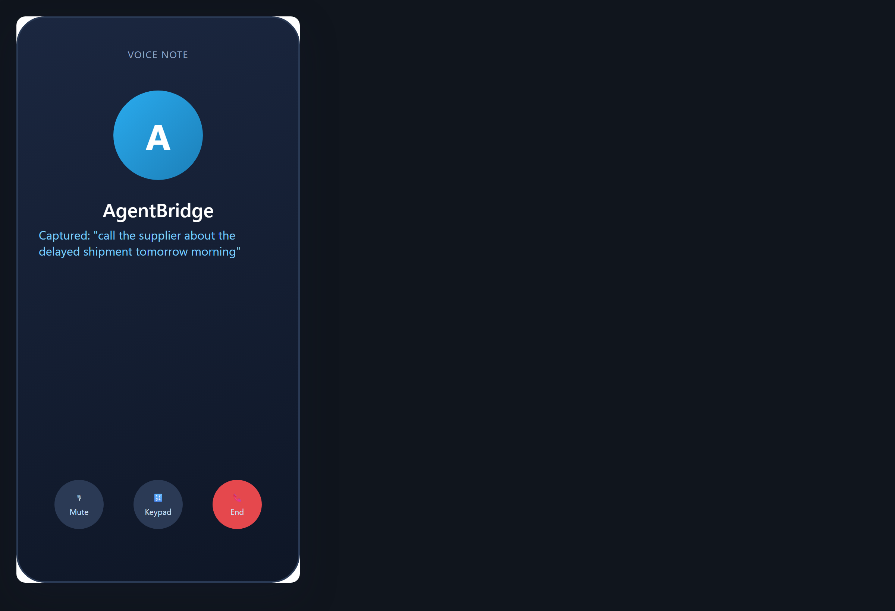

# Votre assistant par la voix et par téléphone

Vous n'êtes pas toujours assis à un bureau. AgentBridge vous écoute quand vous parlez, lit les réponses à voix haute et répond à un appel téléphonique comme une personne. Cela veut dire que vous pouvez utiliser votre assistant pendant que vos mains sont occupées ou quand vous êtes hors du bureau.

### Parlez au lieu d'écrire

*Une note vocale captée par l'agent*

**Ce que vous demandez :** `(speak) Prends une note : appeler le fournisseur demain matin au sujet de la livraison en retard.`

L'agent écoute et écrit la note pour vous. Vos mains restent libres ; l'idée est enregistrée.

*Conseil : La dictée fonctionne pour les messages, les notes et même des emails entiers — il suffit de parler.*

---

### Laissez l'agent vous le lire

*L'agent qui lit sa réponse à voix haute*

**Ce que vous demandez :** `Lis-moi à voix haute le résumé des commandes d'aujourd'hui.`

L'agent lit la réponse d'une voix claire. Utile quand vous vous déplacez, que vous cuisinez, ou que vos yeux sont fatigués.

*Conseil : Vous pouvez demander que n'importe quelle réponse soit lue à voix haute, pas seulement les résumés.*

---

### Appelez votre assistant par téléphone

*Un appel téléphonique à votre assistant AgentBridge*

**Ce que vous demandez :** `(phone) Qu'ai-je accepté de livrer au café cette semaine ?`

Vous appelez, vous dites ce dont vous avez besoin, et l'agent répond à partir de vos notes et de vos documents — par la voix, où que vous soyez.

*Conseil : L'accès par téléphone est protégé par un code PIN, donc vous seul pouvez joindre votre assistant.*

---

### En mains libres sur la route

*Un appel en mains libres pour vérifier votre journée*

**Ce que vous demandez :** `(phone) Lis-moi ma liste de rendez-vous pour aujourd'hui.`

L'agent lit vos rendez-vous par téléphone pour que vous restiez concentré sur la route tout en gardant votre journée en main.

*Conseil : Pendant la conduite, gardez les appels courts et ciblés ; gardez le travail long pour plus tard.*

## Points à retenir

- Vous pouvez configurer un travail une fois et laisser AgentBridge l'exécuter, lui parler, ou y accéder par téléphone et Telegram.
- Le résultat est le même travail fini que vous voyez dans les images, livré là où vous êtes.
- Vous gardez le contrôle : vous choisissez l'heure, le lieu, et qui peut l'utiliser.
