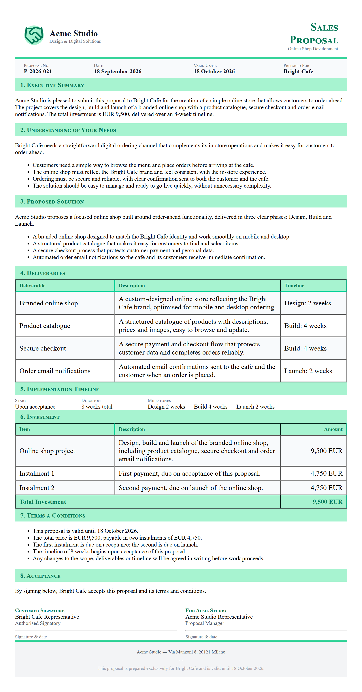
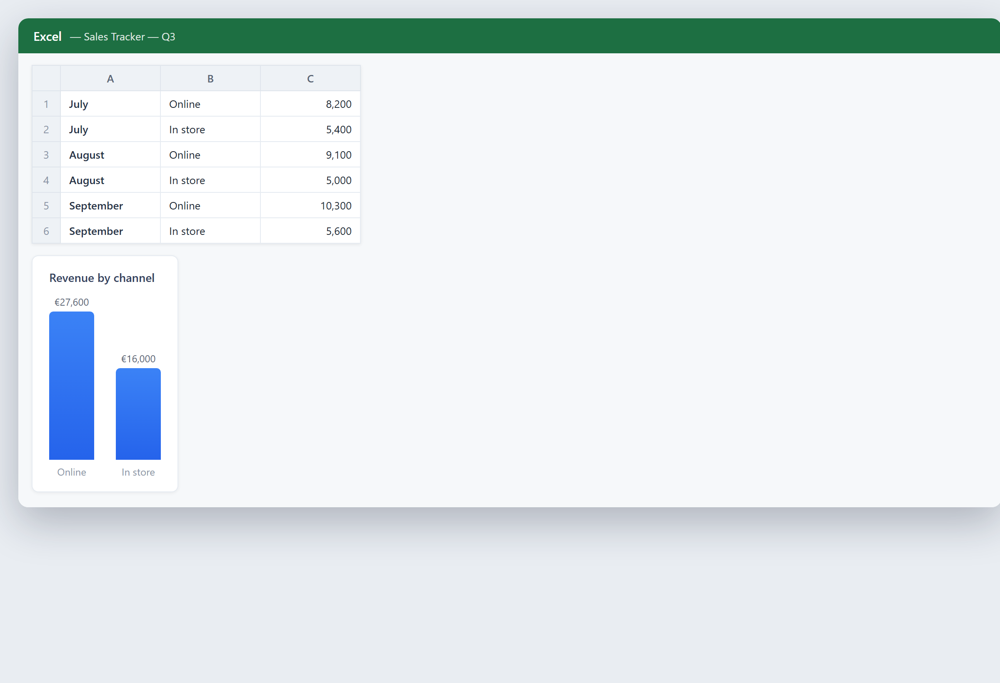
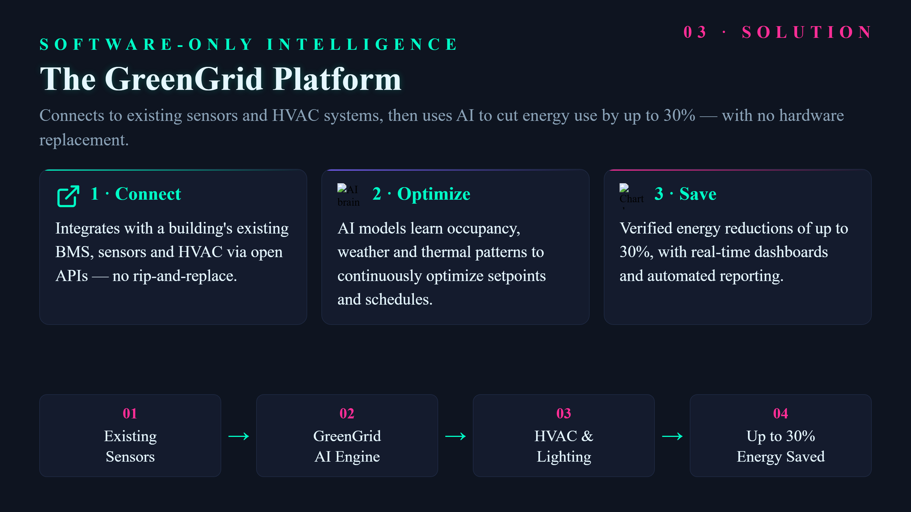
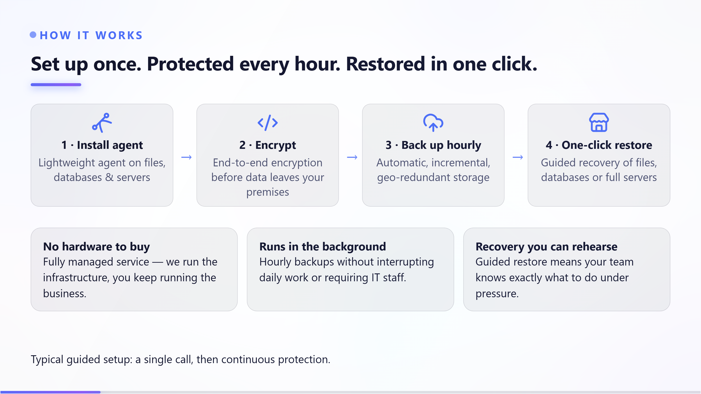
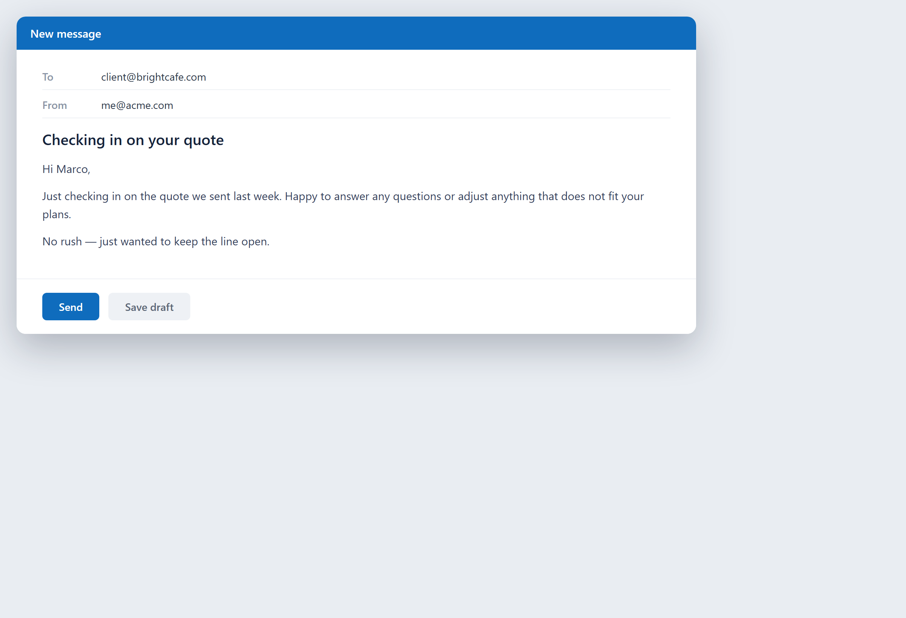
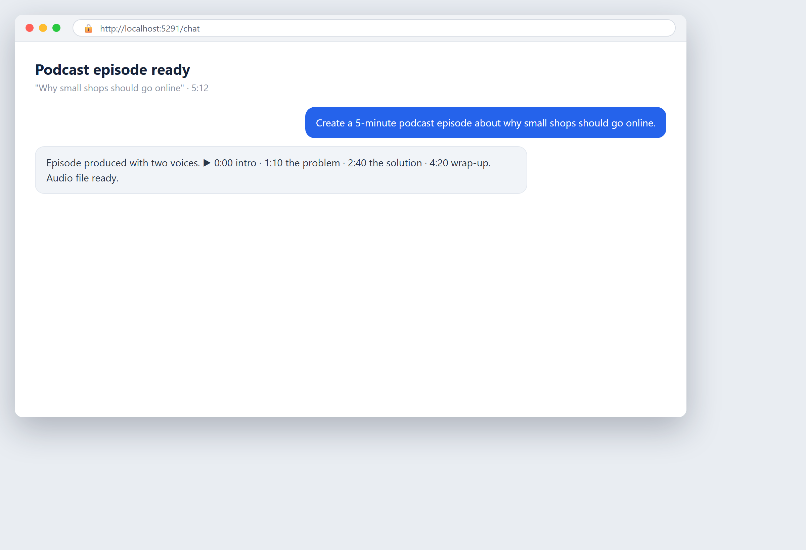

# Chapitre 26 — Ventes et marketing

## En mots simples

Les ventes et le marketing sont l'endroit où l'IA peut vous aider à trouver plus de clients, mieux leur parler, et passer moins de temps à deviner. Le travail ici est plein de petits jobs répétés : trier quels prospects méritent un appel, écrire des emails, répondre aux mêmes questions sur votre site web, et essayer de comprendre ce que vos clients veulent. L'IA est bonne dans tout cela.

L'idée centrale est la *personnalisation à grande échelle*. Un bon vendeur se souvient de chaque client, adapte le message, et relance au bon moment. Une petite équipe ne peut pas faire cela pour des milliers de gens. L'IA le peut. Elle peut regarder chaque prospect et deviner à quel point il est susceptible d'acheter, écrire un email qui semble écrit pour cette personne, répondre à la question d'un visiteur à 2 h du matin, et repérer quels clients sont sur le point de partir.

Ce chapitre couvre quatre jobs : noter les prospects (deviner qui est le plus susceptible d'acheter), écrire des emails et du contenu, faire tourner des chatbots et des assistants, et analyser les clients pour comprendre ce qu'ils veulent et qui risque de partir.

Un avertissement honnête avant de commencer : l'IA est un puissant amplificateur. Elle fera atteindre plus de gens à un bon message, et elle fera atteindre plus de gens à un mauvais message aussi. Elle peut aussi vous pousser vers le spam — envoyer trop, trop souvent, à des gens qui n'ont rien demandé. Le but n'est pas de bombarder tout le monde ; c'est d'atteindre la bonne personne avec le bon message au bon moment. La méthode pour juger si tout cela rapporte vit dans le [Chapitre 16 — Objectifs, coûts et retour sur investissement](ch16-goals-costs-and-return-on-investment.md) ; ce chapitre vous montre quoi automatiser et comment.

## Un peu d'histoire

**Années 1990 : le marketing de masse et la liste de diffusion.** L'automatisation du marketing a commencé avec de simples listes d'emails. Une entreprise pouvait envoyer un message à des milliers de gens à la fois. C'était bon marché et large, mais grossier — tout le monde recevait le même message, que ça lui aille ou non. C'était l'ère du « tirer et prier ».

**Années 2000 : le CRM et l'entonnoir.** Les logiciels de Customer Relationship Management (CRM) — une base de données de chaque client et de chaque interaction — sont arrivés. Les marketeurs ont commencé à penser en « entonnoir » : beaucoup de gens entrent en haut, moins arrivent à un achat en bas. Le CRM permettait de suivre où chaque personne était dans l'entonnoir et de relancer. Les données sont entrées dans le tableau.

**Années 2010 : segmentation et personnalisation.** Avec plus de données, les marketeurs ont appris à diviser leur audience en groupes (segments) et à envoyer à chaque groupe un message différent. « Les gens qui ont acheté X ont aussi acheté Y. » La personnalisation rendait les messages plus pertinents et plus efficaces. Mais c'était encore surtout à base de règles : si un client faisait ceci, envoyer cela.

**Fin des années 2010 : l'apprentissage automatique note les prospects.** L'apprentissage automatique — un logiciel qui apprend des motifs à partir de nombreux exemples — a commencé à noter les prospects. Au lieu qu'une personne devine qui appeler en premier, le modèle regardait des centaines de signaux (taille de l'entreprise, quelles pages ils ont visitées, comment ils vous ont trouvé) et classait les prospects selon leur probabilité d'acheter. Les équipes de ventes ont cessé de gaspiller du temps sur des prospects froids.

**Années 2020 : l'IA générative écrit et discute.** Les grands modèles de langage — IA entraînée sur d'énormes quantités de texte — peuvent maintenant écrire des emails, des textes publicitaires et des descriptions de produits qui sonnent humains. Des chatbots construits sur la même technologie peuvent tenir une vraie conversation, répondre à des questions, et guider un client à travers un achat. Le chatbot est passé d'un menu frustrant de boutons à quelque chose qui comprend réellement ce que vous avez tapé.

**Maintenant : des agents qui travaillent tout le parcours.** La dernière étape est l'agent — une IA qui mène une tâche à travers plusieurs étapes. Un agent orienté client peut répondre à une question, vérifier le stock, et guider un achat. Un agent interne peut prendre une demande de support et créer le ticket. L'exemple mobilezone ci-dessous utilise exactement cela : deux agents, un pour les clients et un pour l'équipe interne.

L'arc : d'un message pour tous, aux entonnoirs suivis, aux segments, aux prospects notés, à l'IA qui écrit et discute. Chaque étape a rendu le marketing plus personnel et moins un jeu de devinettes.

## Curiosité

### 26.5 Le chatbot qui est devenu deux agents

Quand mobilezone, un détaillant suisse en télécoms, a remplacé son vieux chatbot, il n'a pas construit un meilleur bot. Il a construit deux agents différents pour deux jobs différents : un orienté vers les clients, un orienté vers son propre personnel. Cette division est l'idée intéressante. La même technologie d'IA a servi deux publics de deux façons très différentes — un guide d'achat amical sur le site web, et une aide à la rédaction de tickets dans l'entreprise. L'histoire, avec les vrais chiffres, est ci-dessous.

## Un exemple d'entreprise réel

**mobilezone : deux agents Copilot, un pour les clients et un pour l'IT.**

mobilezone est un détaillant suisse en télécommunications avec plus de 125 magasins physiques, vendant des téléphones, des forfaits et des objets connectés. Il avait deux problèmes séparés. Côté client, son vieux chatbot du site web était rigide et frustrant — il ne pouvait suivre qu'un menu fixe et échouait souvent à répondre aux vraies questions. Dans l'entreprise, le personnel devait remplir des formulaires patauds pour signaler les problèmes IT, ce qui ralentissait tout le monde.

Selon une étude de cas client Microsoft publiée, mobilezone a reconstruit les deux côtés en utilisant Microsoft Copilot Studio — un outil pour construire des agents conversationnels d'IA — avec Dynamics 365 (son CRM) et la Power Platform (les outils d'automatisation low-code de Microsoft). Il a construit deux agents :

- **Mia — l'agent orienté client.** Mia est un assistant multilingue sur le site web. Il répond aux questions clients à fort volume, aide les visiteurs à trouver le bon produit ou forfait, et les guide à travers un achat. Parce qu'il comprend le langage naturel, il gère les questions que le vieux bot à menu ne pouvait pas.
- **Supporto — l'agent IT interne.** Supporto est une aide pour le propre personnel de mobilezone. Au lieu de remplir un formulaire rigide, un employé dit à Supporto ce qui est cassé en mots simples, et l'agent crée le ticket IT automatiquement.

Les résultats rapportés : les agents gèrent maintenant **plus de 1 600 chats par mois**, et l'agent IT interne a **réduit le temps de résolution IT d'environ 50 %**. Tout aussi important, les agents ont réduit la charge sur le centre de contact externe de mobilezone (le support téléphonique sous-traité), et l'agent client a amélioré la conversion en ligne en guidant les acheteurs à travers la découverte produit.

Deux leçons ressortent. D'abord, la même technologie a servi deux jobs très différents — ventes externes et support interne — ce qui montre à quel point ces agents sont flexibles. Ensuite, mobilezone n'a pas remplacé les humains ; il a déplacé les conversations faciles et répétitives vers l'agent pour que son personnel puisse se concentrer sur les plus dures. C'est la promesse réaliste : l'IA gère le volume, les humains gèrent la valeur.

Une note sur la source : les chiffres ci-dessus viennent de l'histoire client publiée de Microsoft sur mobilezone. Traitez-les comme les résultats déclarés de mobilezone ; vos propres chiffres dépendront de votre volume et de votre configuration.

## Comment faire

### 26.1 Notation des prospects

Un *prospect* est une personne ou une entreprise qui a montré un peu d'intérêt — elle a rempli un formulaire, téléchargé quelque chose, ou posé une question. Vous n'avez pas le temps d'appeler chaque prospect avec le même effort. Noter les prospects veut dire les classer selon leur probabilité d'acheter, pour que votre équipe appelle les plus chauds en premier.

**Comment l'IA note un prospect.** Un modèle d'apprentissage automatique regarde beaucoup de signaux à la fois : la taille de l'entreprise du prospect, l'intitulé de poste de la personne, quelles pages elle a visitées, combien de fois elle est revenue, si elle a ouvert vos emails, et comment elle vous a trouvé. À partir des affaires passées qui se sont conclues, le modèle apprend quels signaux vont ensemble avec une vente, et il note chaque nouveau prospect en conséquence.

**Pourquoi ça bat le devinage.** Une personne qui note les prospects au feeling est lente et biaisée — elle tend à favoriser les prospects qui « semblent » amicaux, pas ceux qui convertissent vraiment. L'IA note de façon cohérente et rapide, et elle peut peser des centaines de signaux qu'une personne ne peut pas garder dans sa tête.

**Commencez simplement.** Vous n'avez pas besoin d'un modèle parfait dès le premier jour. Commencez avec quelques signaux clairs — taille d'entreprise, rôle, et ce qu'ils ont téléchargé — et notez les prospects à la main dans votre CRM. Au fur et à mesure que vous collectez plus d'affaires conclues, un vrai modèle peut apprendre d'elles et s'améliorer.

**Nourrissez la boucle.** Le modèle s'améliore quand vous lui dites quels prospects sont devenus des clients. Assurez-vous que votre CRM enregistre le résultat de chaque affaire, pour que la notation apprenne de vrais résultats, pas des devinettes.

**Ne faites pas trop confiance au score.** Un score est un indice, pas un verdict. Un score élevé veut dire « appeler bientôt », pas « vente garantie ». Un score bas peut quand même être un bon client que le modèle n'a pas encore appris. Utilisez le score pour fixer la priorité, pas pour ignorer des gens.

### 26.2 Email et contenu

Écrire des emails, des textes publicitaires et des descriptions de produits prend des heures. L'IA générative — IA qui produit du texte — peut les rédiger vite, et une personne peut les éditer pour qu'ils sonnent juste.

**Rédigez, n'expédiez pas.** Utilisez l'IA pour produire un premier brouillon, puis éditez-le. L'IA est excellente pour mettre des mots sur la page rapidement et terrible pour connaître votre voix exacte, votre marque et les sentiments de votre client sans guidance. Le brouillon est à 70 % ; votre édition est les derniers 30 % qui le rendent vôtre.

**Personnalisez à grande échelle.** L'IA peut prendre un modèle et l'adapter pour beaucoup de gens : insérer le nom du destinataire, référencer ce qu'ils ont regardé, adapter l'offre à leur segment. C'est l'idée de personnalisation à grande échelle vue plus tôt — un message qui semble écrit pour une seule personne, envoyé à des milliers.

**Adaptez-vous au canal.** Un email, un post sur les réseaux sociaux et une page produit demandent des longueurs et des tons différents. Dites à l'IA le canal et l'objectif, et éditez en conséquence. Un email long ne marche pas comme un tweet ; un tweet ne marche pas comme une page d'atterrissage.

**Gardez la voix humaine.** Le texte d'IA peut sonner plat, générique, ou trop empressé. Lisez chaque brouillon à voix haute. S'il ne sonne pas comme quelque chose que vous diriez, réécrivez-le. Vos clients sentent quand un message est générique.

**Ne laissez jamais l'IA envoyer sans révision.** Un email IA non révisé peut contenir un mauvais prix, un mauvais nom, ou une ligne inappropriée. Ayez toujours un humain qui lit avant que ça parte. C'est la même règle qu'en finance : l'IA rédige, l'humain approuve.

**Surveillez le volume.** L'IA rend facile d'envoyer plus d'emails que vous ne devriez. Plus n'est pas mieux. Envoyer trop à des gens qui n'ont pas demandé est du spam, et ça brûle votre liste et votre réputation. Envoyez moins, mais faites compter chacun.

### 26.3 Chatbots et assistants

Un chatbot est un programme qui parle avec un client sur votre site web ou application. Les chatbots modernes, construits sur des grands modèles de langage, comprennent ce qu'une personne tape et répondent en langage simple — un énorme pas en avant par rapport aux vieux menus « appuyez sur 1 pour les ventes ».

**Ce que fait un bon chatbot.** Il répond instantanément aux questions courantes (prix, horaires, livraison, retours), guide un visiteur vers le bon produit, capture des coordonnées pour une relance, et passe la main à un humain quand il ne peut pas aider. Le passage de main est critique : un chatbot qui ne passe jamais la main frustre les gens et perd des ventes.

**Concevez le passage de main d'abord.** Avant de construire le bot, décidez quand il doit passer la conversation à une personne. Quand le bot n'est pas sûr, quand le client demande un humain, quand le sujet est sensible — passez la main. Un bot qui connaît ses limites est digne de confiance ; un qui bluffe ne l'est pas.

**Entraînez-le sur vos vraies questions.** Nourrissez le bot des questions que les clients posent réellement, avec les réponses que vous voulez. Plus il connaît vos produits et politiques spécifiques, plus il est utile. Un bot générique donne des réponses génériques qui frustrent.

**Laissez-le parler plusieurs langues.** L'une des plus grandes victoires d'un chatbot moderne est le support multilingue. Il peut répondre à un client dans sa propre langue sans que vous engagiez de traducteurs. C'est exactement ce que fait Mia de mobilezone.

**Mesurez ce qu'il gère et ce sur quoi il échoue.** Suivez combien de conversations le bot résout seul, combien il passe, et ce à quoi il n'a pas pu répondre. Les échecs sont de l'or — ils vous disent quoi lui apprendre ensuite. (Les mêmes idées de chatbot, appliquées au support plutôt qu'aux ventes, sont traitées au [Chapitre 27 — Relation client et assistance](ch27-customer-care-and-support.md).)

### 26.4 Analyse client

L'analyse client veut dire utiliser les données pour comprendre qui sont vos clients, ce qu'ils veulent, et qui est sur le point de partir. L'IA est forte ici parce qu'elle peut voir des motifs à travers des milliers de clients qu'aucune personne ne pourrait repérer à la main.

**Segmentez vos clients.** L'IA peut regrouper les clients par comportement : acheteurs fréquents, gros dépensiers, acheteurs saisonniers, clients à risque. Chaque groupe a besoin d'un message différent. C'est la segmentation, et l'IA le fait plus vite et plus précisément que des règles manuelles.

**Repérez l'attrition avant qu'elle n'arrive.** L'*attrition* (churn) veut dire qu'un client cesse d'acheter. L'IA peut regarder des signaux — moins de visites, des commandes plus petites, moins d'engagement — et signaler les clients susceptibles de partir bientôt. Cela vous donne du temps pour les reconquérir avec une offre ou un appel personnel, au lieu de l'apprendre après leur départ.

**Trouvez la prochaine meilleure offre.** L'IA peut regarder ce qu'un client a acheté et suggérer ce qu'il voudra probablement ensuite. « A acheté un téléphone, a probablement besoin d'une coque et d'une assurance. » C'est l'idée du moteur de recommandation, et elle élève la valeur de chaque client.

**Lisez ce que disent les clients.** L'IA peut lire des avis, des commentaires de sondages et des chats de support, et en extraire les grands thèmes : ce que les gens adorent, ce qui les agace, ce qu'ils demandent. Au lieu de lire mille commentaires un par un, vous obtenez un résumé des grands thèmes. Cela transforme un retour brut en quelque chose sur quoi vous pouvez agir.

**Ne traitez pas les gens comme des points de données.** L'analyse est un outil pour mieux servir les clients, pas pour les manipuler. Utilisez ce que vous apprenez pour améliorer leur expérience, pas pour exploiter leurs faiblesses. La ligne entre personnalisation et manipulation est réelle, et vous devriez rester du bon côté.

## Éthique et responsabilité

Les ventes et le marketing touchent directement l'attention et la confiance des gens, alors la ligne éthique compte.

**Ne spammez pas.** L'IA rend facile d'envoyer trop. Envoyer des messages à des gens qui n'ont pas demandé, ou plus qu'ils n'ont accepté, est du spam. Respectez le consentement et la fréquence. Une courte liste de gens qui veulent vos messages bat une énorme liste que vous bombardez.

**Soyez honnête dans le contenu écrit par IA.** L'IA peut écrire une affirmation qui semble vraie mais ne l'est pas. Vérifiez chaque affirmation factuelle — prix, fonctionnalités, résultats — avant qu'elle ne parte. Ne laissez jamais l'IA inventer un bénéfice que vous ne pouvez pas livrer.

**Divulguez quand c'est un bot.** Dans beaucoup d'endroits, et par bonne pratique, un client devrait savoir qu'il parle à un chatbot et pas à une personne. Rendez le passage de main à un humain facile et clair.

**Respectez la vie privée.** L'analyse client utilise des données personnelles. Suivez les règles pour les manipuler — les bases sont dans le [Chapitre 10 — Vie privée et RGPD](ch10-privacy-and-gdpr.md). Collectez seulement ce dont vous avez besoin, dites aux gens ce que vous collectez, et gardez-le en sécurité.

**Ne manipulez pas.** La personnalisation devrait aider les gens à trouver ce qu'ils veulent, pas les pousser vers un achat dont ils se repentiront. Évitez les « dark patterns » — des astuces qui mettent la pression sur les gens. Construisez la confiance, pas un piège.

**Gardez un humain dans la boucle.** L'IA rédige l'email, la pub, la réponse. Un humain révise avant que ça atteigne un client. Cette seule règle prévient la plupart des dégâts.

## Erreurs à éviter

**Spammer avec l'IA.** Utiliser la puissance de l'outil pour envoyer plus que les gens ne veulent. Envoyez moins, faites-le compter.

**Expédier du contenu IA non révisé.** Un mauvais prix ou une fausse affirmation dans un email écrit par IA abîme la confiance. Révisez toujours.

**Un chatbot qui ne passe jamais la main.** Un bot qui bluffe au lieu de passer à un humain frustre les clients et perd des ventes. Concevez le passage de main d'abord.

**Un contenu générique et plat.** Du texte IA qui sonne comme celui de tout le monde. Éditez pour votre voix ou il sera ignoré.

**Trop faire confiance au score des prospects.** Traiter un score comme un verdict au lieu d'un indice. Utilisez-le pour fixer la priorité, pas pour ignorer des gens.

**Poubelle en entrée, poubelle en sortie.** Si vos données CRM sont désordonnées, les segments et les signaux d'attrition sont faux. Nettoyez vos données d'abord.

**Traiter les clients comme des points de données.** Utiliser l'analyse pour manipuler au lieu de servir. Restez du bon côté éthique.

**Pas de divulgation des bots.** Laisser un chatbot prétendre être humain. Soyez clair.

**Ignorer les règles de vie privée.** Utiliser des données personnelles sans consentement ni sécurité. Suivez les bases du RGPD.

**Confondre activité et résultats.** Compter les emails envoyés au lieu des affaires conclues. Mesurez les résultats, pas le volume.

**Sauter la référence de départ.** Ne pas mesurer la conversion avant, si bien que vous ne pouvez pas prouver le gain. Mesurez d'abord (voir le Chapitre 22).

**Remplacer entièrement le contact humain.** Les clients veulent toujours une personne pour les problèmes durs. Gardez les humains pour les conversations à valeur.

## Exercice pratique

### 26.7 Exercice : planifiez une campagne assistée par IA

Choisissez une campagne — un email à d'anciens clients, un chatbot sur votre site, ou une passe de notation de prospects — et planifiez-la de bout en bout.

**Étape 1 — Choisissez le job.** Choisissez un : notation de prospects, campagne email, chatbot, ou analyse client. Faites-en un, pas tous.

**Étape 2 — Définissez l'objectif et la métrique.** Que devrait accomplir ceci ? Inscriptions, réponses, questions résolues, clients reconquis ? Choisissez un nombre à mesurer.

**Étape 3 — Mesurez la référence de départ.** Ce nombre est à combien maintenant ? Écrivez-le. Sans lui vous ne pouvez pas prouver le gain.

**Étape 4 — Rassemblez les données.** Pour la notation : vos prospects passés et lesquels se sont conclus. Pour l'email : votre liste consentie. Pour le chatbot : vos vraies questions et réponses clients. Pour l'analyse : vos enregistrements clients. Nettoyez les données d'abord.

**Étape 5 — Construisez la partie IA.** Notez les prospects, rédigez l'email, entraînez le bot, ou lancez la segmentation. Laissez l'IA faire le gros du travail.

**Étape 6 — Ajoutez la révision humaine.** Lisez chaque brouillon. Vérifiez chaque affirmation factuelle. Décidez les règles de passage de main du chatbot. Rien ne part sans une lecture humaine.

**Étape 7 — Vérifiez le consentement et la vie privée.** Confirmez que vous êtes autorisé à envoyer des messages à ces gens et que leurs données sont manipulées correctement.

**Étape 8 — Lancez petit et mesurez.** Faites-le tourner sur un petit groupe d'abord. Comparez la métrique à la référence de départ. Si ça marche, montez en échelle. Sinon, apprenez et ajustez.

Faites une campagne bien. Les leçons que vous apprenez — sur le ton, sur les passages de main, sur ce à quoi vos clients répondent — se reportent dans chaque campagne suivante.

## Checklist

### 26.8 Checklist ventes et marketing

Avant de lancer toute activité de vente ou de marketing assistée par IA, vérifiez ceci.

- [ ] **Vous avez mesuré la référence de départ** pour la seule métrique qui vous importe.
- [ ] **Un humain révise chaque message écrit par IA** avant qu'il n'atteigne un client.
- [ ] **Chaque affirmation factuelle est vérifiée** — prix, fonctionnalités, résultats.
- [ ] **Vous avez le consentement** pour envoyer des messages aux gens à qui vous en envoyez.
- [ ] **Vous respectez la fréquence** — pas de spam, pas de sur-envoi.
- [ ] **Le chatbot a des règles de passage de main claires** vers un humain.
- [ ] **Le chatbot est entraîné sur vos vraies questions**, pas des génériques.
- [ ] **Vous divulguez que c'est un bot** là où requis et par bonne pratique.
- [ ] **Vous nettoyez vos données** avant de noter, segmenter ou analyser.
- [ ] **Vous renvoyez les résultats** au modèle de notation des prospects pour qu'il apprenne.
- [ ] **Vous traitez le score des prospects comme un indice**, pas un verdict.
- [ ] **Vous utilisez l'analyse pour servir les clients**, pas pour les manipuler.
- [ ] **Vous suivez les règles de vie privée** (bases du RGPD, voir le Chapitre 10).
- [ ] **Vous gardez les humains pour les conversations difficiles.**
- [ ] **Vous mesurez les résultats** (affaires, réponses, victoires), pas juste le volume envoyé.
- [ ] **Vous lancez petit d'abord** et ne montez en échelle que ce qui fait ses preuves.

Si une case est vide, vous mettez la confiance en risque. Remplissez-la avant d'appuyer sur envoyer.

## Points clés à retenir

- L'IA aide les ventes et le marketing en personnalisant à grande échelle — notant les prospects, adaptant les messages, répondant aux questions, et repérant les clients à risque.
- Le cas mobilezone (une histoire client Microsoft) a construit deux agents Copilot Studio — Mia pour les clients, Supporto pour l'IT interne — gérant plus de 1 600 chats par mois et réduisant le temps de résolution IT d'environ 50 %.
- L'IA rédige, un humain révise : n'expédiez jamais un message écrit par IA et ne laissez pas un chatbot bluffer au lieu de passer la main à une personne.
- Des données propres sont la fondation — des enregistrements désordonnés rendent les scores de prospects, les segments et les signaux d'attrition faux.
- Utilisez l'IA pour mieux servir les clients, pas pour les spammer ou les manipuler ; le consentement et l'honnêteté protègent la confiance sur laquelle vous vendez.

<!-- BEGIN agentbridge-examples -->

## Essayez avec AgentBridge

Voici à quoi ressemble le même travail avec AgentBridge. Chaque encadré montre le résultat fini et la seule ligne que vous tapez pour l'obtenir.

### Transformer une idée en proposition

*Un document de proposition de projet structuré*

**Ce que vous demandez :** `Crée une proposition de projet pour une petite boutique en ligne : objectifs, ce que nous livrons, un calendrier de 8 semaines, et un prix de 9 500 euros.`

L'agent construit une proposition avec l'objectif du client, votre solution, les livrables, le calendrier et le prix — le tout dans une mise en page propre qui a l'air d'avoir pris tout un après-midi. Cela a pris une minute.

*Astuce : Ajoutez votre logo et une phrase sur vos résultats passés pour lui donner une touche personnelle.*

---

### Suivre vos ventes

*Un suivi des ventes avec le chiffre d'affaires par canal*

**Ce que vous demandez :** `Crée un suivi des ventes avec mois, canal et chiffre d'affaires, et un graphique du chiffre d'affaires par canal.`

L'agent construit le suivi et le graphique. Ajoutez des lignes au fur et à mesure, ou joignez votre liste de ventes brute et demandez-lui de remplir la feuille pour vous.

*Astuce : Joignez un export désordonné de votre boutique et dites « nettoie ça en un suivi » — il le fera.*

---

### Une présentation pitch à partir d'une seule invite

*Une diapositive de présentation construite par l'agent*

**Ce que vous demandez :** `Fais une présentation pitch de 6 diapositives pour ma startup de livraison : problème, solution, marché, modèle, traction, demande.`

L'agent conçoit les diapositives avec un look propre, une idée claire par diapositive, et le bon ordre pour un pitch. Dans le navigateur, appuyez sur F11 pour le plein écran et présentez.

*Astuce : Besoin d'un vrai .pptx à envoyer ? Utilisez /tools office-files et demandez PowerPoint.*

---

### Une deck de vente client

*Une diapositive de présentation de vente orientée client*

**Ce que vous demandez :** `Crée une deck de vente résumant notre travail avec Acme et proposant la prochaine phase.`

L'agent construit une deck focalisée : les résultats jusqu'ici, ce que le client a gagné, et la prochaine étape proposée. Vous ajustez les chiffres et présentez avec assurance.

*Astuce : Joignez le rapport de projet et l'agent tire les points forts dans les diapositives.*

---

### Une relance polie

*Un brouillon d'email de relance amical*

**Ce que vous demandez :** `Écris une courte relance à un client qui n'a pas répondu à notre devis de la semaine dernière.`

L'agent écrit une pichenette légère et polie qui rappelle sans pression. Vous l'envoyez et gardez la relation chaleureuse.

*Astuce : Une relance programmée peut envoyer celles-ci pour vous si une réponse n'est pas arrivée.*

---

### Une newsletter client

*Un brouillon de newsletter prêt à envoyer*

**Ce que vous demandez :** `Écris une newsletter mensuelle pour nos clients : nouveautés, une astuce, et un petit code de réduction.`

L'agent écrit la newsletter dans votre voix avec les nouvelles, une astuce utile et l'offre. Envoyez-la, ou laissez-le en préparer une selon un calendrier.

*Astuce : Une tâche programmée mensuelle peut rédiger la newsletter pour votre révision à chaque fois.*

---

### Transformer un sujet en podcast

*Un épisode de podcast prêt à être joué*

**Ce que vous demandez :** `Crée un épisode de podcast de 5 minutes sur pourquoi les petites boutiques devraient se mettre en ligne, dans un style amical à deux voix.`

L'agent écrit le script et produit un épisode audio avec deux voix, prêt à publier. Votre message, en forme audio, sans studio.

*Astuce : Donnez-lui vos points clés et il les façonne en une conversation naturelle.*

<!-- END agentbridge-examples -->
