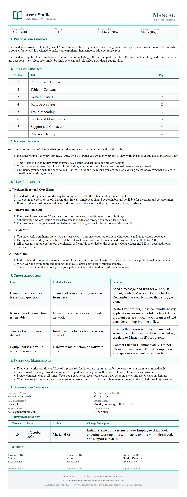
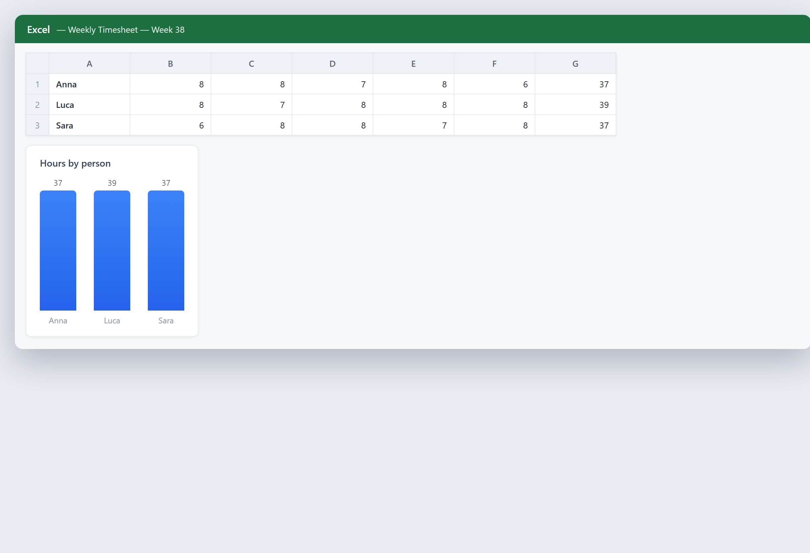
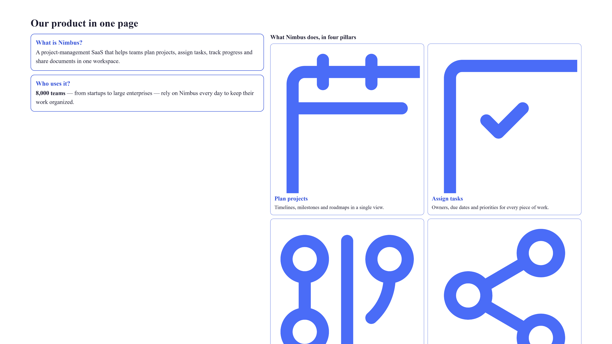

# Chapitre 28 — Ressources humaines et personnel

## En mots simples

Les ressources humaines sont l'endroit où une entreprise rencontre ses gens. Recruter, former, aider les nouveaux employés à s'installer, et comprendre pourquoi les gens partent — cela façonne toute l'entreprise. C'est aussi plein de travail répétitif : lire des centaines de CV, répondre aux mêmes questions d'intégration, trier la formation par rôle, et fouiller de vieux dossiers pour trouver pourquoi le personnel démissionne. L'IA peut prendre la partie répétitive de chaque métier et laisser la partie humaine — le jugement, l'équité et le soin — là où elle doit être.

Pensez aux RH comme à un entonnoir et un jardin en même temps. L'entonnoir est le recrutement : beaucoup de gens entrent en haut, et vous les réduisez à quelques bons ajustements. Le jardin est tous ceux que vous avez déjà : vous les arrosez de formation, vous guettez les signes de problème, et vous essayez de les garder en croissance. L'IA aide aux deux bouts. Dans l'entonnoir, elle trie et fait des listes présélectionnées plus vite qu'une personne ne peut lire. Dans le jardin, elle repère des modèles dans mille petits signaux qu'aucun manager ne pourrait garder dans sa tête.

Ce chapitre couvre quatre métiers : filtrer les CV et les candidatures, intégrer les nouveaux embauchés, la formation personnalisée, et l'analyse du roulement. Chacun est un endroit où une petite entreprise peut économiser du temps et prendre de meilleures décisions sur les gens.

Une idée honnête avant de commencer : les gens ne sont pas des factures. Un mauvais chiffre sur une facture coûte de l'argent ; une mauvaise décision sur une personne coûte une vie, une carrière, et votre réputation. Donc l'IA dans les RH est une *assistante*, jamais la *juge*. Elle lit, trie, suggère et signale. Une personne décide encore qui obtient le poste, qui obtient la promotion, et pourquoi quelqu'un est licencié. Et en Europe, le recrutement et la gestion des travailleurs sont traités comme des utilisations à haut risque de l'IA, avec de vrais devoirs légaux. Le traitement complet du règlement européen sur l'IA vit dans le [Chapitre 5 — Règles et responsabilité juridique](ch05-rules-and-legal-responsibility.md) ; ce chapitre vous montre quoi automatiser et comment, et où la loi trace une ligne. La méthode pour juger si tout cela rapporte vit dans le [Chapitre 16 — Objectifs, coûts et retour sur investissement](ch16-goals-costs-and-return-on-investment.md).

## Un peu d'histoire

**Années 1980-1990 : la base de données RH.** Le premier grand changement dans le travail RH fut le dossier de personnel informatisé. Au lieu de dossiers papier dans une armoire, les enregistrements des employés vivaient dans une base de données. La paie, les présences et les détails personnels sont devenus consultables. C'était la première fois que le logiciel touchait le cœur des RH, et il a fixé le schéma : stocker les données, garder l'humain aux commandes des décisions.

**Années 1990-2000 : le système de suivi des candidatures.** À mesure que les candidatures sont passées en ligne, les entreprises ont adopté le système de suivi des candidatures, ou ATS — un logiciel qui collecte les candidatures, les stocke, et laisse les recruteurs les chercher et les trier. Un recruteur pouvait maintenant voir chaque candidat pour un poste au même endroit et filtrer par mots-clés. Cela a mis de l'ordre dans le flot de candidatures en ligne, mais le filtrage était simple : il faisait correspondre des mots, pas des personnes.

**Années 2000 : l'e-learning et le système de gestion de l'apprentissage.** La formation est passée de la salle de classe à l'écran. Le système de gestion de l'apprentissage, ou LMS, délivrait des cours en ligne et suivait qui complétait quoi. Cela a rendu la formation extensible, mais les premières versions étaient taille unique : tout le monde regardait la même vidéo, quel que soit ce qu'il savait déjà.

**Années 2010 : l'analytique des gens (people analytics).** Les entreprises ont commencé à analyser les données RH comme elles analysaient les données de ventes. Elles regardaient quelles embauches restaient, quelles équipes performaient, et quels signaux prédisaient qu'une personne démissionne. L'analytique des gens a transformé les RH d'une fonction de paperasse en une fonction de données. Mais elle avait besoin de gros jeux de données et d'analystes qualifiés, donc surtout les grandes entreprises pouvaient le faire.

**Années 2020 : les grands modèles de langage lisent et écrivent sur les gens.** Les grands modèles de langage — IA entraînée sur d'énormes quantités de texte — peuvent maintenant lire un CV et une description de poste et juger à quel point ils correspondent, rédiger un plan de formation personnalisé, et répondre à une question RH d'un employé en langage simple. C'est la dernière étape : une IA qui lit les mots que les gens écrivent et raisonne à leur sujet. Elle est puissante, et précisément parce qu'elle est puissante, c'est le domaine où la loi est la plus stricte.

L'arc : des dossiers papier, aux bases de données consultables, aux filtres par mots-clés, à l'analytique, à une IA qui lit et raisonne sur les gens. Chaque étape a pris plus du travail répétitif des mains humaines — et chaque étape a élevé les enjeux pour l'équité, parce que les décisions portent sur des vies humaines.

## Curiosité

### 28.5 La loi dit : dites à vos travailleurs avant que l'IA touche leurs emplois

Voici un fait que tout employeur européen devrait connaître avant d'allumer un outil RH qui affecte le personnel.

Le règlement européen sur l'IA a une règle spécifique sur les travailleurs. En mots simples : si vous utilisez un système d'IA à haut risque sur le lieu de travail — un qui affecte des décisions sur vos employés — vous devez le dire à vos travailleurs et à leurs représentants *avant* de commencer à l'utiliser. La loi l'énonce directement à l'article 26(7) : « Avant de mettre en service ou d'utiliser un système d'IA à haut risque sur le lieu de travail, les déployeurs qui sont des employeurs informent les représentants des travailleurs et les travailleurs concernés qu'ils seront soumis à l'utilisation du système d'IA à haut risque. »

Deux choses comptent ici. D'abord, ce n'est pas optionnel. C'est un devoir légal, pas une courtoisie. Ensuite, c'est *avant*, pas après. Vous ne pouvez pas déployer un outil de filtrage IA et le dire aux gens un mois plus tard. Vous le dites d'abord.

Pourquoi cette règle existe-t-elle ? Parce que les gens ont le droit de savoir quand une machine façonne leur vie professionnelle — qu'un outil lise leur candidature, classe leur performance, ou décide leurs tâches. Le secret sur l'IA au travail érode la confiance et peut cacher de l'injustice. Dire aux gens ouvertement est le minimum qu'un employeur juste fait.

Un avertissement lié : le même règlement *interdit* la reconnaissance des émotions sur le lieu de travail — utiliser l'IA pour lire les sentiments d'un travailleur depuis son visage ou sa voix est interdit sauf pour des raisons médicales ou de sécurité. Un outil qui « détecte » si un agent de centre d'appels est content ou stressé pour le noter est carrément interdit. La liste complète des pratiques interdites et les dates par étapes sont dans le [Chapitre 5](ch05-rules-and-legal-responsibility.md). Le point ici est simple : soyez ouverts sur l'IA que vous utilisez sur les gens, et ne lisez jamais leurs émotions en secret.

## Un exemple d'entreprise réel

**Une firme de taille moyenne qui a automatisé le recrutement et l'intégration — un scénario illustratif.**

Cet exemple est illustratif. C'est une composition réaliste, pas un résultat d'entreprise rapporté, construit pour montrer comment les quatre métiers RH s'assemblent et où l'humain et la loi se situent.

Imaginez une entreprise de 400 personnes qui embauche environ 80 employés par an, surtout pour quelques rôles récurrents : ventes, assistance, et back-office. Chaque poste ouvert apporte 200 à 400 candidatures. Les deux personnes RH se noyaient : lire les CV prenait des jours, les questions d'intégration se répétaient toute la journée, et personne ne savait pourquoi les gens partaient après un an.

Ils ont changé trois choses.

D'abord, **un filtrage de CV avec une vérification humaine.** Ils ont utilisé un outil IA pour lire chaque candidature par rapport à la description de poste et produire une liste présélectionnée avec une courte raison pour chaque correspondance. Le personnel RH ne laissait pas l'outil rejeter qui que ce soit. Ils relisaient la liste présélectionnée, et ils échantillonnaient aussi un lot de candidatures rejetées chaque semaine pour vérifier que l'outil ne laissait pas tomber injustement de bons candidats. L'outil a réduit le temps de filtrage de jours à heures. La décision est restée humaine.

Ensuite, **un assistant d'intégration.** Ils ont construit un chatbot entraîné sur leur propre manuel, leurs politiques et leurs FAQ. Les nouveaux embauchés pouvaient demander « Comment faire une demande de congé ? » ou « Quelle est la politique de notes de frais ? » et obtenir une réponse instantanée, jour ou nuit. Les deux personnes RH ont cessé de répondre aux mêmes dix questions chaque jour et ont passé leur temps sur les nouveaux embauchés qui avaient vraiment besoin d'un humain — les nerveux, ceux avec des situations inhabituelles.

Enfin, **une revue du roulement.** Ils ont extrait deux ans de dossiers RH dans une analyse simple : qui est parti, de quel rôle, après combien de temps, et ce que disait leur dernière enquête d'engagement. Le modèle était clair — le personnel d'assistance partait le plus souvent après 12 à 18 mois, et leurs commentaires de départ se regroupaient autour de la paie et de l'absence de chemin clair pour grandir. Ce seul constat leur a donné une correction concrète : une revue salariale et un chemin de promotion défini pour l'assistance. Ils n'avaient pas besoin d'une IA sophistiquée pour agir dessus ; ils avaient besoin que le modèle soit mis au jour, ce que l'analyse a fait.

Remarquez la forme. L'IA a fait la lecture, les réponses et le tri. Les humains ont pris les décisions, le soin et les actions. Et parce que l'outil de filtrage affectait le recrutement — une utilisation à haut risque — l'entreprise l'a dit à ses travailleurs et à leurs représentants avant de l'allumer, comme la loi l'exige. Voilà le modèle à copier.

## Comment faire

### 28.1 Filtrage de CV et de curriculums

Filtrer des CV (curriculums) est le gouffre temporel RH classique. Un seul poste ouvert peut apporter des centaines de candidatures, et lire chacune prend des minutes. L'IA peut toutes les lire et produire une liste présélectionnée, pour qu'un humain relise une pile gérable au lieu d'une montagne.

**Ce que l'IA fait.** Elle lit chaque CV et la description de poste, puis classe ou trie les candidatures selon à quel point elles correspondent. Elle regarde les compétences, l'expérience et les mots-clés. Les outils modernes lisent le sens, pas seulement les mots, donc « a géré une équipe de cinq » peut correspondre à « expérience de leadership ».

**L'avertissement haut risque.** Dans l'UE, utiliser l'IA pour filtrer des candidatures ou trier des candidats est une utilisation **à haut risque** selon le règlement sur l'IA, parce qu'elle affecte les moyens de subsistance d'une personne. Cela apporte de vrais devoirs : transparence, supervision humaine, et soin contre le biais. Lisez le [Chapitre 5](ch05-rules-and-legal-responsibility.md) avant de déployer un outil de filtrage. Ne traitez pas un filtreur de CV comme « juste un logiciel ».

**Le biais est le danger central.** Une IA entraînée sur les embauches passées apprend les modèles des embauches passées — y compris toute injustice passée. Si votre entreprise a historiquement embauché surtout des hommes pour un rôle, l'outil peut apprendre à déclasser les femmes. S'il a appris à favoriser une université, il peut écarter d'aussi bons candidats d'ailleurs. Ce n'est pas hypothétique ; c'est arrivé dans de vrais systèmes. Protégez-vous : relisez la liste présélectionnée et la pile rejetée pour chercher des modèles, testez l'outil sur des exemples diversifiés, et ne le laissez jamais auto-rejeter.

**Gardez la décision humaine.** Utilisez l'IA pour présélectionner et pour expliquer *pourquoi* elle a fait correspondre. Une personne fait l'appel. Une liste présélectionnée avec des raisons est bien meilleure qu'un simple classement, parce qu'elle laisse le réviseur voir la logique de l'outil et attraper une mauvaise correspondance.

**Dites-le aux candidats et aux travailleurs.** Soyez ouverts sur le fait que l'IA assiste dans le filtrage, et dites à vos travailleurs et à leurs représentants avant de l'allumer, comme la loi l'exige. Les données des candidats sont des données personnelles ; traitez-les selon les règles de confidentialité du [Chapitre 10 — Confidentialité et RGPD](ch10-privacy-and-gdpr.md).

### 28.2 L'intégration

L'intégration est la première vraie expérience qu'un nouvel embauché a de votre entreprise. Une bonne intégration fait qu'une personne se sent la bienvenue, claire et prête. Une mauvaise les laisse confus et anxieux. L'IA aide en répondant instantanément à l'innombrable quantité de questions de routine, pour que le côté humain de l'intégration — l'accueil, les présentations, le réconfort — reçoive plus de temps, pas moins.

**L'assistant d'intégration.** Un chatbot entraîné sur votre manuel, vos politiques et vos questions courantes peut répondre à un nouvel embauché à 21h la veille de son premier jour : « À quelle heure dois-je arriver ? », « Qu'est-ce que j'apporte ? », « Comment la paie est-elle mise en place ? ». Cela enlève les petites confusions qui rendent un premier jour stressant.

**Une liste de contrôle guidée.** L'IA peut générer un plan d'intégration personnalisé pour chaque rôle : les comptes à ouvrir, les systèmes à accéder, les gens à rencontrer, la formation à finir. Au lieu d'une liste générique unique, chaque nouvel embauché obtient un chemin qui convient à son poste. L'outil suit la progression et pousse ce qui manque.

**Rédigez les documents d'accueil.** L'IA peut rédiger l'email de bienvenue, la présentation à l'équipe et le calendrier de la première semaine, pour que le manager parte d'un bon brouillon au lieu d'une page blanche. Le manager le personnalise. La touche humaine reste, mais les corvées diminuent.

**Ce que l'IA ne peut pas remplacer.** Le café d'accueil, le mentor, le manager qui prend des nouvelles au troisième jour. L'intégration est émotionnelle autant que pratique. Utilisez l'IA pour l'information et la liste de contrôle ; gardez une personne pour l'accueil. Un nouvel embauché qui ne parle jamais qu'à un bot se sent comme un numéro.

**Mesurez les 90 premiers jours.** Suivez combien de temps met un nouvel embauché pour devenir productif et comment il se sent à 30, 60 et 90 jours. Si l'intégration avec l'IA fonctionne, le temps de montée en puissance baisse et la satisfaction précoce monte. Si ce n'est pas le cas, le bot n'est pas la réponse — le processus l'est.

### 28.3 Formation personnalisée

L'ancienne formation était taille unique : tout le monde regardait le même cours. La formation personnalisée utilise l'IA pour adapter l'apprentissage à ce que chaque personne sait déjà et à ce que son rôle demande. C'est la différence entre un cours magistral figé et un tuteur qui sait où vous êtes bloqué.

**S'adapter à la personne.** L'IA peut donner un court quiz de départ, voir ce qu'une personne sait déjà, et sauter ce qu'elle a maîtrisé. Elle passe du temps seulement sur les manques. Cela respecte le temps de l'apprenant et rend la formation plus rapide et plus pertinente.

**S'adapter au rôle.** Un embauché à l'assistance a besoin d'une formation différente d'un embauché aux ventes, même dans la même entreprise. L'IA peut assembler un chemin d'apprentissage à partir de votre bibliothèque de contenu qui convient au rôle, au niveau, et au rythme de la personne.

**Rédigez le contenu.** L'IA peut transformer vos documents existants — une politique, un guide produit, une réunion enregistrée — en un court module de formation avec des questions pour vérifier la compréhension. Cela transforme un savoir qui existe déjà en une formation que les gens peuvent réellement utiliser, sans qu'un spécialiste construise chaque cours.

**Répondre aux questions pendant l'apprentissage.** Un apprenant peut demander à l'IA un point délicat et obtenir une explication en mots simples, comme un tuteur. C'est là que les grands modèles de langage excellent : ils expliquent, reformulent et donnent des exemples à la demande.

**Gardez-le honnête et vérifié.** La formation générée par l'IA doit être relue par un expert humain avant de sortir. Un module de formation confiant mais faux propage les erreurs vite. Vérifiez les faits, vérifiez le ton, et gardez une personne disponible pour les questions qui comptent. La formation façonne la façon dont les gens travaillent ; elle doit être juste.

### 28.4 Analyse du roulement

Le roulement signifie les gens qui quittent votre entreprise. Un roulement élevé est coûteux — vous perdez des compétences, vous réembauchez, vous reformez. L'analyse du roulement utilise l'IA pour regarder vos données RH et trouver *pourquoi* les gens partent, pour que vous puissiez réparer la cause au lieu de deviner.

**À quoi l'IA regarde.** Elle combine des enregistrements : qui est parti, de quel rôle, après combien de temps, leur paie, leur manager, leur dernière enquête d'engagement, s'ils ont été promus, à quelle fréquence ils étaient en retard. Seule, chaque fait est petit. Ensemble, ils forment un modèle.

**Le modèle est la valeur.** L'IA peut mettre au jour quelque chose comme : « Les gens du rôle X qui n'ont pas été promus en 18 mois partent à trois fois le taux normal. » Voilà un constat sur lequel vous pouvez agir. Aucun manager ne pourrait garder mille enregistrements dans sa tête et le voir ; l'analyse le peut.

**Prédisez le risque, pas la personne.** Certains outils signalent quels employés actuels montrent des modèles semblables à ceux qui sont partis. Utilisez cela pour *démarrer une conversation* — un point, un plan de développement — jamais pour marquer en silence quelqu'un comme « susceptible de démissionner » et le traiter différemment. Une prédiction est une raison de se soucier, pas une raison d'agir contre quelqu'un.

**Surveillez les petits signaux.** Enquêtes d'engagement, une baisse de performance, une promotion manquée, un changement de manager — ce sont les petits signaux qui précèdent souvent une démission. L'IA est douée pour les remarquer chez beaucoup de gens à la fois. Le travail humain est de répondre par une vraie conversation.

**La confidentialité d'abord.** L'analyse du roulement utilise des données personnelles sensibles. Traitez-la selon les règles de confidentialité du [Chapitre 10](ch10-privacy-and-gdpr.md), gardez-la sécurisée, et utilisez-la pour améliorer les conditions du groupe, pas pour espionner des individus. Le but est un meilleur lieu de travail, pas un système de surveillance.

## Éthique et responsabilité

Les RH sont l'endroit le plus sensible pour utiliser l'IA, parce que le résultat est une décision sur une vie humaine. La barre éthique est plus haute ici que partout ailleurs dans ce livre.

**Une personne décide sur les gens.** L'IA lit, trie et suggère. Un humain fait chaque décision d'embauche, de promotion et de licenciement. Ne laissez jamais un outil auto-rejeter un candidat ou auto-licencier un travailleur. L'humain doit posséder le résultat et pouvoir l'expliquer.

**Combattez le biais activement.** L'IA RH hérite des biais dans ses données d'entraînement. Revoyez les résultats à travers les groupes — genre, âge, origine — et cherchez des modèles injustes. Testez l'outil avant de lui faire confiance, et continuez à le tester après. L'équité n'est pas un réglage qu'on active une fois ; c'est une habitude qu'on vérifie.

**Soyez ouverts avec les travailleurs.** Dites à vos travailleurs et à leurs représentants avant que toute IA à haut risque ne touche leurs emplois, comme la loi l'exige. Le secret sur l'IA au travail rompt la confiance et cache l'injustice. L'ouverture est à la fois la loi et la bonne chose.

**Ne lisez jamais les émotions au travail.** La reconnaissance des émotions sur le lieu de travail est interdite selon le règlement européen sur l'IA. N'achetez ni n'utilisez un outil qui note le personnel en lisant leurs visages ou leurs voix. C'est interdit, et c'est mal.

**Protégez les données personnelles.** Les données RH sont parmi les plus sensibles qu'une entreprise détient — paie, notes de santé, performance, circonstances personnelles. Gardez-les, limitez qui les voit, et suivez le [Chapitre 10](ch10-privacy-and-gdpr.md). Ne donnez pas de données employés à des outils IA publics sans vérifier les implications de sécurité (voir le [Chapitre 6 — La cybersécurité à l'ère de l'IA](ch06-cybersecurity-in-the-ai-era.md)).

**Utilisez les données pour aider, pas pour punir.** Les prédictions de roulement et les données d'engagement devraient faire de vous un meilleur employeur — meilleure paie, meilleurs chemins de croissance, meilleures conditions. Elles ne devraient jamais devenir un outil pour surveiller, classer ou punir des individus. Mesurez le lieu de travail, pas la personne comme cible.

**Gardez l'humain dans l'accueil.** Dans l'intégration et dans les RH quotidiennes, l'IA gère l'information ; les humains gèrent le soin. Une entreprise qui externalise tout contact humain à un bot perd la confiance qui fait qu'un lieu de travail fonctionne.

## Erreurs à éviter

**Laisser l'IA rejeter des candidats.** La pire erreur RH. Un outil qui auto-rejette cache le biais et tue de bonnes embauches. Gardez toujours une décision humaine.

**Ignorer le biais.** Ne pas vérifier si l'outil traite les groupes injustement. Le biais de recrutement passé devient un biais de recrutement futur si vous ne regardez pas. Testez et revoyez.

**Allumer un outil à haut risque en secret.** Ne pas dire aux travailleurs et à leurs représentants avant d'utiliser une IA qui les affecte. Cela rompt la loi et la confiance.

**Acheter un outil de reconnaissance des émotions.** C'est interdit sur le lieu de travail. Un argumentaire de vendeur pour une « détection d'humeur » sur le personnel est un piège.

**Traiter une prédiction comme un verdict.** Agir contre un employé parce qu'un modèle l'a signalé comme « susceptible de démissionner ». Une prédiction est une raison de parler, pas de punir.

**Surveiller le personnel.** Utiliser les données RH pour regarder et classer des individus au lieu d'améliorer les conditions du groupe. Cela empoisonne la confiance.

**Une intégration uniquement par bot.** Un nouvel embauché qui ne parle jamais à un humain se sent comme un numéro. Gardez l'accueil humain.

**Formation IA non relue.** Publier une formation générée par l'IA qui est fausse avec assurance. Un expert humain doit la vérifier.

**Automatiser un mauvais processus RH.** Si votre recrutement ou votre intégration est cassé, l'IA fait un processus cassé plus rapide. Réparez le processus d'abord.

**Fuir des données employés.** Mettre des données RH sensibles dans des outils IA non sécurisés. Vérifiez la sécurité et la confidentialité d'abord.

**Pas de référence de départ.** Ne pas mesurer le délai d'embauche, le temps de montée en puissance, ou le roulement avant, pour ne pas pouvoir prouver l'amélioration. Mesurez d'abord (voir le [Chapitre 22 — Mesurer les résultats et le ROI](ch22-measuring-results-and-roi.md)).

**Oublier que la loi est le plancher.** Se conformer au règlement sur l'IA ne rend pas un outil de recrutement juste. L'éthique se situe au-dessus de la conformité, et vous la possédez (voir le [Chapitre 4 — Une IA éthique](ch04-ethical-ai-doing-the-right-thing.md)).

## Exercice pratique

### 28.7 Exercice : planifiez une automatisation RH de façon responsable

Choisissez un métier RH et planifiez son aide IA de bout en bout, avec l'humain et la loi intégrés.

**Étape 1 — Choisissez le métier.** Choisissez-en un : filtrage de CV, intégration, formation, ou analyse du roulement. Faites-en un, pas tous.

**Étape 2 — Définissez le but et la métrique.** Un délai d'embauche plus rapide ? Une montée en puissance des nouveaux embauchés plus rapide ? Un roulement plus bas ? Choisissez un nombre à mesurer.

**Étape 3 — Mesurez la référence de départ.** Quelle est ce nombre maintenant ? Combien de temps prend le filtrage ? Combien de temps pour monter en puissance ? Quel est votre taux de roulement ? Écrivez-le.

**Étape 4 — Classez le risque.** Est-ce une utilisation à haut risque selon le règlement sur l'IA ? Le filtrage et la gestion des travailleurs le sont. Si oui, vous avez des devoirs légaux : transparence, supervision humaine, soin contre le biais. Notez-les (voir le [Chapitre 5](ch05-rules-and-legal-responsibility.md)).

**Étape 5 — Marquez chaque étape.** Pour chaque étape, marquez-la : **l'IA la fait** (lire, trier, rédiger, mettre au jour), **un humain la relit** (vérifier la liste présélectionnée, relire la formation), ou **un humain la décide** (l'embauche, la promotion, la correction). Toute décision sur une personne doit être humaine.

**Étape 6 — Construisez le contrôle du biais.** Décidez comment vous testerez les modèles injustes à travers les groupes, et à quelle fréquence vous relirez la pile rejetée et les résultats.

**Étape 7 — Planifiez l'avis aux travailleurs.** Écrivez comment et quand vous informerez les travailleurs et leurs représentants avant d'allumer l'outil, comme la loi l'exige.

**Étape 8 — Lancez petit et mesurez.** Faites-le tourner sur un rôle ou une équipe d'abord. Comparez la métrique à la référence de départ. Ne passez à l'échelle que ce qui prouve que cela aide et traite les gens équitablement.

Faites un métier bien. Le contrôle du biais et l'avis aux travailleurs que vous construisez aux étapes 6 et 7 ont de la valeur à eux seuls — ils vous forcent à voir vos propres modèles de recrutement, ce qui est utile même au-delà de l'outil.

## Liste de contrôle

### 28.8 Liste de contrôle RH et personnel

Avant d'utiliser l'IA sur les gens, vérifiez ceci.

- [ ] **Vous avez mesuré la référence de départ** — délai d'embauche, temps de montée en puissance, taux de roulement.
- [ ] **Un humain prend chaque décision sur une personne** — pas d'auto-rejet, pas d'auto-licenciement.
- [ ] **Vous avez classé le risque** — le filtrage et la gestion des travailleurs sont à haut risque selon le règlement sur l'IA.
- [ ] **Vous avez dit aux travailleurs et à leurs représentants avant d'allumer** toute IA à haut risque qui les affecte (Art. 26(7)).
- [ ] **Vous testez le biais** à travers le genre, l'âge et l'origine, et revoyez la pile rejetée.
- [ ] **Vous n'utilisez jamais la reconnaissance des émotions** sur les travailleurs — elle est interdite.
- [ ] **L'outil explique ses correspondances** pour qu'un réviseur puisse voir la logique.
- [ ] **L'intégration garde un accueil humain** — le bot répond, une personne accueille.
- [ ] **La formation générée par l'IA est relue par un expert humain** avant de sortir.
- [ ] **Les prédictions de roulement démarrent une conversation**, pas une punition.
- [ ] **Les données RH sont gardées sécurisées** et suivent les règles de confidentialité (voir le [Chapitre 10](ch10-privacy-and-gdpr.md)).
- [ ] **Vous utilisez les données pour améliorer les conditions du groupe**, pas pour espionner des individus.
- [ ] **Vous réparez le processus RH avant de l'automatiser.**
- [ ] **Vous traitez la conformité comme le plancher** et votre propre équité comme la norme au-dessus.

Si une case est vide, une personne peut le sentir — et la loi peut l'atteindre. Remplissez chaque case avant de laisser l'IA près de vos gens.

## Points à retenir

- L'IA dans les RH prend le travail répétitif — lire des CV, répondre aux questions d'intégration, trier la formation, mettre au jour les modèles de roulement — et laisse la décision, le soin et l'action aux humains.
- Le recrutement et la gestion des travailleurs sont des utilisations à haut risque selon le règlement européen sur l'IA : une personne doit décider, vous devez vous protéger contre le biais, et vous devez informer les travailleurs et leurs représentants avant d'allumer toute IA à haut risque qui les affecte.
- La reconnaissance des émotions sur le lieu de travail est interdite ; n'achetez ni n'utilisez jamais un outil qui note le personnel en lisant leurs sentiments.
- Utilisez les données RH pour améliorer le lieu de travail pour le groupe, jamais pour surveiller ou punir des individus, et gardez l'accueil humain dans l'intégration.
- Mesurez la référence de départ, gardez un humain dans chaque décision sur les gens, et traitez la loi comme le plancher et l'équité comme la norme au-dessus.

<!-- BEGIN agentbridge-examples -->

## Essayez avec AgentBridge

Voici à quoi ressemble le même travail avec AgentBridge. Chaque encadré montre le résultat fini et la seule ligne que vous tapez pour l'obtenir.

### Un simple manuel du personnel

*Un manuel du personnel amical, prêt à partager*

**Ce que vous demandez :** `Écris un court manuel de l'employé couvrant les horaires de travail, les congés, les règles de télétravail et à qui demander de l'aide.`

L'agent écrit un manuel clair et amical en langage simple, avec chaque sujet sur sa propre page. Mettez-le à jour à tout moment en demandant — « ajoute une ligne sur la nouvelle règle de stationnement ».

*Conseil : Gardez-le dans votre zone de documents pour que l'agent puisse répondre à des questions à partir de lui plus tard.*

---

### Une feuille de temps hebdomadaire

*Une feuille de temps hebdomadaire avec des totaux par personne*

**Ce que vous demandez :** `Crée une feuille de temps hebdomadaire avec des personnes, des projets, des heures par jour et un total par personne.`

L'agent construit la grille de la feuille de temps avec des colonnes quotidiennes et des totaux automatiques. Remplissez-la ou joignez vos heures brutes et laissez-le les trier.

*Conseil : Multipliez les heures par chaque tarif et vous avez aussi une feuille de facturation — demandez simplement.*

---

### Formez votre équipe rapidement

*Une diapositive de formation étape par étape*

**Ce que vous demandez :** `Fais une présentation de formation sur la façon de gérer un remboursement client, étape par étape.`

L'agent transforme le processus en diapositives claires, une étape chacune, faciles à suivre. Utilisez-la pour l'intégration et les rappels.

*Conseil : Ajoutez une dernière diapositive avec « à qui demander » pour que les gens sachent où obtenir de l'aide.*

<!-- END agentbridge-examples -->
