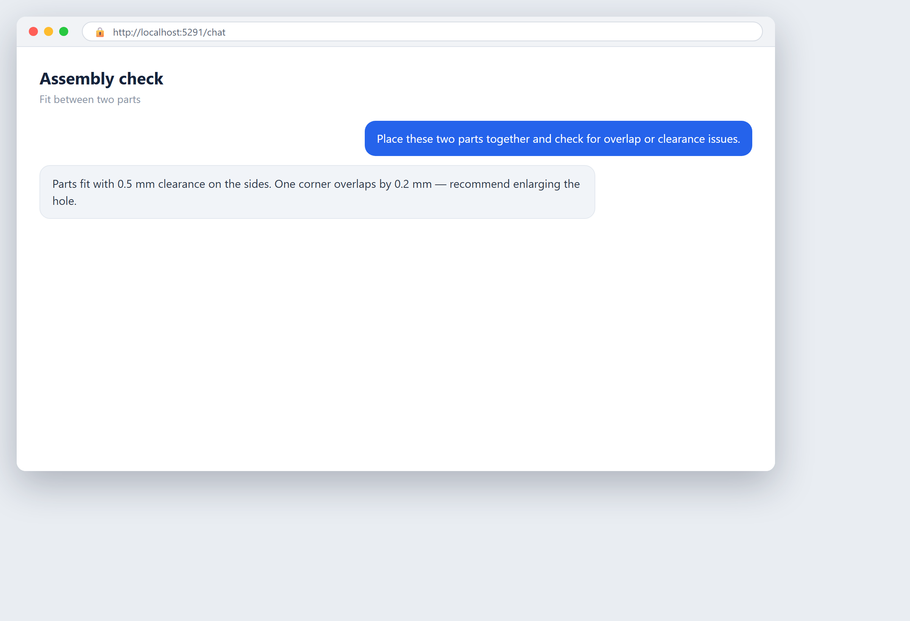
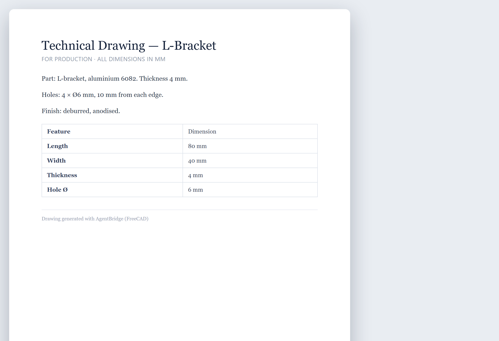

# Chapitre 31 — Une petite entreprise de fabrication

*Ce chapitre est une synthèse représentative. Ce n'est pas une entreprise réelle. Il rassemble les schémas que l'on voit souvent chez les petits ateliers d'usinage et de fabrication qui adoptent l'IA. Tous les chiffres sont donnés à titre d'exemple — ils montrent la forme de la décision, pas une promesse. Remplacez-les par les vôtres.*

## Contexte

Imaginez un petit atelier d'usinage de précision. Nous l'appellerons **Northgate Machining**. Il emploie environ vingt-cinq personnes. Il fabrique des pièces métalliques sur mesure, à la commande — des pièces uniques et des petites séries pour d'autres usines. Rien ne reste en rayon à attendre un acheteur. Chaque pièce commence par une demande d'un client.

Le travail démarre par un **RFQ**, qui signifie « demande de devis ». Un client envoie un plan par e-mail — en général un PDF avec la forme de la pièce, ses mesures et la matière dans laquelle elle doit être fabriquée. L'atelier doit examiner ce plan, calculer combien de temps prendra chaque étape de coupe et de finition, additionner le coût du métal et du temps machine, puis renvoyer un prix. Ce prix, c'est le devis. S'il est trop élevé, le client va ailleurs. S'il est trop bas, l'atelier gagne le travail mais perd de l'argent à le faire.

Deux estimateurs expérimentés font l'essentiel de ce chiffrage. Ils le font depuis des années. Ils regardent un plan et savent à peu près ce que ça coûte. Mais « à peu près » cache beaucoup de choses dans cette phrase. L'atelier n'a aucune trace écrite de ce que les devis passés ont vraiment coûté à produire. Ce savoir est dans deux têtes. Quand ces deux personnes sont en vacances, le chiffrage ralentit fortement.

Derrière le chiffrage se trouve le reste de l'atelier. Le métal brut — barres, plaques, tiges — est suivi dans un tableur que l'on met à jour quand quelqu'un y pense. Le contrôle qualité est un dernier contrôle visuel à la main, à la fin du travail. Les rapports hebdomadaires pour le patron sont recopiés à la main depuis trois tableurs différents. Rien n'est relié. Tout dépend des gens qui pensent à noter les choses.

C'est un petit fabricant normal et en bonne santé. Il est rentable. Il est occupé. Et il laisse de l'argent sur la table à quatre endroits : le chiffrage, les stocks, la qualité et les rapports.

## Le problème

La patronne, Elena, sent les problèmes mais n'arrive pas toujours à les voir. Nommons-les clairement.

**Le chiffrage est lent et irrégulier.** Une pièce simple demande une heure à chiffrer. Une pièce complexe demande une demi-journée. En moyenne, il s'écoule deux jours entre l'arrivée de l'e-mail et l'envoi du devis. Dans cet intervalle, le client a déjà interrogé deux autres ateliers. La rapidité compte. Pire, les deux estimateurs chiffrent le même plan différemment. L'un est prudent et chiffre haut. L'autre est agressif et chiffre bas. Sur une année, certains travaux sont silencieusement sous-facturés. L'atelier les gagne, les fabrique, et découvre plus tard que le temps machine a coûté plus que le prix ne le couvrait. Ces pertes sont invisibles parce que personne ne compare le devis au coût réel après coup.

**Les stocks se gèrent au jugé.** L'atelier achète du métal brut quand quelqu'un remarque que le rayon est bas. Trop souvent, c'est trop tard — un travail est retardé parce que la bonne barre n'est pas en stock. Tout aussi souvent, l'atelier achète trop, et une matière coûteuse reste là pendant des mois, immobilisant de la trésorerie. Le tableur n'est jamais tout à fait juste. Personne ne lui fait confiance, alors les gens revérifient en allant voir le rayon, ce qui fait perdre du temps.

**Les défauts de qualité sont détectés trop tard.** Une pièce défectueuse n'est souvent repérée qu'au contrôle final, une fois tout le travail terminé. Si l'erreur a été faite à la première coupe, l'atelier a pu produire cinquante mauvaises pièces avant de s'en apercevoir. C'est de la rebut — de la matière et du temps machine jetés. Repérer un défaut après cinquante pièces au lieu d'après une seule, c'est cinquante fois la perte.

**Les rapports mangent des heures.** Chaque vendredi, quelqu'un passe trois ou quatre heures à extraire des chiffres des tableurs pour préparer une synthèse pour Elena. Ce temps est une charge pure — il ne produit aucune pièce et ne gagne aucun client.

Chacun de ces points est une petite fuite. Ensemble, ils drainent de l'argent réel et du temps réel. Si vous voulez voir comment ces quatre activités se classent par rapport au reste de votre entreprise, la méthode impact-effort du [Chapitre 12 — Où l'IA peut aider votre entreprise](ch12-where-ai-can-help-your-business.md) est l'endroit pour les évaluer.

## La solution

Elena n'essaie pas « d'utiliser l'IA partout ». Elle choisit les quatre fuites et les attaque une par une, en commençant par la plus grosse et la plus facile.

**Un chiffrage plus intelligent.** Au lieu de lire chaque plan depuis zéro, l'atelier injecte ses travaux passés dans un système. Pour chaque travail passé, il enregistre désormais deux choses qu'il n'avait jamais reliées avant : le devis d'origine et le coût réel de production. Avec le temps, cela devient une bibliothèque de référence. Quand un nouveau plan arrive, un assistant IA lit le PDF, en extrait les caractéristiques clés — les dimensions, les tolérances (à quel point chaque mesure doit être exacte), la matière, le nombre de pièces — et suggère un prix basé sur des travaux passés similaires. L'estimateur ne part plus d'une page blanche. Il part d'un brouillon et l'ajuste. L'IA fait la première passe ; l'humain tranche.

**Des stocks qui prédisent.** L'atelier relie son tableur de stocks à un outil de prévision simple. L'outil regarde à quelle vitesse chaque matière est consommée et suggère quand recommander et combien. Il ne passe pas la commande lui-même. Il émet une suggestion : « Vous serez à court de cette barre d'aluminium dans neuf jours ; commandez maintenant. » Une personne confirme. Le travail au jugé devient un prompt.

**Des contrôles qualité à la machine.** Au lieu de vérifier seulement à la fin, l'atelier place une petite caméra sur une machine. Un système de vision par ordinateur — une IA qui lit ce que voit une caméra — examine chaque pièce à sa sortie et signale tout ce qui semble anormal : une fissure, une mauvaise dimension, un trou manquant. L'opérateur voit l'alerte immédiatement et s'arrête avant de fabriquer cinquante mauvaises copies. Le contrôle humain final reste en place ; la caméra déplace simplement l'avertissement plus tôt. (Le traitement plus approfondi du contrôle qualité par vision et de la maintenance prédictive se trouve dans le [Chapitre 29 — Opérations et production](ch29-operations-and-production.md).)

**Des rapports qui s'écrivent tout seuls.** Les tableurs sont reliés à un assistant de reporting. Le vendredi, au lieu de taper, Elena reçoit une synthèse rédigée : travaux chiffrés, travaux gagnés, taux de rebut, niveaux de stock, trésorerie immobilisée. Elle la lit et la modifie. Trois heures deviennent quinze minutes.

Remarquez le schéma commun aux quatre points. L'IA n'agit jamais seule. Elle lit, suggère, signale et rédige. Un humain décide, confirme et approuve. C'est le même schéma « l'humain relit le brouillon de la machine » que montre le cas Elanco dans le [Chapitre 25 — Administration et finance](ch25-administration-and-finance.md). Dans un atelier où un chiffre faux peut faire perdre de l'argent réel, cette règle n'est pas facultative.

## Les outils

Rien de tout cela n'a demandé une équipe d'ingénieurs. Les outils sont des produits du commerce, destinés aux petites entreprises.

- **Un assistant de lecture de documents** qui ouvre le plan en PDF et en extrait les dimensions et les caractéristiques dans un formulaire structuré. C'est la même catégorie d'outil que celui qui lit les factures dans le [Chapitre 25](ch25-administration-and-finance.md).
- **Un assistant de chiffrage** construit par-dessus, qui compare les caractéristiques extraites aux travaux passés et propose un prix. Cela peut être un outil low-code greffé sur le tableur de devis existant de l'atelier, connecté comme décrit dans le [Chapitre 19 — Connecter l'IA aux systèmes que vous utilisez déjà](ch19-connecting-ai-to-systems-you-already-use.md).
- **Un module de prévision** pour le tableur de stocks ou le système ERP (planification des ressources d'entreprise) de base de l'atelier. Beaucoup d'outils de stock incluent désormais une fonction « suggérer une commande ».
- **Une caméra et un outil d'inspection par vision par ordinateur** sur une machine. Cela se vend en petites unités autonomes pour le contrôle qualité.
- **Un assistant de reporting** qui lit les tableurs reliés et rédige la synthèse hebdomadaire en langage clair.

Comment choisir entre eux sans se laisser tromper par des démos séduisantes, c'est traité dans le [Chapitre 17 — Choisir ses outils sans se faire avoir](ch17-choosing-tools-without-being-fooled.md). Une mise en garde propre à un atelier d'usinage : **les plans sont confidentiels.** Le plan d'une pièce d'un client est sa propriété intellectuelle. Avant d'injecter des plans dans un outil cloud, vérifiez où vont les données et qui peut les voir. Pour certains ateliers, garder l'IA sur leurs propres ordinateurs — l'auto-hébergement, expliqué dans le [Chapitre 8 — Auto-hébergement : gardez vos données sous contrôle](ch08-self-hosting-keep-your-data-under-control.md) — est le choix le plus sûr. Les risques d'envoyer des fichiers sensibles à des services tiers sont dans le [Chapitre 9 — Services tiers et IA fantôme](ch09-third-party-services-and-shadow-ai.md).

## Les coûts

Voici un budget de première année illustratif pour un atelier comme Northgate. Ce sont des chiffres inventés pour montrer la forme. Utilisez les vôtres.

**Coûts directs.**
- Assistant de chiffrage et de lecture de documents : environ 9 000 € par an d'abonnements.
- Module de prévision : environ 3 000 € par an.
- Caméra et unité d'inspection par vision : environ 6 000 € en une fois, plus 1 200 € par an.
- Assistant de reporting : environ 2 400 € par an.
- Installation et intégration (aide externe pour connecter les outils aux tableurs et à la machine) : environ 10 000 € en une fois.
- Formation des estimateurs et des opérateurs : environ 3 000 € en une fois.

Total de la première année : environ **34 600 €**. Les années suivantes, en régime stable, les coûts ponctuels disparaissent et les abonnements récurrents reviennent à environ **15 600 €**.

**Coûts indirects.** Ce sont ceux que les gens oublient.
- Les estimateurs passent des heures à apprendre l'outil et à vérifier ses brouillons. C'est du temps réel, valorisé à leur coût horaire complet.
- Le creux d'apprentissage : pendant les premières semaines, le chiffrage est plus lent, pas plus rapide, le temps que les gens fassent confiance au nouveau système.
- La caméra de vision a besoin de recalibrages occasionnels quand l'éclairage ou la pièce change.
- Quelqu'un doit examiner chaque jour les devis suggérés par l'IA et les points de commande. Ne sautez jamais cette étape.

La méthode complète pour compter ces coûts honnêtement, et pour transformer les économies en un chiffre de retour, se trouve dans le [Chapitre 16 — Objectifs, coûts et retour sur investissement](ch16-goals-costs-and-return-on-investment.md). Ne faites pas le calcul de tête. Écrivez-le.

## Les résultats

Après un an, mesuré par rapport à la référence qu'Elena avait enregistrée avant de commencer, le résultat illustratif ressemble à ceci. Rappelez-vous : vos chiffres seront différents. Ils montrent à quoi ressemble une bonne adaptation, pas ce que sera la vôtre.

- **Le temps de chiffrage** est passé d'une moyenne de deux jours à quelques heures pour la plupart des pièces. L'estimateur relit un brouillon au lieu de tout construire depuis zéro.
- **Moins de travaux sous-facturés.** Comme le devis est ancré sur ce que des travaux similaires ont réellement coûté, l'écart entre le prix annoncé et le coût réel s'est réduit. L'atelier a cessé de perdre silencieusement de l'argent sur les travaux gagnés.
- **Le taux de réussite s'est amélioré.** Des devis plus rapides ont permis à Northgate de répondre à plus de demandes de devis dans la fenêtre où le client est encore en train de choisir.
- **Le rebut a baissé.** Repérer un défaut à la machine au lieu de la fin a réduit la matière et le temps machine gaspillés. Au lieu de cinquante mauvaises pièces, l'opérateur l'a repéré à la première ou à la deuxième.
- **La rotation des stocks s'est améliorée.** Moins de ruptures de stock ont signifié moins de travaux retardés. Moins de surachats ont signifié moins de trésorerie figée sur le rayon.
- **Les rapports** sont passés de trois ou quatre heures de frappe à environ quinze minutes de lecture et de modification.

L'honnête mise en garde : rien de tout cela ne s'est passé dès le premier jour. L'assistant de chiffrage était approximatif le premier mois parce que la bibliothèque de travaux passés était mince. La caméra de vision donnait de fausses alertes tant qu'elle n'était pas calibrée. Les économies ont monté progressivement sur plusieurs semaines, exactement comme l'avertissement de la courbe d'apprentissage du [Chapitre 16](ch16-goals-costs-and-return-on-investment.md) le prédit. Elena a mesuré les vrais chiffres après la montée en puissance, pas pendant.

## Leçons apprises

**Commencez par le chiffrage.** Des quatre fuites, le chiffrage était le plus impactant et le moins risqué à essayer. Un devis faux est repéré par l'estimateur avant son envoi. Cela en a fait le premier projet parfait — la même règle « fort impact, grande facilité d'abord » du [Chapitre 12](ch12-where-ai-can-help-your-business.md).

**Vos travaux passés sont le carburant.** L'assistant de chiffrage n'était bon que dans la mesure du registre des devis passés et de leurs coûts réels. La chose la plus précieuse qu'Elena ait faite, c'est de commencer à relier chaque devis à son coût réel de production. Sans ces données, l'IA n'avait rien à apprendre. La préparation des données est traitée dans le [Chapitre 14 — Les données : la matière première](ch14-data-the-raw-material.md).

**L'IA rédige ; l'humain décide.** Pas un devis n'est parti sans qu'une personne l'ait approuvé. Pas une commande n'a été passée sans qu'une personne l'ait confirmée. Dans un atelier où un chiffre faux est de l'argent réel, le contrôle humain est la sécurité, pas un délai.

**Les plans sont confidentiels.** Traitez chaque plan d'un client comme une propriété intellectuelle sensible. Décidez où il a le droit d'aller avant de l'injecter où que ce soit. Pour certains ateliers, cela signifie l'auto-hébergement ; pour d'autres, un fournisseur vérifié avec un contrat clair.

**Calibrez la caméra ; ne lui faites pas aveuglément confiance.** Le système de vision n'était pas du « brancher et utiliser ». Il fallait le régler pour distinguer un vrai défaut d'une ombre. Prévoyez ce budget, et gardez le contrôle humain final en place.

**Attendez-vous à la montée en puissance.** Le premier mois a été plus lent et plus désordonné que le douzième. Jugez le projet après la courbe d'apprentissage, pas pendant.

**Connectez, ne remplacez pas.** Northgate n'a pas jeté ses tableurs ni son ERP. Il a greffé l'IA sur ce qui fonctionnait déjà, comme décrit dans le [Chapitre 19](ch19-connecting-ai-to-systems-you-already-use.md). L'atelier a gardé ses systèmes et a ajouté une couche plus intelligente par-dessus.

La leçon du petit fabricant est la même que dans tous les autres secteurs : trouvez la fuite, choisissez la plus facile à forte valeur, laissez l'IA rédiger et signaler, gardez un humain sur la décision, et mesurez honnêtement. Un atelier de vingt-cinq personnes sans ingénieurs peut y arriver. Les outils sont prêts. La seule chose qui manque, c'est un regard clair sur l'endroit où l'argent s'enfuit.

<!-- BEGIN agentbridge-examples -->

## Essayez avec AgentBridge

Voici à quoi ressemble le même travail avec AgentBridge. Chaque encadré montre le résultat fini et la seule ligne que vous tapez pour l'obtenir.

### Concevoir une pièce simple

*Une pièce simple modélisée avec l'outil CAO*

**Ce que vous demandez :** `Conçois un petit support métallique de 80 sur 40 millimètres avec quatre trous de fixation.`

L'agent pilote l'outil CAO pour modéliser la pièce avec les bonnes dimensions, et vous obtenez un fichier que vous pouvez relire ou exporter.

*Conseil : Décrivez la forme et les mesures ; l'agent se charge des étapes de CAO.*

---

### Vérifier l'ajustement des pièces

*Une vérification d'assemblage entre deux pièces*

**Ce que vous demandez :** `Placez ces deux pièces ensemble et vérifiez s'il y a un chevauchement ou un problème de jeu.`

L'agent assemble les pièces dans le modèle CAO et signale où elles se heurtent ou où l'ajustement est trop serré.

*Conseil : Repérez les problèmes d'ajustement à l'écran, pas sur l'établi.*

---

### Un plan pour l'atelier

*Un plan technique coté pour la production*

**Ce que vous demandez :** `Produis un plan technique du support avec les cotes principales indiquées.`

L'agent génère un plan avec les dimensions indiquées, prêt pour la personne qui fabriquera la pièce.

*Conseil : Demandez la vue dont vous avez besoin — dessus, côté — pour que le plan soit clair.*

<!-- END agentbridge-examples -->
