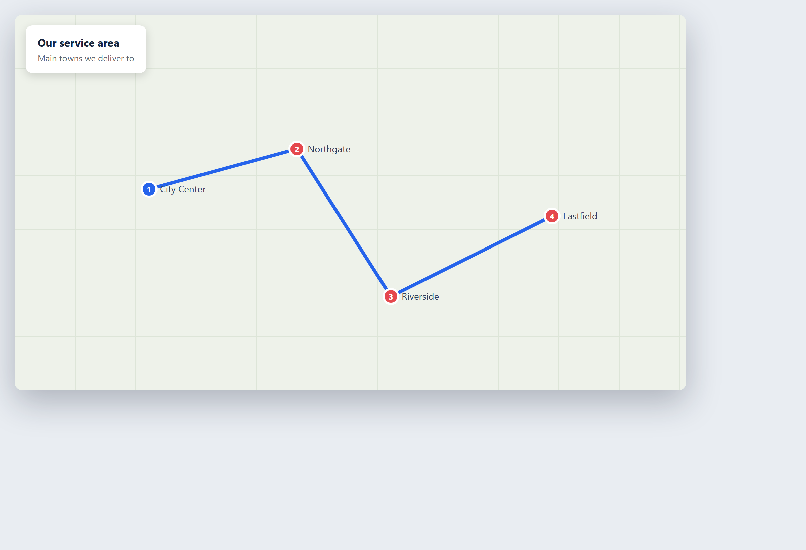

# Chapitre 34 — Services et conseil

*Ce chapitre est un composite représentatif. Ce n'est pas un vrai cabinet. Il combine les schémas courants que nous voyons dans les cabinets de conseil et de services professionnels qui adoptent l'IA. Tous les chiffres sont illustratifs — ils montrent la forme de la décision, pas une promesse. Remplacez-les par les vôtres.*

## Contexte

Imaginez un cabinet de conseil de taille moyenne. Nous l'appellerons **Northbeam Advisory**. Il a environ vingt-cinq consultants et une petite équipe de support. Il ne vend pas un produit. Il vend de l'expertise et du temps. Un client — d'habitude une autre entreprise — a un problème, et Northbeam envoie des gens le résoudre : un projet de stratégie ici, une revue d'opérations là, une étude de données ailleurs.

Chaque projet suit le même chemin approximatif. Vient d'abord le **pitch** : une proposition qui dit ce que le cabinet comprend, ce qu'il va faire, et ce que cela coûtera. Si le client accepte, l'équipe fait le travail. Pendant le travail, le client reçoit des **rapports d'étape** réguliers. À la fin, il y a un livrable final et une facture. Entre tout cela se trouve une montagne de coordination : trouver les bonnes personnes pour le travail, réserver des réunions, rédiger ce qui a été dit, et garder la trace de qui est libre quand.

Pendant des années, tout cela tournait sur les gens. Un associé écrit une proposition en ouvrant une ancienne et en la réécrivant. Un consultant résout un problème que le cabinet a résolu il y a trois ans, mais personne ne se souvient où, alors ils le résolvent depuis zéro. Un chef de projet construit chaque rapport d'étape à la main, copiant des nombres d'un fichier dans une diapositive. Quelqu'un passe une demi-journée à faire correspondre les agendas des consultants aux besoins des projets. Le cabinet a du succès. Mais il passe une grande quantité de temps cher et formé sur un travail répétitif, et il continue de perdre des connaissances qu'il a déjà payées une fois.

Un cabinet de conseil est comme un cabinet professionnel sur un point important. Tout ce qu'il touche est **confidentiel**. La stratégie d'un client, un modèle de coûts, un plan de fusion — ceux-ci sont partagés en confiance. Ce seul fait façonne la façon dont l'IA peut être utilisée ici, tout comme pour un cabinet d'avocats. C'est le fil conducteur de ce chapitre.

## Le problème

Les fuites du cabinet sont faciles à nommer.

**Les propositions sont lentes.** Chaque nouveau pitch commence près d'une page blanche. Le cabinet a écrit des centaines de propositions et y a du bon matériel, mais trouver le bon exemple passé, la bonne étude de cas, la bonne structure de prix, prend du temps. Un associé peut passer deux journées pleines sur une proposition qui est surtout du réassemblage. Des propositions lentes signifient aussi des occasions manquées — certaines affaires sont perdues simplement parce que la réponse est arrivée trop tard.

**Les connaissances s'en vont par la porte.** Quand un consultant part, le savoir-faire dans sa tête part avec lui. Une méthode qu'il a affinée, une particularité de client qu'il a apprise, une solution qu'il a trouvée — à moins que quelqu'un ne l'ait écrite, c'est perdu. Alors le cabinet paie pour résoudre les mêmes problèmes encore et encore. C'est la fuite la plus coûteuse, parce qu'elle est invisible.

**Le reporting est manuel.** Un rapport d'étape est surtout le même chaque semaine : ce qui a bougé, ce qui est en retard, ce qui vient ensuite. Mais une personne l'assemble à la main à chaque fois, tirant des nombres des fichiers projet et écrivant le même genre de récit. C'est fiable et c'est ennuyeux, et cela mange des heures qui pourraient être facturables.

**La surcharge de coordination.** Faire correspondre les compétences du bon consultant à un projet, vérifier qui est libre, réserver des réunions et rédiger les notes après coup est une taxe constante. Des réunions ont lieu, mais personne ne veut rédiger le compte rendu, alors les décisions deviennent floues et quelqu'un doit refaire la conversation plus tard.

Si vous voulez voir comment ceux-ci se classent par rapport au reste de votre cabinet, la méthode impact-effort du [Chapitre 12 — Où l'IA peut aider votre entreprise](ch12-where-ai-can-help-your-business.md) est l'endroit pour les noter.

Au-dessus des quatre se trouve la confidentialité. Tout outil qui lit la proposition ou le dossier projet d'un client doit être un outil dont le cabinet peut se fier à ce qu'il ne le fuitera pas. Cette question vient en premier.

## La solution

Northbeam s'attaque aux quatre fuites par ordre de sûreté, pas seulement de taille. La règle est la même qu'utilise un cabinet d'avocats : commencer là où une erreur est peu chère et les données ne sont pas les plus sensibles, et aller vers le travail sensible seulement quand les outils sont fiables.

**Un assistant de propositions qui rédige à partir de l'historique du cabinet.** Quand un nouveau pitch arrive, un consultant écrit un court brief — le client, le problème, le périmètre approximatif. Un assistant IA cherche dans les propositions passées du cabinet et tire les sections les plus pertinentes, puis rédige une première version : une compréhension du problème, une approche suggérée, une étude de cas qui convient. L'associé ne commence plus à froid. Il édite un brouillon au lieu de construire à partir de rien. Deux jours deviennent quelques heures. C'est le même schéma « la machine rédige, l'humain revoit » que le cas Elanco montre au [Chapitre 25 — Administration et Finance](ch25-administration-and-finance.md).

**Une mémoire consultable pour le cabinet.** Le cabinet met ses livrables passés, ses méthodes et ses notes dans une recherche interne que les consultants peuvent interroger en langage simple. On appelle souvent cela une **base de connaissances avec recherche IA**. Sous le capot, elle utilise une technique appelée **génération augmentée par récupération**, ou RAG. En mots simples : au lieu de poser une question à une IA générale, le système regarde d'abord les documents du cabinet lui-même, puis répond en n'utilisant que ce qu'il y a trouvé. Donc quand un consultant demande « Comment avons-nous géré une revue du risque fournisseur pour un client du commerce de détail ? », le système trouve le vrai projet passé et répond à partir de lui. Les connaissances cessent de partir par la porte. La technologie de chatbot et de recherche derrière ceci est couverte au [Chapitre 27 — Service et support client](ch27-customer-care-and-support.md).

**Un reporting qui se rédige tout seul.** L'outil de rapport d'étape se connecte aux données du projet — tâches, dates, jalons — et rédige le rapport hebdomadaire : ce qui a bougé, ce qui a glissé, ce qui vient ensuite. Le chef de projet le revoit, ajoute le jugement humain sur le ton et ce qu'il faut souligner, et l'envoie. La page blanche a disparu.

**Planification et résumés de réunions.** Un assistant de planification fait correspondre les compétences et la disponibilité des consultants aux besoins des projets et propose qui devrait travailler sur quoi. Pour les réunions, un outil enregistre l'appel, rédige le compte rendu, et liste les décisions et les points d'action. Une personne le vérifie avant qu'il circule. Les décisions cessent d'être floues parce que la rédaction se fait automatiquement.

Dans chaque cas, l'humain reste aux commandes. En conseil, le client paie pour le jugement et la responsabilité. L'IA rédige, cherche et résume. Le consultant décide, adapte, et assume le travail.

## Les outils

Les outils sont ordinaires, mais la façon dont ils sont déployés est façonnée par la confidentialité.

- **Un assistant de propositions** qui cherche dans les propositions passées du cabinet et en rédige une nouvelle à partir d'un brief.
- **Une recherche de connaissances interne** (RAG) sur les livrables et notes du cabinet, pour que les consultants puissent poser des questions en langage simple et obtenir des réponses ancrées dans le travail du cabinet lui-même.
- **Un assistant de reporting** qui se connecte aux données projet et rédige des rapports d'étape.
- **Un assistant de planification** pour faire correspondre les gens aux projets, plus un **outil de résumé de réunions** qui transforme un appel enregistré en compte rendu de brouillon.

Comment choisir ces outils sans être ébloui par une démo est couvert au [Chapitre 17 — Choisir des outils sans se faire avoir](ch17-choosing-tools-without-being-fooled.md). Comment les connecter aux systèmes de gestion de projet et de documents existants du cabinet est au [Chapitre 19 — Connecter l'IA aux systèmes que vous utilisez déjà](ch19-connecting-ai-to-systems-you-already-use.md).

**La confidentialité vient en premier.** Un chatbot général dans lequel vous collez une proposition client peut la stocker, s'entraîner dessus, ou l'exposer. Pour un cabinet de conseil, cela peut briser la confiance d'un client et un devoir contractuel de secret. Le cabinet doit utiliser des outils qui gardent les données clients privées — soit un service de qualité entreprise avec un contrat clair de non-entraînement et non-partage, soit un modèle tournant sur les machines du cabinet lui-même. L'auto-hébergement est expliqué au [Chapitre 8 — Auto-hébergement : gardez vos données sous contrôle](ch08-self-hosting-keep-your-data-under-control.md). Le danger que le personnel colle en silence des données clients dans des outils publics — l'IA fantôme — est le sujet du [Chapitre 9 — Services tiers et IA fantôme](ch09-third-party-services-and-shadow-ai.md). Et parce que les dossiers clients et les listes de contacts détiennent des données personnelles, les règles de vie privée du [Chapitre 10 — Confidentialité et RGPD](ch10-privacy-and-gdpr.md) s'appliquent pleinement.

## Les coûts

Voici un budget illustratif de première année pour un cabinet comme Northbeam. Ce sont des chiffres inventés pour montrer la forme. Utilisez les vôtres.

**Coûts directs.**
- Assistant de propositions (qualité entreprise, avec un contrat de confidentialité) : environ 12 000 € par an.
- Recherche de connaissances interne (plateforme RAG) : environ 9 000 € par an.
- Assistant de reporting : environ 4 800 € par an.
- Outils de planification et de résumé de réunions : environ 6 000 € par an.
- Mise en place et intégration avec les systèmes de gestion de projet et de documents : environ 12 000 € ponctuels.
- Formation des consultants et du personnel de support : environ 5 000 € ponctuels.

Total première année : environ **48 800 €**. Les années stables d'après, les abonnements récurrents reviennent à environ **31 800 €**.

**Coûts indirects.**
- Les consultants passent du temps à revoir chaque brouillon de l'IA. C'est le coût du filet de sécurité, et il doit rester.
- Le creux d'apprentissage pendant que tout le monde s'adapte.
- Le coût de la mise en ordre de la base de connaissances. Une recherche n'est bonne que ce que vous y mettez, et quelqu'un doit la garder propre et à jour.
- Le temps passé à examiner chaque outil pour la confidentialité et la conformité avant usage.
- Le coût d'une erreur si un brouillon est cru sans vérification — en conseil, un nombre faux dans un rapport client peut coûter bien plus qu'un abonnement.

La méthode complète pour compter ces coûts et transformer les économies en un chiffre de retour est au [Chapitre 16 — Objectifs, coûts et retour sur investissement](ch16-goals-costs-and-return-on-investment.md). Ne faites pas le calcul dans votre tête. Écrivez-le.

## Les résultats

Après un an, mesuré contre une référence que le cabinet a enregistrée avant de commencer, le résultat illustratif ressemble à ceci. Vos chiffres différeront. Ceux-ci montrent à quoi peut ressembler un bon ajustement.

- **Les propositions se sont accélérées.** Un pitch qui prenait deux jours prend désormais quelques heures, parce que l'associé édite un brouillon au lieu de construire depuis une page blanche. Le cabinet répond aussi plus tôt, ce qui gagne quelques affaires qu'il aurait manquées.
- **Les connaissances sont restées.** Quand des consultants partaient, leur savoir-faire restait dans la base consultable. Le cabinet résolvait moins de problèmes deux fois.
- **Le temps de reporting a baissé.** Le rapport d'étape hebdomadaire est devenu une revue d'un brouillon, pas une construction manuelle, libérant des heures chez les chefs de projet.
- **Les réunions produisaient des traces.** Les décisions et les points d'action étaient rédigés automatiquement, donc moins de conversations devaient être répétées.
- **Plus de temps facturable.** Avec moins de temps passé au réassemblage et à la recherche, les consultants passaient plus de leur journée sur le travail que le client paie.

La réserve honnête : rien de tout cela n'a été instantané. L'assistant de propositions produisait des brouillons bruts au début jusqu'à ce qu'il ait assez de bonnes propositions passées pour apprendre le style du cabinet. La recherche de connaissances donnait des réponses faibles jusqu'à ce que les documents soient organisés et étiquetés. L'outil de résumé de réunions étiquetait mal les intervenants au début. Les gains ont monté sur des semaines, comme l'avertissement sur la courbe d'apprentissage du [Chapitre 16](ch16-goals-costs-and-return-on-investment.md) le prédit. Le cabinet a mesuré les vrais chiffres après la montée, pas pendant.

## Leçons apprises

**La confidentialité est la première contrainte, pas une réflexion après coup.** En conseil, la question n'est jamais seulement « cet outil marche-t-il ? ». C'est « peut-on faire confiance à cet outil avec le dossier privé d'un client ? ». Répondez à cela avant tout le reste. Utilisez des outils de qualité entreprise avec un contrat clair de non-entraînement, ou auto-hébergez. Voir [Chapitre 8](ch08-self-hosting-keep-your-data-under-control.md) et [Chapitre 9](ch09-third-party-services-and-shadow-ai.md).

**L'IA rédige ; le consultant conseille.** La valeur d'un consultant est le jugement et la responsabilité. L'IA fait la présélection, rédige et résume ; le consultant décide et signe. Ne laissez jamais un brouillon devenir un travail destiné au client sans un esprit humain dessus.

**Une base de connaissances est un jardin, pas un dépotoir.** La recherche IA n'est bonne que ce que les documents derrière elle sont. Si vous jetez dedans des fichiers désordonnés, périmés ou faux, vous obtenez des réponses fausses confiantes. Quelqu'un doit posséder la base, la garder à jour, et contrôler qui peut voir quoi. Le contrôle d'accès compte : un consultant sur le projet d'un client ne devrait pas pouvoir rechercher le matériel confidentiel d'un autre client. Le principe de prontitude des données est au [Chapitre 14 — Les données : la matière première](ch14-data-the-raw-material.md).

**Enregistrer des réunions demande un consentement.** Un outil de résumé de réunions fonctionne en enregistrant l'appel. Enregistrer une conversation est un traitement de données personnelles, et les gens doivent le savoir et être d'accord. Dites aux participants avant d'enregistrer, et suivez les règles du [Chapitre 10 — Confidentialité et RGPD](ch10-privacy-and-gdpr.md). N'enregistrez pas en cachette.

**Méfiez-vous de la réponse fausse confiante.** Ces outils peuvent produire un texte qui semble juste et est faux — une étude de cas qui n'a jamais eu lieu, un nombre qui ne colle pas. En conseil, une chiffre fabriqué dans un rapport client est une catastrophe. Vérifiez chaque nombre et chaque affirmation contre la vraie source. Le problème de fiabilité est couvert au [Chapitre 2 — L'IA expliquée simplement](ch02-ai-explained-simply.md), et le devoir d'être honnête sur ce que l'IA peut et ne peut pas faire est au [Chapitre 4 — IA éthique : faire ce qu'il faut](ch04-ethical-ai-doing-the-right-thing.md).

**Commencez par le travail sûr.** Northbeam a commencé par la recherche interne et les brouillons de reporting — faible risque, pas encore les propositions clients les plus sensibles. Il est allé vers la rédaction de propositions seulement une fois les outils jugés fiables. C'est la règle « facilité d'abord » du [Chapitre 12](ch12-where-ai-can-help-your-business.md).

**Mesurez honnêtement et attendez-vous à la montée.** Enregistrez la référence avant de commencer. Jugez le projet après la courbe d'apprentissage, pas pendant. La méthode est au [Chapitre 22 — Mesurer les résultats et le ROI](ch22-measuring-results-and-roi.md).

La leçon du cabinet de conseil est la même que celle de tout autre secteur, avec un garde-fou de plus : trouvez le travail répétitif — propositions, recherche, reporting, coordination — laissez l'IA rédiger et récupérer, gardez un humain sur le jugement et la relation client, et mesurez honnêtement. Et dans un cabinet bâti sur la confiance, ne laissez jamais l'outil toucher le dossier confidentiel d'un client tant que vous n'êtes pas certain que c'est sûr.

<!-- BEGIN agentbridge-examples -->

## Essayez avec AgentBridge

Voici à quoi ressemble le même travail avec AgentBridge. Chaque encadré montre le résultat fini et la seule ligne que vous tapez pour l'obtenir.

### Dessinez votre zone de service

*Une carte de zone de service pour les clients*

**Ce que vous demandez :** `Montre notre zone de service sur une carte avec les principales villes que nous couvrons.`

L'agent produit une carte claire de votre couverture que vous pouvez mettre sur votre site web ou envoyer aux clients.

*Conseil : Gardez-la à jour à mesure que vous grandissez — demandez simplement une nouvelle version.*

<!-- END agentbridge-examples -->
