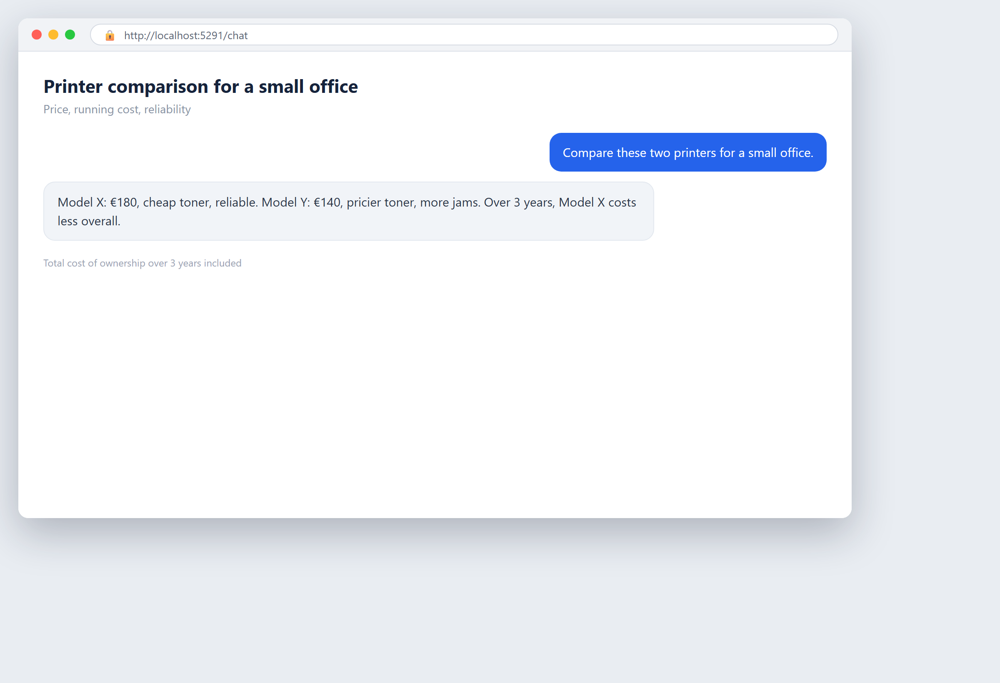

# Capitolo 17 — Scegliere strumenti senza farsi ingannare

## In parole semplici

Ogni fornitore di IA ti dirà che il suo strumento è facile, economico e rivoluzionario. Alcuni dicono la verità. Molti no. Questo capitolo è la tua difesa. Ti insegna a guardare oltre la demo lucida e il venditore sicuro, e scegliere uno strumento che davvero si adatta alla tua azienda.

L'idea più importante qui è semplice: **non stai comprando uno strumento, stai comprando un risultato.** Uno strumento vale solo ciò che fa per te. Un prodotto bello che non risolve il tuo problema è un giocattolo costoso. Il tuo lavoro è collegare ogni scelta a un problema reale e a un numero reale.

Una buona analogia è comprare un'auto. Il salone fa sembrare ogni auto straordinaria. Il cuoio brilla, il motore ronza, il venditore è affascinante. Ma tu non compri un'auto per il salone. La compri per la strada che davvero percorri, i passeggeri che davvero porti, e il carburante che puoi permetterti. Quindi fai domande difficili, la provi su *tue* strade, e leggi i costi di gestione. Scegliere strumenti di IA è la stessa disciplina.

Questo capitolo copre come scegliere tra comprare software pronto, costruirne uno su misura, o farlo da sé. Ti dà le domande esatte da fare a un fornitore. Ti mostra dove si nascondono i costi nascosti. Spiega perché una demo non basta e come eseguire invece un piccolo pilota. E guarda gli strumenti open-source — software il cui codice è libero da usare e modificare — come un'opzione reale e conveniente.

Una regola da portare con te: **rallenta.** Il venditore vuole urgenza. "Questo prezzo finisce venerdì." "Restano solo due licenze." L'urgenza è un trucco per impedirti di pensare. Un buon strumento sopravvive a una settimana di attenta riflessione. Uno cattivo conta sul fatto che tu non pensi. Prenditi la settimana.

## Un po' di storia

**Anni 1960–1970: il software è su misura.** Agli inizi, se un'azienda voleva software, pagava specialisti per scriverlo da zero. Non c'era l'opzione "pronto all'uso". Il software era un abito su misura, fatto apposta, costoso e lento da consegnare.

**Anni 1980: la rivoluzione del software a pacchetto.** Prodotti come fogli di calcolo e programmi di videoscrittura arrivarono in una scatola. Per la prima volta, un'azienda poteva comprare uno strumento generale e adattarlo a molti lavori. Questo era più economico e veloce delle costruzioni su misura. Nasceva il moderno mercato del software.

**Anni 1990–2000: grandi suite e la trappola del lock-in.** Grandi fornitori vendevano enormi suite integrate — un prodotto per tutto. Funzionavano bene, ma allontanarsi era doloroso e costoso. Le aziende scoprirono che la scelta facile oggi poteva diventare una prigione costosa domani. La parola **vendor lock-in** — restare bloccati con un fornitore perché andarsene è troppo difficile — entrò nel vocabolario del business. (Il lock-in è coperto per intero nel [Capitolo 9](ch09-third-party-services-and-shadow-ai.md).)

**Anni 2000: l'open-source diventa di massa.** Linux, Apache e poi migliaia di progetti gratuiti provarono che il software poteva essere costruito da comunità e regalato, eppure far funzionare i più grandi siti web del mondo. L'open-source smise di essere un hobby e divenne un'opzione seria e affidabile.

**Anni 2010: l'era degli abbonamenti.** Il software passò da "compra una volta" a "paga ogni mese". Questo abbassò il prezzo d'ingresso ma aggiunse un nuovo tipo di costo che non finisce mai. Gli abbonamenti resero facile iniziare e facile perdere il conto di ciò per cui si pagava.

**Anni 2020: la corsa all'oro dell'IA.** Centinaia di strumenti di IA apparvero quasi da un giorno all'altro, molti con grandi finanziamenti e promesse ancora più grandi. Il divario tra ciò che una demo mostra e ciò che uno strumento consegna nel lavoro reale non è mai stato così largo. Scegliere bene è ora un'abilità centrale di business, non un extra gradito.

L'arco: da su misura, a scatola, ad abbonamento, a inondato. Gli strumenti continuano a cambiare. Il bisogno di scegliere con cura non cambia mai.

## Curiosità

### 17.6 Il libro "Headcount Zero" — un'azienda senza dipendenti

Quanto lontano può spingersi l'idea "non servono persone"? C'è un libro che la porta all'estremo. Si chiama **"Headcount Zero: How to Build an AI-Run Company with Paperclip"**, di **Anthony David Adams**. È pubblicato come libro open-source su GitHub (il repository `AnthonyDavidAdams/zero-employee-company-book`), così chiunque può leggerlo gratis.

La domanda che il libro pone è: *e se non dovessi mai assumere nessuno?* Invece di dipendenti, il fondatore gestisce un'azienda fatta di **agenti di IA** — programmi software che possono svolgere task da soli. Il fondatore diventa una specie di manager di un organigramma pieno di lavoratori di IA, coordinati da una piattaforma open-source che il libro chiama **Paperclip**.

Questo non è un piano che la maggior parte delle piccole imprese dovrebbe seguire domani. Un'azienda con letteralmente zero umani è un estremo esperimento mentale, e ha limiti ovvi: chi è responsabile quando qualcosa va storto? Chi tiene la responsabilità legale? Chi capisce il bisogno non espresso di un cliente? (Queste sono esattamente i ruoli umani discussi nel [Capitolo 15](ch15-people-roles-and-culture.md).)

Ma come lente, "Headcount Zero" è utile. Forza una domanda onesta: **quanto del tuo lavoro è davvero umano, e quanto è routine che una macchina potrebbe portare?** La maggior parte delle aziende scopre che una quota sorprendente dei task quotidiani è routine. Questo non significa licenziare tutti. Significa liberare le persone dalle parti noiose così possono fare il giudizio, le relazioni e il lavoro creativo che le macchine non possono. Leggi il libro come una provocazione, non un'istruzione. Ti mostra il bordo del possibile, e il bordo è dove vivono le domande interessanti.

## Un esempio di business reale

*Il seguente è un composito illustrativo di comuni schemi del mondo reale, non una singola azienda nominata.*

Un piccolo studio di contabilità voleva "automatizzare con l'IA". Un fornitore diede una demo abbagliante: lo strumento leggeva una pila di ricevute e produceva un riassunto ordinato in pochi secondi. Il titolare firmò un contratto biennale sul posto, abbagliato.

Sei mesi dopo, la realtà sembrava diversa. La demo aveva usato una manciata di ricevute pulite e perfette. Le ricevute reali dello studio erano accartocciate, sfocate, in tre lingue e piene di casi limite. Lo strumento sbagliava abbastanza spesso che il personale doveva ricontrollare tutto, il che significava che il "risparmio" era minuscolo. Il contratto biennale li bloccava. L'abbonamento continuava a fatturare. Lo strumento divenne un ornamento costoso.

Un secondo studio scelse diversamente. Prima di firmare qualsiasi cosa, chiese al fornitore una **prova sui propri dati disordinati**, non sul set demo pulito del fornitore. Eseguì un pilota di due settimane su ricevute reali. Lo strumento ne gestiva bene circa il 70% e falliva sul resto. Quel numero — 70% — permise allo studio di prendere una decisione chiara: tenere lo strumento per il 70% facile, tenere umani sul 30% difficile, e firmare solo un contratto annuale con una via d'uscita chiara. Lo stesso strumento, scelto con disciplina invece che con abbaglio, divenne un aiuto genuino.

La differenza non era il software. Era che il secondo studio si rifiutò di essere ingannato da una demo e provò prima sulla propria realtà.

## Come fare

### 17.1 Software pronto, costruito su misura, o fai-da-te

Quando ti serve uno strumento, hai tre grandi percorsi. Ognuno ha un suo posto.

**Pronto all'uso (compralo già fatto).** Questo è software a cui ti abboni o che acquisti così com'è, come un servizio di chatbot o un'app di riassunto documenti. È il modo più veloce e di solito più economico per iniziare. Lo ottieni oggi, funziona appena tolto dalla scatola, e qualcun altro lo mantiene. Il compromesso: fa ciò che *lui* è stato costruito per fare, non esattamente ciò che *tu* volevi. Se il tuo bisogno è comune, uno strumento pronto è quasi sempre la prima scelta giusta.

**Costruito su misura (paghi qualcuno per costruirlo).** Uno sviluppatore scrive software solo per te. Questo si adatta perfettamente ai tuoi bisogni. Ma è lento, costoso, e ora possiedi una cosa che richiede manutenzione per sempre. Le costruzioni su misura hanno senso solo quando il tuo bisogno è speciale e nessuno strumento pronto lo copre — e quando il valore è abbastanza alto da giustificare il costo. Per la maggior parte delle piccole imprese, il su misura raramente è la prima mossa.

**Fai-da-te (lo costruisci tu, con strumenti no-code o leggeri).** Strumenti come app di automazione ti lasciano collegare servizi da solo senza scrivere codice. Questo è economico e flessibile, e impari molto. Il compromesso: richiede il tuo tempo, e se te ne vai, la cosa che hai costruito può essere difficile da mantenere per qualcun altro. Il fai-da-te è ottimo per piccole automazioni che puoi possedere e tenere semplici.

Una semplice regola pratica: **inizia con il pronto. Vai sul fai-da-te per piccoli lavori di collante tra strumenti. Vai sul su misura solo quando nient'altro si adatta e il premio è grande.** La maggior parte delle aziende vive felicemente sui primi due.

### 17.2 Domande da fare al fornitore

Non prendere mai la parola di un fornitore. Fai domande dirette e ascolta attentamente le risposte — soprattutto ciò che schiva. Tieni pronte queste:

- **Cosa fa esattamente questo, e cosa NON fa?** Costringili oltre il marketing. Un sicuro "gestisce tutto" è un segnale d'allarme.
- **Com'è quando fallisce?** Ogni strumento fallisce da qualche parte. Un fornitore onesto sa nominare i suoi punti deboli. Un fornitore che dice "non fallisce mai" mente o non ne ha idea.
- **Qual è il costo totale su tre anni, non solo il primo mese?** Falli dire il numero completo ad alta voce.
- **Cosa succede ai miei dati?** Dove sono archiviati, chi può vederli, e addestrate la vostra IA su di essi? (Questo conta per la privacy — vedi [Capitolo 10](ch10-privacy-and-gdpr.md).)
- **Posso far uscire i miei dati, e in che formato?** Questa è la tua botola di fuga. Se non puoi andartene in modo pulito, sei bloccato.
- **Che supporto ricevo, e quanto in fretta?** Tempi di risposta, canali, e se il supporto è incluso o costa extra.
- **Chi altro lo usa nel mio settore, e posso parlargli?** Un referenza reale vale dieci demo.
- **Qual è la vostra roadmap, e quanto è stabile l'azienda?** Uno strumento di una startup instabile può sparire. Chiedi da quanto tempo sono in attività e chi li finanzia.
- **Qual è il contratto, e come disdico?** Leggi i termini di uscita prima di firmare, non dopo.

Scrivi le risposte. Confronta i fornitori sulle stesse domande. Il fornitore che risponde con chiarezza e onestà si distingue da quello che gesticola e affascina.

### 17.3 Costi nascosti e abbonamenti

Il prezzo adesivo è il costo più piccolo. Il costo reale si nasconde in posti dove la maggior parte della gente non guarda mai. (Il metodo completo sui costi vive nel [Capitolo 16](ch16-goals-costs-and-return-on-investment.md); qui c'è la versione specifica per fornitore.)

Fai caso a questi:

- **Prezzo per postazione.** Molti strumenti fatturano per utente. Uno strumento "economico" diventa costoso quando aggiungi tutta la tua squadra. Conta le postazioni prima di firmare.
- **Commissioni basate sull'uso.** Alcuni strumenti di IA fatturano per task, per messaggio o per documento. Un mese intenso può produrre una sorpresa nella bolletta. Chiedi esattamente come viene misurato l'uso.
- **Costi di installazione e avvio.** Iniziare può costare extra, a volte più del primo anno di abbonamento.
- **Costi di integrazione.** Collegare lo strumento ai tuoi sistemi esistenti potrebbe richiedere aiuto a pagamento.
- **Funzioni premium dietro un muro a pagamento.** La funzione che ti ha venduto può essere su un livello superiore. Controlla quale livello ti serve davvero.
- **Formazione e supporto come extra.** "Supporto incluso" spesso significa un articolo di aiuto, non una persona. Il vero aiuto può costare di più.
- **L'abbonamento senza fine.** Una retta mensile sembra piccola ma non si ferma mai. Moltiplicala per tre o cinque anni per vedere il vero peso.
- **Costi di uscita e di cambio.** Disdire può essere difficile, e spostare i tuoi dati altrove può richiedere lavoro a pagamento.

Prima di firmare, costruisci un **costo totale a tre anni** per ogni opzione. Aggiungi ognuno di questi. Il prezzo mensile del fornitore è spesso solo un terzo del vero numero a tre anni.

### 17.4 Demo e progetti pilota

Una demo è una performance. Mostra lo strumento al suo meglio, su dati scelti per conquistarti. Non decidere mai solo su una demo.

Un **progetto pilota** è l'alternativa onesta. Un pilota è una piccola prova a tempo definito dello strumento sul *tuo* lavoro reale, con i *tuoi* dati disordinati reali, misurando un *tuo* risultato reale. Dove una demo ti mostra un montaggio di momenti salienti, un pilota ti mostra la verità.

Come eseguire un buon pilota:

- **Usa i tuoi dati, inclusi i casi disordinati.** Non accettare il campione pulito del fornitore.
- **Tienilo piccolo e corto.** Due o quattro settimane su un processo bastano per imparare molto.
- **Definisci il successo prima di iniziare.** Che numero deve raggiungere lo strumento per contare come superato? (Questo si collega al metodo del pilota nel [Capitolo 18](ch18-your-first-pilot-project.md).)
- **Testa il fallimento, non solo il successo.** Spingilo con casi difficili apposta.
- **Prova il supporto.** Manda una richiesta di supporto durante il pilota e vedi quanto sono veloci e utili.
- **Testa l'uscita.** Prova a esportare i tuoi dati. Assicurati di potertene andare.

Un fornitore che rifiuta un pilota reale sui tuoi dati ti sta dicendo qualcosa. Un fornitore che lo accoglie è sicuro per un buon motivo.

### 17.5 Strumenti open-source: un'alternativa conveniente e flessibile

**Open-source** significa che il codice sorgente del software — le istruzioni che lo fanno funzionare — è libero da vedere, usare e modificare per chiunque. Non lo stai "piratando"; l'open-source è un modo legale, comune e spesso eccellente in cui il software viene fatto. Il web che stai usando proprio ora probabilmente gira su software open-source.

Perché considerarlo per l'IA:

- **Costo di licenza basso o nullo.** Molti strumenti open-source sono liberi da usare.
- **Nessun lock-in.** Perché puoi vedere e modificare il codice, non sei intrappolato con un fornitore.
- **Puoi farlo girare da te.** I modelli di IA open-source possono girare sulle tue macchine, il che tiene i tuoi dati sotto il tuo controllo (questo è il **self-hosting**, coperto nel [Capitolo 8](ch08-self-hosting-keep-your-data-under-control.md)).
- **Una comunità dietro.** I progetti popolari migliorano in fretta e hanno molti utenti da cui imparare.

I compromessi:

- **Potresti aver bisogno di più competenza per installarlo.** L'open-source spesso dà per scontato che tu possa configurare le cose, o che possa assumere qualcuno che può.
- **Il supporto è basato sulla comunità.** Può non esserci nessuno da chiamare. Dipendi da documentazione e forum.
- **Possiedi la manutenzione.** Se lo fai girare tu, tenerlo aggiornato e sicuro è su di te.

L'equilibrio onesto: l'open-source è un percorso potente ed economico, soprattutto quando il controllo dei dati conta. Ma baratta denaro con sforzo e competenza. Se non hai né l'uno né l'altra, uno strumento pronto a pagamento può essere l'inizio più saggio. Se hai un po' di aiuto tecnico, l'open-source può farti risparmiare molto e liberarti dal lock-in.

## Etica e responsabilità

Scegliere strumenti non è eticamente neutro. Le tue scelte riguardano i tuoi clienti, il tuo personale e i tuoi dati.

**Proteggi i dati dei tuoi clienti nella scelta stessa.** Prima che qualsiasi strumento tocchi i dati dei clienti, sappi dove vanno e chi può vederli. Uno strumento che addestra la sua IA sulle informazioni private dei tuoi clienti senza consenso può violare la legge (vedi [Capitolo 10](ch10-privacy-and-gdpr.md)).

**Non lasciare che l'hype di un fornitore guidi una decisione che riguarda le persone.** Se uno strumento cambierà i lavori del tuo personale, sceglilo per ragioni oneste e coinvolgi la tua gente, non perché un venditore ha creato una falsa urgenza.

**Preferisci strumenti che puoi verificare e lasciare.** Uno strumento che nasconde come funziona, o intrappola i tuoi dati, è una povera scelta etica oltre che una povera scelta di business. Trasparenza e una via d'uscita pulita sono segni di un fornitore che ti rispetta.

**Sii onesto nelle tue stesse affermazioni.** Se compri uno strumento di IA e dici ai clienti "il nostro servizio usa l'IA", assicurati che sia vero e non marketing esagerato.

**Considera l'etica del fornitore stesso.** Dove vivono i loro dati? Rispettano le leggi sulla privacy? Sono stabili e onesti? Stai facendo partnership con loro; scegli un partner di cui ti fideresti con il tuo nome.

Uno strumento è una relazione. Scegli il partner con la cura con cui sceglieresti un socio d'affari.

## Errori da evitare

### 17.7 Errori comuni

**Comprare sulla demo.** Decidere da una performance curata su dati puliti. Fai sempre il pilota sulla tua realtà disordinata.

**Ignorare il costo a tre anni.** Guardare il prezzo mensile e non il totale. L'abbonamento non si ferma.

**Cascare nell'urgenza.** "Il prezzo finisce venerdì" è un trucco di vendita. Un buon strumento sopravvive a una settimana di riflessione.

**Nessun piano di uscita.** Firmare senza controllare come far uscire i tuoi dati. È così che nasce il lock-in.

**Comprare prima di definire il problema.** Prendere uno strumento e poi cercare un uso. Definisci prima il problema, poi trova lo strumento.

**Confondere popolarità con adattamento.** Uno strumento usato da migliaia può comunque non adattarsi al *tuo* flusso di lavoro.

**Saltare il test del supporto.** Non controllare come si comporta il fornitore dopo la vendita. Testa il supporto durante il pilota.

**Personalizzare troppo presto.** Pagare per una costruzione su misura quando uno strumento pronto coprirebbe l'80% del bisogno.

**Sottostimare la manutenzione del fai-da-te.** Costruirla da sé e dimenticare che ora devi tenerla in vita.

**Fidarsi di "gestisce tutto".** Nessuno strumento lo fa. Un fornitore che afferma il contrario non ti sta dicendo la verità.

**Non leggere il contratto.** Firmare senza leggere i termini di disdetta e sui dati. Leggi prima, non dopo.

**Scegliere il prezzo adesivo più basso.** Il prezzo mensile più basso può nascondere il costo totale più alto.

## Esercizio pratico

### 17.8 Esercizio: una griglia di valutazione

Costruisci una semplice griglia di punteggi per confrontare strumenti fianco a fianco. Questo trasforma una scelta confusa in una chiara.

**Passo 1 — Elenca le tue opzioni.** Scrivi due o tre strumenti candidati (o percorsi: pronto, fai-da-te, open-source).

**Passo 2 — Elenca i criteri.** Usa questi, o aggiungi i tuoi:

- Si adatta al mio problema reale (0–5)
- Gestisce bene i miei dati disordinati (0–5)
- Costo totale a tre anni (più basso è meglio — dagli un punteggio)
- Facilità d'uso per il mio personale (0–5)
- Privacy e controllo dei dati (0–5)
- Facilità di uscita / nessun lock-in (0–5)
- Qualità del supporto (0–5)
- Stabilità del fornitore (0–5)

**Passo 3 — Dai un punteggio a ogni strumento.** Dai un numero per ogni criterio. Sii onesto, non speranzoso.

**Passo 4 — Dai peso a ciò che conta di più.** Se la privacy dei dati è critica per te, raddoppia il suo peso. Se il costo conta di più, dagli un peso più alto.

**Passo 5 — Somma.** Lo strumento con il punteggio ponderato più alto è il tuo favorito.

**Passo 6 — Testa il favorito con un pilota.** La griglia restringe il campo; il pilota lo conferma. Non saltare il pilota.

Metti la griglia su una pagina. Rende la decisione visibile e difendibile, e impedisce a un venditore affascinante di scavalcare il tuo giudizio con il fascino.

## Checklist

### 17.9 Checklist per valutare un fornitore

Prima di firmare con qualsiasi fornitore di IA, spunta ogni casella.

- [ ] **So enunciare l'esatto problema che questo strumento risolve per me.**
- [ ] **So cosa lo strumento NON fa, e dove fallisce.**
- [ ] **Ho un costo totale a tre anni, non solo il prezzo mensile.**
- [ ] **So come funziona il prezzo** — per postazione, per uso, livelli, costi di installazione.
- [ ] **So dove sono archiviati i miei dati e chi può vederli.**
- [ ] **So se il fornitore addestra la sua IA sui miei dati, e acconsento o rifiuto.**
- [ ] **Ho testato lo strumento sui miei dati disordinati, non sul set demo del fornitore.**
- [ ] **Ho eseguito un piccolo pilota con un numero di successo definito.**
- [ ] **Ho testato il supporto del fornitore durante la prova.**
- [ ] **Ho testato l'esportazione dei miei dati fuori dallo strumento.**
- [ ] **Ho letto i termini di disdetta prima di firmare.**
- [ ] **Ho una referenza da un'altra azienda del mio settore, o ho provato a ottenerne una.**
- [ ] **Ho controllato la stabilità del fornitore e da quanto tempo è in attività.**
- [ ] **Ho resistito all'urgenza e mi sono preso tempo per pensare.**
- [ ] **Ho confrontato almeno due opzioni sugli stessi criteri.**

Se una casella è vuota, non hai finito di valutare. Riempila prima di firmare. Uno strumento scelto con la testa lucida vale molto più di uno comprato in un abbaglio.

## Punti chiave

- Non stai comprando uno strumento, stai comprando un risultato — collega ogni scelta a un problema reale e a un numero reale.
- Una demo è una performance su dati puliti; un pilota sui tuoi dati disordinati è l'unico test onesto.
- Il prezzo mensile è solo una frazione del costo — costruisci sempre un totale a tre anni che includa postazioni, uso, installazione, supporto e uscita.
- L'open-source è un percorso reale, conveniente e senza lock-in, ma baratta denaro con sforzo e competenza; sceglilo quando hai l'aiuto per farlo girare.
- Rifiuta l'urgenza: un buon strumento sopravvive a una settimana di attenta riflessione, e un fornitore che accoglie un pilota reale è sicuro per un buon motivo.

<!-- BEGIN agentbridge-examples -->

## Provalo con AgentBridge

Ecco come appare lo stesso lavoro con AgentBridge. Ogni riquadro mostra il risultato finito e l'unica riga che digiti per ottenerlo.

### Confronta prodotti prima di comprare

*Un confronto prodotti fianco a fianco*

**Cosa chiedi:** `Confronta queste due stampanti per un piccolo ufficio: prezzo, costo di gestione e affidabilità.`

L'agente fa ricerche su entrambi i prodotti e dispone un confronto chiaro così puoi scegliere la soluzione migliore per il tuo budget e il tuo uso.

*Suggerimento: Chiedi il costo totale di proprietà, non solo il prezzo adesivo.*

<!-- END agentbridge-examples -->
