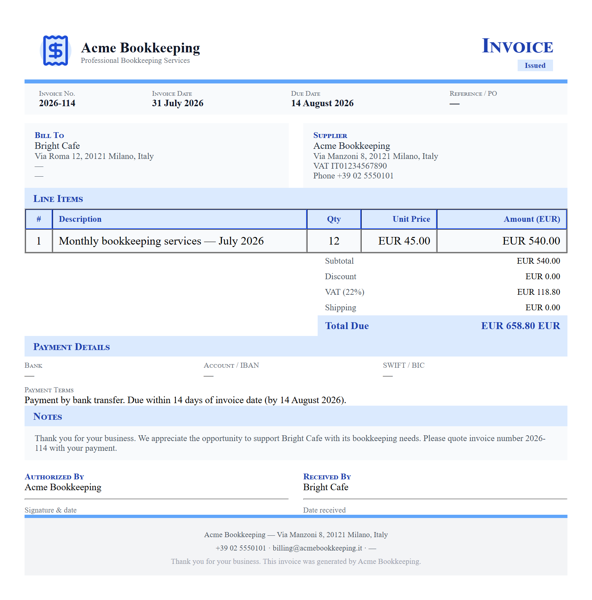
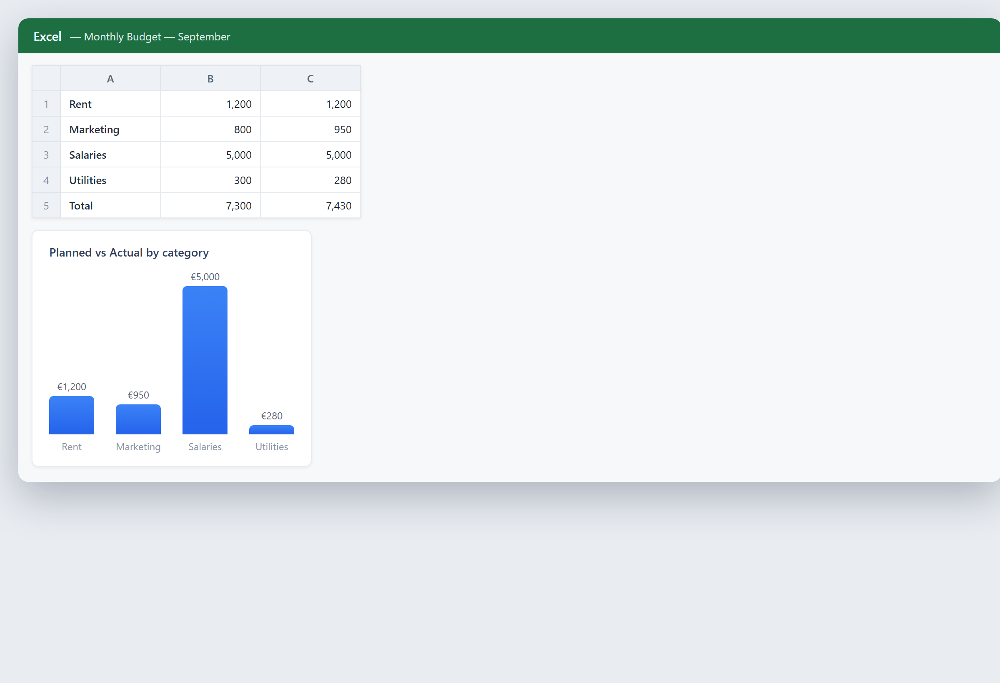

# Capitolo 25 — Amministrazione e finanza

## In parole semplici

L'amministrazione e la finanza sono dove l'IA silenziosamente risparmia più ore in una piccola impresa. Non perché il lavoro sia difficile, ma perché è ripetitivo. Fatture, righe bancarie, note spese, report mensili, previsioni di cassa — gli stessi task, ancora e ancora, ogni singola settimana. La ripetizione è esattamente ciò che il software sa fare bene, e l'IA aggiunge la capacità di leggere documenti disordinati e individuare schemi che una persona potrebbe perdere.

Pensa al tuo back office come a una stanza piena di carta che non smette mai di arrivare. Ogni fattura è un piccolo pezzo di carta che qualcuno deve leggere, digitare in un sistema, abbinare a un ordine, controllare per errori, e archiviare. Moltiplica questo per centinaia o migliaia di pezzi al mese, e vedi dove vanno i giorni. L'IA non si stanca, non perde la concentrazione alle 16, e non le dispiace fare lo stesso task per la millesima volta.

Questo capitolo copre quattro lavori: leggere fatture e documenti, abbinare (riconciliare) registri, produrre report automaticamente, e prevedere la cassa. Ognuno è un posto dove una piccola impresa può risparmiare tempo reale e fare meno errori.

Una idea importante prima di iniziare: l'IA in finanza è un *disegnatore*, non il *decisore*. Legge, ordina, abbina e suggerisce. Una persona approva ancora il movimento di denaro, firma il report, e possiede il risultato. Tieni un umano nel ciclo per tutto ciò che tocca denaro vero. Il metodo per giudicare se tutto questo vale il costo vive nel [Capitolo 16 — Obiettivi, costi e ritorno sull'investimento](ch16-goals-costs-and-return-on-investment.md); questo capitolo ti mostra cosa automatizzare e come.

## Un po' di storia

**Anni 1960–1980: la rivoluzione del foglio di calcolo.** Il primo grande cambiamento nel lavoro di back office fu il foglio di calcolo elettronico. Prima, i contabili tenevano i registri a mano e una singola modifica poteva significare ore di ricalcolo. I fogli di calcolo resero il calcolo istantaneo. Questa fu la prima volta che il software prese il controllo di un compito finanziario centrale, e fissò lo schema: automatizza l'aritmetica, lascia l'umano al comando del significato.

**Anni 1990: OCR e scansione di documenti.** L'Optical Character Recognition — software che legge il testo stampato da un'immagine scansionata e lo trasforma in testo modificabile — arrivò negli strumenti business. All'improvviso una fattura di carta poteva diventare dati invece che una pila di carta. Il primo OCR era lento e faceva errori, quindi una persona controllava ancora tutto. Ma la porta era aperta: la carta poteva diventare digitale.

**Anni 2000: automazione a regole e RPA.** La Robotic Process Automation — "bot" software che seguono regole fisse per spostare dati tra sistemi — divenne popolare. Un bot poteva copiare un totale di fattura da uno schermo e incollarlo in un altro. Questo funzionava su task prevedibili ma si rompeva nell'istante in cui un documento sembrava diverso: veloce ma fragile.

**Anni 2010: il machine learning legge documenti.** Il machine learning — software che impara schemi da molti esempi invece di seguire regole fisse — cambiò la lettura di documenti. Invece di dire al computer esattamente dove guardare, gli mostravi migliaia di fatture, e imparava a trovare il fornitore, la data e il totale da solo, anche quando il layout cambiava.

**Anni 2020: grandi modelli linguistici e agenti.** I grandi modelli linguistici — IA addestrata su enormi quantità di testo — ora possono leggere una fattura, capire cosa dice, e redigere una risposta al fornitore. Gestiscono formati insoliti che rompevano gli strumenti più vecchi. Il passo più nuovo è l'*agente*: IA che prende un task intero, come "processa questa email del fornitore", e lo porta avanti per parecchi passi da sola, con un umano che rivede il risultato. L'esempio Elanco più avanti in questo capitolo è esattamente questo tipo di agente.

L'arco: da registri scritti a mano, a fogli di calcolo istantanei, a testo scansionato, a bot che seguono regole, a IA che legge e ragiona. Ogni passo ha tolto più del lavoro ripetitivo dalle mani umane e ha lasciato agli umani il giudizio.

## Curiosità

### 25.5 Il "middleware umano" che l'IA ha sostituito

Per anni, il team procure-to-pay di Elanco — le persone che gestiscono domande e carte tra l'acquisto di beni e il loro pagamento — ha lavorato come quella che l'azienda chiamava "middleware umano". Rispondevano manualmente a oltre 30.000 richieste all'anno, e ognuna richiedeva più di dieci minuti. Dieci minuti qui, dieci minuti là, moltiplicati per trentamila, è una montagna di ore spese a spostare informazioni tra sistemi a mano.

Quella storia, con i numeri reali e il sistema di IA a due livelli che l'ha sostituita, è raccontata per intero in "Un esempio di business reale" qui sotto. La curiosità qui è la frase stessa: "middleware umano". Descrive un lavoro in cui una persona esiste solo per portare dati da un posto all'altro. È il tipo di lavoro che l'IA è più brava a rimuovere — e il tipo che dovresti cercare nel tuo back office.

## Un esempio di business reale

**Elanco: un ecosistema di IA a due livelli per procure-to-pay, che taglia il tempo di risposta alle richieste di circa il 99%.**

Elanco è un'azienda globale di salute animale che produce medicine e trattamenti per animali domestici e da allevamento. Il suo team procure-to-pay — il gruppo che gestisce tutto tra l'ordinare beni e il pagare il fornitore — aveva un problema cronico. Il team passava le sue giornate come "middleware umano", rispondendo manualmente a oltre 30.000 richieste all'anno. Ogni richiesta richiedeva più di dieci minuti: qualcuno cercava nel sistema finanziario, controllava l'ordine, consultava il fornitore, e digitava una risposta. Il lavoro era lento, ripetitivo e soggetto a errori.

Secondo The Hackett Group, che ha nominato questo progetto vincitore nella categoria Purchase-to-Pay dei suoi Hackett Innovation Awards 2026 (annunciato in un comunicato Business Wire il 24 giugno 2026), Elanco lo ha risolto con un ecosistema di IA basato su agenti a due livelli costruito su ElancoGPT, la piattaforma IA sicura dell'azienda. I due livelli erano:

- **Livello uno — AskSAP.** I dipendenti potevano fare domande in linguaggio semplice e ottenere risposte prese dal sistema aziendale SAP dell'azienda (il software che gestisce la sua finanza e le sue operazioni). Invece di aprire parecchi schermi e dare la caccia a un numero, una persona chiedeva semplicemente: "Qual è lo stato di questo ordine di acquisto?" e otteneva una risposta.
- **Livello due — l'agente procure-to-pay.** Questo agente scansiona automaticamente le email dei fornitori in arrivo, capisce cosa vuole il fornitore (l'"intento"), verifica la richiesta contro i dati live nel sistema aziendale, e redige una risposta. Un dipendente umano poi rivede la bozza prima che venga inviata.

Il risultato fu drammatico. Il tempo di risoluzione delle richieste scese a **meno di 10 secondi** — ciò che The Hackett Group descrisse come **una riduzione del 99%** rispetto ai precedenti oltre dieci minuti. L'azienda riportò anche che il sistema eliminò approssimativamente il **30% o 40%** delle richieste manuali procure-to-pay del tutto, perché molte domande semplicemente smisero di essere fatte una volta che i dipendenti potevano trovare le risposte da soli tramite AskSAP.

Due cose vale la nota. Primo, l'umano è ancora lì: l'agente *redige*, il dipendente *rivede*. Elanco non lasciò che l'IA inviasse denaro o risposte da sola. Secondo, la vittoria più grande venne dal dare alle persone un modo più veloce di trovare risposte, il che rimosse il bisogno della richiesta fin dall'inizio. Questo è uno schema che puoi copiare: la migliore automazione spesso rimuove la richiesta, non solo il lavoro.

Una nota sulla fonte: questo è un caso Hackett Innovation Award, non una storia cliente Microsoft. I numeri sopra vengono dall'annuncio del premio di The Hackett Group. Tratta le percentuali come i risultati riportati dall'azienda, e ricorda che i tuoi numeri saranno diversi a seconda dei tuoi sistemi e del tuo volume.

## Come fare

### 25.1 Fatture e documenti

Leggere fatture e altri documenti a mano è uno dei più grandi divora-tempo in una piccola impresa. L'elaborazione documenti con IA può leggere una fattura, estrarre i campi chiave, e metterli dove appartengono.

**Cosa estrae l'IA.** Da una tipica fattura, il software estrae il nome del fornitore, il numero di fattura, la data, le voci, l'imposta e il totale. Legge PDF, carta scansionata e allegati email. Gli strumenti moderni gestiscono molti layout senza che gli venga detto ognuno in anticipo.

**Come funziona nella pratica.** Punti lo strumento su una cartella di fatture in arrivo, o lo colleghi alla tua email. Legge ognuna, estrae i campi, e o li inserisce nel tuo sistema contabile o li mette in una coda perché una persona confermi. Più fatture vede, meglio diventa con i tuoi specifici fornitori.

**Il controllo umano.** Non lasciare che lo strumento registri fatture nei tuoi libri senza revisione, almeno all'inizio. Configuralo per estrarre e segnalare, e fai approvare a una persona. Sorveglia il tasso di errore (come consiglia il Capitolo 22). Nel tempo, man mano che l'accuratezza si dimostra, puoi lasciare che le fatture di routine a basso valore si registrino automaticamente e instradare solo le insolite a un umano.

**Dove risparmia di più.** Alto volume e formati ripetitivi. Se processi centinaia di fatture al mese, il risparmio è grande e ovvio. Se ne processi dieci, lo strumento potrebbe non ripagarsi. Adatta lo strumento al tuo volume.

**Sorveglia i campi ad alta posta.** Il totale e l'imposta sono i due campi che devono essere giusti, perché un numero sbagliato qui costa denaro reale. Ricontrolla questi finché non ti fidi dello strumento; nome del fornitore e data sono a rischio più basso se sbagliati.

### 25.2 Riconciliazioni

Riconciliare significa abbinare due serie di registri per assicurarsi che coincidano. L'esempio classico è abbinare il tuo estratto conto bancario contro il tuo libro mastro contabile. Se coincidono, i tuoi libri sono corretti. Se non coincidono, manca qualcosa, è duplicato o sbagliato, e devi trovarlo.

**Perché è doloroso a mano.** Abbinare riga per riga è lento e noioso, e la noia causa errori. Una persona che scorre centinaia di righe bancarie alla fine perderà un pagamento duplicato o una ricevuta mancante.

**Come aiuta l'IA.** Gli strumenti di riconciliazione con IA abbinano i registri automaticamente confrontando importi, date e numeri di riferimento. Collegano una riga bancaria alla fattura corrispondente, segnalano quelli che coincidono in modo pulito, e fanno emergere solo le discrepanze per un'indagine umana. Invece di controllare tutto, controlli le eccezioni.

**Il modello a eccezioni.** Questa è l'idea chiave: lascia che il software gestisca il 95% che coincide, e porta il 5% che non coincide a una persona. Il lavoro della persona cambia da "abbina ogni riga" a "risolvi le poche che non coincidono". È un lavoro più piccolo e più interessante, ed è dove il giudizio umano davvero aggiunge valore.

**Discrepanze comuni da aspettarsi.** Un pagamento che appare due volte (un duplicato), una commissione bancaria che nessuno ha registrato, una ricevuta mancante per un pagamento con carta, un pagamento fatto al fornitore sbagliato. Lo strumento segnala questi; tu li risolvi. Nel tempo impari i tuoi schemi e puoi aggiungere regole per beccare quelli ricorrenti automaticamente.

**Tieni una traccia di audit.** Qualunque cosa faccia lo strumento, assicurati che registri cosa ha abbinato e cosa ha segnalato. Quando il tuo commercialista o un revisore chiede come si è arrivati a una cifra, ti serve una traccia chiara. I buoni strumenti la producono; chiedi prima di comprare.

### 25.3 Report automatici

Report mensili e settimanali — conto profitti e perdite, vendite per prodotto, spese per categoria — sono un altro posto dove l'IA risparmia ore. Invece di una persona che tira numeri in un foglio di calcolo ogni mese, il report può costruirsi da solo.

**Report pianificati.** Imposta il report per generarsi su un programma fisso (ogni lunedì, il primo del mese) e consegnarlo nella tua casella o in una cartella condivisa. I numeri vengono tirati dai tuoi sistemi live, quindi il report è sempre aggiornato. Nessuno deve ricordarsi di farlo.

**Riassunti in linguaggio semplice.** L'IA moderna può leggere i numeri e scrivere un breve riassunto in parole semplici: "Il fatturato è salito dell'8% questo mese, trainato dal prodotto X; le spese sono salite del 3%, soprattutto nelle spedizioni." Questo trasforma una tabella di cifre in una frase che puoi davvero leggere e su cui agire. È come avere un analista junior che scrive il commento per te.

**Fai domande in linguaggio semplice.** Alcuni strumenti ti lasciano chiedere "Quali sono stati i nostri cinque migliori clienti questo trimestre?" e ottenere una risposta senza scrivere una formula. Questo è utile per le domande estemporanee che una volta significavano "ci guarderò dopo" e poi non succedeva mai.

**Non saltare la lettura umana.** Un report automatico è un punto di partenza, non un documento decisionale finito. Leggi il riassunto, controlla che i numeri abbiano senso, e aggiungi il tuo giudizio prima di agire su di esso o condividerlo. L'IA può riassumere con sicurezza ed essere comunque sbagliata se i dati sottostanti sono disordinati. Spazzatura dentro, spazzatura sicura di sé fuori.

**Standardizza il formato.** Una volta sistemato un layout di report, tienilo stabile. Un formato coerente è più facile da leggere di mese in mese e più facile da notare quando qualcosa sembra storto. Cambia il formato solo deliberatamente, non ogni volta.

### 25.4 Previsioni di cassa

Prevedere la cassa significa predire quanti soldi ci saranno in banca nelle prossime settimane e mesi. È diverso dal profitto. Un'azienda può essere profittevole sulla carta e comunque restare senza cassa se i pagamenti arrivano in ritardo. La cassa è ossigeno; il profitto è cibo. Puoi sopravvivere a lungo senza cibo e solo minuti senza ossigeno.

**Perché l'IA aiuta.** Una buona previsione deve combinare molti segnali: fatture che hai inviato ma non incassato, bollette che devi, schemi stagionali, e quanto affidabilmente i tuoi clienti pagano davvero in tempo. L'IA può guardare la tua storia e imparare, per esempio, che il cliente A di solito paga due settimane in ritardo, mentre il cliente B paga presto. Poi pondera la previsione di conseguenza.

**Inizia dalle basi.** Una previsione semplice risponde: quale cassa entra, quale esce, e qual è il saldo, settimana per settimana per le prossime 8-13 settimane. Costruiscila anche senza IA — un foglio di calcolo funziona. L'IA la migliora imparando schemi di pagamento e segnalando rischio.

**Sorveglia il punto basso.** Il numero più importante è il punto più basso nella previsione. Se la previsione mostra il tuo saldo scendere sotto un livello sicuro alla settimana nove, hai tempo ora per correggere — inseguire fatture, ritardare un acquisto, organizzare una linea di credito. Tutto il valore di prevedere è vedere il calo prima che accada.

**Tratta le previsioni come intervalli, non promesse, e aggiornale spesso.** Una previsione è una stima, non una garanzia. Presentala come un intervallo probabile con un caso migliore e un caso peggiore, e pianifica così che il caso peggiore sia sopravvivibile. Le previsioni di cassa diventano stantie in fretta, quindi aggiorna settimanalmente; una previsione di un mese fa è quasi inutile perché così tanto è cambiato. L'abitudine di un controllo cassa settimanale è una delle routine più preziose che un piccolo titolare possa costruire.

## Etica e responsabilità

La finanza è dove gli errori costano denaro reale e fiducia reale, quindi la responsabilità conta qui più che quasi ovunque.

**Tieni un umano nel ciclo per i movimenti di denaro.** L'IA dovrebbe redigere, estrarre, abbinare e suggerire. Una persona dovrebbe approvare tutto ciò che invia denaro, cambia un saldo, o firma un report. Un agente che legge un'email del fornitore e paga senza revisione è un rischio di frode: una fattura falsa, un'email spoofata, o un totale letto male possono prosciugare cassa in fretta. L'agente di Elanco redige e un umano rivede — copia quello schema esattamente.

**Proteggi i dati finanziari.** Fatture e registri bancari sono sensibili. Usa strumenti che tengono i tuoi dati sicuri e, dove possibile, dentro il tuo ambiente. Fai attenzione a inviare documenti finanziari a servizi di IA pubblici. Le basi di sicurezza sono coperte nel [Capitolo 6 — Cybersecurity nell'era dell'IA](ch06-cybersecurity-in-the-ai-era.md) e l'opzione self-hosting nel [Capitolo 8 — Self-hosting: tieni i tuoi dati sotto controllo](ch08-self-hosting-keep-your-data-under-control.md).

**Sii onesto nei report.** Un riassunto automatico può far sembrare ok un mese cattivo. Non lasciare che la lucidità di un report scritto dall'IA nasconda un problema reale. Leggi i numeri tu stesso e riporta la verità, soprattutto quando è scomoda.

**Bada alla traccia di audit e tieni la segregazione dei compiti.** Conserva registri di ciò che l'IA ha estratto, abbinato e cambiato; se un revisore chiede come è stata prodotta una cifra, devi poter mostrare il percorso. E ricorda che l'automazione può nascondere una cattiva transazione facilmente quanto trovarne una: la persona che configura un fornitore non dovrebbe essere la stessa che approva il suo pagamento. L'IA non rimuove il bisogno di controlli interni; cambia come si presentano.

## Errori da evitare

**Lasciare che l'IA muova denaro senza revisione.** Il singolo errore più pericoloso. Richiedi sempre l'approvazione umana per i pagamenti.

**Automatizzare un cattivo processo.** Se il tuo attuale processo di fatturazione è un disastro, automatizzarlo fa solo un disastro più veloce. Pulisci il processo prima, poi automatizza.

**Fidarsi dell'estrazione ciecamente.** L'IA può leggere male un totale o una cifra d'imposta. Controlla i campi ad alta posta finché non hai prova di accuratezza.

**Nessuna gestione delle eccezioni.** Se automatizzi solo i casi facili e non hai un piano per quelli insoliti, gli insoliti si accumulano e rompono il sistema. Progetta per le eccezioni dal primo giorno.

**Saltare la traccia di audit.** Uno strumento che non può mostrare cosa ha fatto è una passività in un audit. Esigi tracciabilità.

**Prevedere il caso migliore e scommetterci.** Una previsione è un intervallo. Pianifica così che il caso peggiore sia sopravvivibile.

**Previsioni stantie e confusione profitto-vs-cassa.** Una previsione di cassa di un mese fa è inutile; aggiorna settimanalmente. E ricorda che puoi essere profittevole e restare comunque senza denaro — prevedi la cassa, non solo il profitto.

**Iper-automatizzare basso volume.** Se hai solo dieci fatture al mese, uno strumento potrebbe non ripagare. Adatta lo strumento al tuo volume.

**Inviare dati sensibili a IA pubblica.** Fatture e righe bancarie sono sensibili. Usa strumenti sicuri o self-hostati.

**Nessuna linea di base.** Non misurare quanto tempo richiedeva il task prima, così non puoi provare il risparmio. Misura prima di iniziare (vedi Capitolo 22).

**Nascondere numeri cattivi.** Un report IA lucido che maschera un mese cattivo è disonesto. Riporta la verità.

## Esercizio pratico

### 25.7 Esercizio: mappa la tua automazione di back office

Scegli un task di back office e pianifica la sua automazione da cima a fondo.

**Passo 1 — Scegli il task.** Scegli il task finanziario o amministrativo più ripetitivo che hai: inserimento fatture, riconciliazione bancaria, il report mensile, o la previsione di cassa.

**Passo 2 — Misura la linea di base.** Quanto tempo richiede ora, e quante volte al mese lo fai? Scrivi entrambi. Questo è il tuo numero "prima".

**Passo 3 — Disegna i passi attuali.** Elenca ogni passo che un umano fa oggi: ricevere, leggere, digitare, abbinare, controllare, archiviare. Vedere i passi rende l'automazione ovvia.

**Passo 4 — Segna ogni passo.** Per ogni passo, segnalo: **l'IA lo fa** (estrarre, abbinare, riassumere), **l'umano lo rivede** (approvare, firmare), o **l'umano lo decide** (la chiamata di giudizio). Ogni movimento di denaro deve essere approvato dall'uomo.

**Passo 5 — Scegli lo strumento.** Scegli uno strumento che si adatta al tuo volume e al tuo sistema contabile. Non comprare il più grande; compra quello che si adatta.

**Passo 6 — Inizia con estrai-e-segnala.** Lancia con l'IA che estrae e segnala, e un umano che approva tutto. Non andare completamente automatico il primo giorno.

**Passo 7 — Metti la soglia di errore.** Decidi il tasso di errore che fa scattare un'azione. Per esempio, "se più del 3% dei totali estratti è sbagliato, ci fermiamo e rivediamo lo strumento".

**Passo 8 — Pianifica la previsione di cassa.** Costruisci una semplice previsione di cassa di 8-13 settimane, anche in un foglio di calcolo. Segna il punto più basso. Decidi cosa farai se scende sotto il tuo livello sicuro.

Fai questo per un task prima. Una volta che funziona e i numeri provano il risparmio, passa al task successivo. Un task ben automatizzato ti insegna più di cinque a metà.

## Checklist

### 25.8 Checklist amministrazione e finanza

Prima di automatizzare qualsiasi task finanziario, controlla queste.

- [ ] **Hai misurato la linea di base** — tempo per task e quanto spesso lo fai.
- [ ] **Un umano approva ogni movimento di denaro** — nessuna IA invia denaro da sola.
- [ ] **Pulisci il processo prima di automatizzarlo.**
- [ ] **Controlli i campi ad alta posta** (totali, imposta) finché non ti fidi dello strumento.
- [ ] **Hai progettato per le eccezioni** — i casi insoliti hanno un percorso chiaro verso un umano.
- [ ] **Lo strumento tiene una traccia di audit** che puoi mostrare a un commercialista o revisore.
- [ ] **I dati finanziari sono tenuti sicuri**, non inviati a servizi IA pubblici.
- [ ] **I report sono letti da un umano** prima che tu agisca su di essi o li condivida.
- [ ] **Riporti i numeri cattivi onestamente**, non solo il riassunto lucido.
- [ ] **Mantieni la segregazione dei compiti** — configurazione fornitore e approvazione pagamento sono persone separate.
- [ ] **Prevedi la cassa, non solo il profitto**, e sorvegli il punto più basso.
- [ ] **Aggiorni la previsione di cassa settimanalmente.**
- [ ] **Tratti le previsioni come un intervallo**, e pianifichi così che il caso peggiore sia sopravvivibile.
- [ ] **Adatti lo strumento al tuo volume** — niente iper-automazione di task minuscoli.
- [ ] **Hai messo una soglia di errore** che fa scattare una revisione.
- [ ] **Tieni la decisione sui soldi separata dalla decisione sulle persone** (vedi Capitolo 16).

Se una casella è vuota, il rischio è ancora tuo. Riempila prima di lasciare che l'IA si avvicini al denaro.

## Punti chiave

- L'amministrazione e la finanza sono piene di lavoro ripetitivo — fatture, abbinamenti, report, previsioni — e la ripetizione è esattamente ciò che l'IA sa fare bene.
- Tieni l'IA come disegnatore e l'umano come decisore: lascialo estrarre, abbinare e suggerire, ma una persona deve approvare tutto ciò che muove denaro.
- Il caso Elanco (vincitore di un Hackett Innovation Award 2026) ha tagliato il tempo di risposta alle richieste procure-to-pay a meno di 10 secondi, circa una riduzione del 99%, usando un agente a due livelli che redige risposte per la revisione umana e rimuove molte richieste del tutto.
- Prevedi la cassa, non solo il profitto, aggiornala settimanalmente, e pianifica così che il calo del caso peggiore sia sopravvivibile.
- Pulisci il processo prima di automatizzarlo, progetta per le eccezioni, e tieni una traccia di audit che puoi mostrare.

<!-- BEGIN agentbridge-examples -->

## Provalo con AgentBridge

Ecco come appare lo stesso lavoro con AgentBridge. Ogni riquadro mostra il risultato finito e l'unica riga che digiti per ottenerlo.

### Crea una fattura in pochi secondi

*Un documento di fattura finito prodotto dall'agente*

**Cosa chiedi:** `Fai una fattura per Bright Cafe per 12 ore di contabilità a 45 euro l'ora, con scadenza in 14 giorni.`

L'agente scrive una fattura vera con i dati della tua attività, le voci, il subtotale, l'imposta e il totale, e una scadenza. Ottieni un documento reale che puoi stampare o inviare. Se un numero è sbagliato, lo dici e lui lo corregge.

*Suggerimento: Chiedila come un vero file Word (/tools office-files) se vuoi continuare a modificarla in Microsoft Office.*

---

### Scrivi una lettera formale

*Una lettera di affari formale, formattata e pronta*

**Cosa chiedi:** `Scrivi una lettera formale al nostro proprietario per rinnovare il contratto di locazione di altri due anni alle stesse condizioni.`

L'agente scrive la lettera con il saluto giusto, un corpo chiaro e una chiusura gentile, nella voce della tua attività. La rivedi, cambi una parola se vuoi, e la invii.

*Suggerimento: Digli a chi stai scrivendo e cosa vuoi; lui gestisce il tono formale per te.*

---

### Un budget che puoi leggere

*Un foglio di calcolo di budget con un chiaro grafico a barre*

**Cosa chiedi:** `Crea un foglio di calcolo di budget mensile con pianificato e effettivo per affitto, marketing e stipendi, più un grafico.`

L'agente crea il foglio di calcolo con le categorie, le colonne pianificato ed effettivo, i totali, e un grafico che mostra la differenza a colpo d'occhio. Puoi aprirlo in Excel e continuare a lavorarci.

*Suggerimento: Chiedi il titolo del grafico e la valuta così corrisponde alla tua attività.*

---

### Invia la fattura via email

*La fattura allegata a un'email pronta da inviare*

**Cosa chiedi:** `Invia via email la fattura che abbiamo appena creato al cliente con una breve nota di accompagnamento amichevole.`

L'agente allega la fattura e scrive una breve nota di accompagnamento con l'importo e la scadenza. Un messaggio, inviato.

*Suggerimento: Concatenalo: 'fai la fattura e inviala al cliente' in un'unica richiesta.*

<!-- END agentbridge-examples -->
