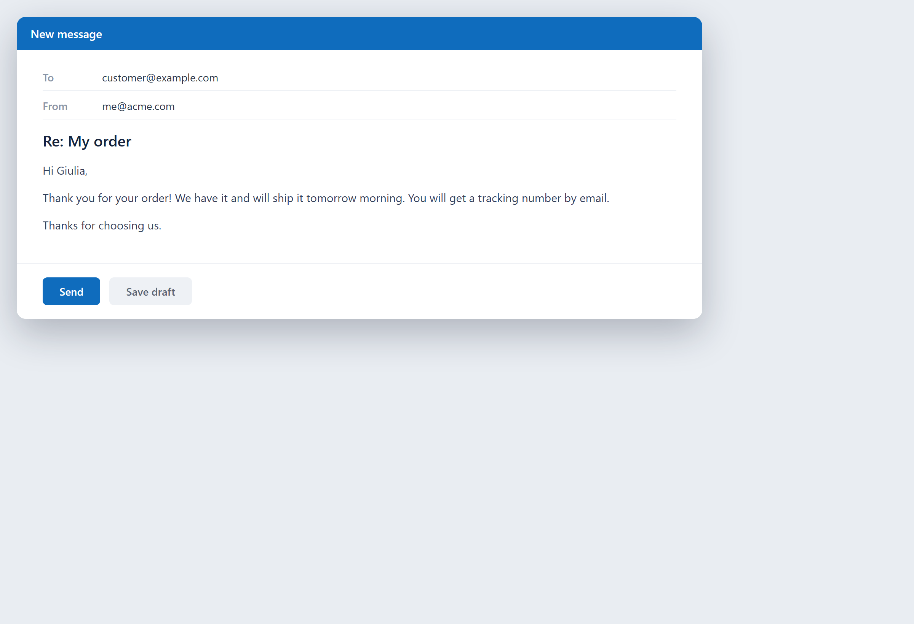
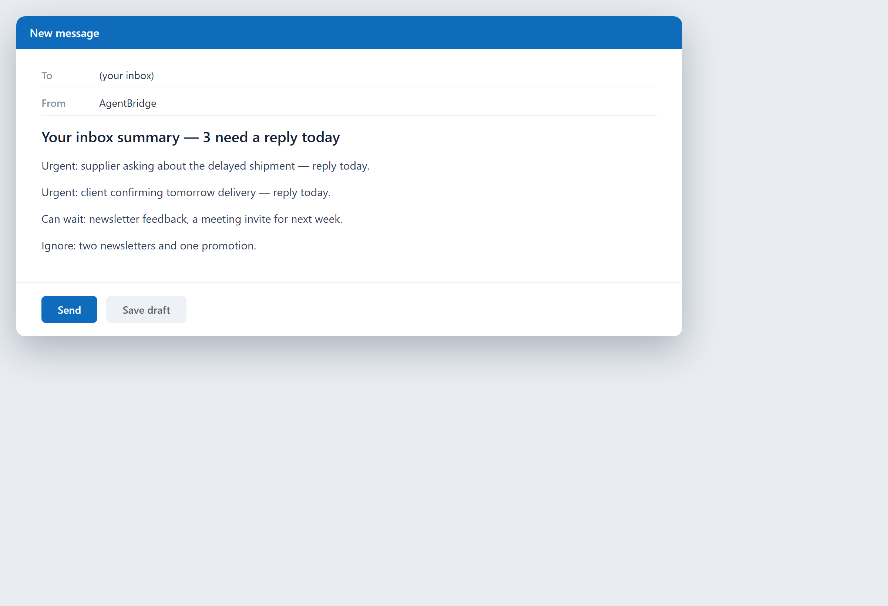
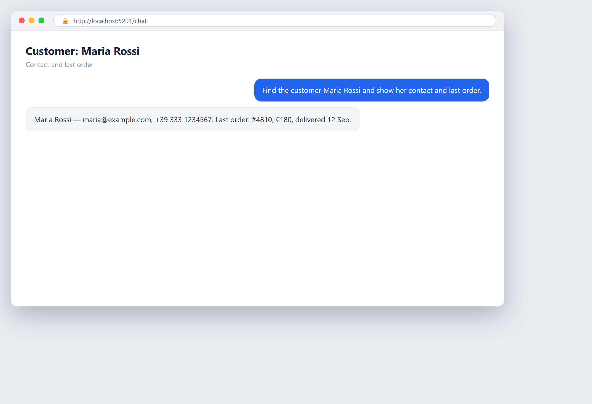

# Capitolo 27 — Assistenza e supporto clienti

## In parole semplici

L'assistenza clienti è il momento in cui un'azienda dimostra di tenere davvero ai suoi clienti. Quando qualcosa va storto o un cliente ha una domanda, la velocità e la qualità della risposta decidono se resterà o se se ne andrà. Il problema è che il supporto è pieno delle stesse domande ripetute all'infinito, e un piccolo team non può rispondere a tutte all'istante. L'AI aiuta rispondendo subito a quelle più comuni e indirizzando rapidamente quelle difficili alla persona giusta.

Pensa al supporto come a una fila. Ogni domanda si mette in attesa di una risposta. Più la fila è lunga, più le persone si frustrano. L'AI accorcia la fila in due modi: risponde ad alcune domande prima ancora che arrivino a un essere umano, e smista le altre perché la persona giusta veda il problema giusto per primo.

Questo capitolo copre quattro attività: i chatbot e le FAQ che rispondono alle domande più comuni, la gestione dei ticket che smista e indirizza i problemi, l'analisi del sentiment che capisce come si sentono i clienti, e una base di conoscenza intelligente che tiene tutte le risposte in un unico posto consultabile.

Prima di tutto, un'idea onesta: l'obiettivo dell'AI nel supporto non è nascondere i clienti alle tue persone. È liberare le tue persone dalle domande ripetitive, così possono dedicare il tempo ai casi che hanno davvero bisogno di un essere umano — il cliente arrabbiato, il problema complesso, quello che decide se qualcuno resterà per dieci anni. L'AI gestisce il volume; gli umani gestiscono l'attenzione. Il metodo per giudicare se conviene si trova nel [Capitolo 16 — Obiettivi, costi e ritorno sull'investimento](ch16-goals-costs-and-return-on-investment.md); questo capitolo ti mostra cosa automatizzare e come.

## Un po' di storia

**Anni '60–'80: il call center.** L'assistenza clienti significava il telefono. Un cliente chiamava, aspettava in linea e parlava con un operatore. Tutta la disciplina consisteva nel mettere abbastanza persone a rispondere al telefono. Funzionava, ma era costoso, lento, e cresceva solo assumendo più gente.

**Anni '90: la posta elettronica e il ticket.** Il supporto si spostò in parte sull'email, e nacque il "ticket": ogni richiesta di un cliente diventava una scheda numerata che si poteva seguire, assegnare e chiudere. I ticket misero ordine nel caos delle email di supporto. Strumenti come i primi software helpdesk resero possibile vedere ogni richiesta aperta in un unico posto.

**Anni 2000: la base di conoscenza e il self-service.** Le aziende capirono che la maggior parte delle domande di supporto erano sempre le stesse poche. Costruirono basi di conoscenza — biblioteche consultabili di risposte — perché i clienti potessero aiutarsi da soli. Il self-service tolse un po' di peso agli operatori, ma le prime basi di conoscenza erano difficili da consultare e spesso non trovavano ciò che il cliente cercava.

**Anni 2010: la chat e il chatbot a regole.** Arrivò la chat dal vivo, e con essa il chatbot. I primi chatbot erano basati su regole: un albero decisionale che collegava parole chiave a risposte preregistrate. Erano economici ma frustranti — non capivano nulla fuori copione, e i clienti spesso si sentivano intrappolati.

**Fine anni 2010: l'AI legge il sentiment.** Il machine learning cominciò a leggere il *tono* di un messaggio — se un cliente era contento, frustrato o arrabbiato — e poteva segnalare un cliente arrabbiato perché un operatore senior rispondesse per primo. L'analisi del sentiment aggiunse un nuovo segnale allo smistamento: non solo qual è il problema, ma come si sente il cliente a riguardo.

**Anni 2020: i grandi modelli linguistici e il supporto agentico.** I grandi modelli linguistici — AI addestrata su enormi quantità di testo — hanno creato chatbot che capiscono davvero cosa ha scritto un cliente e rispondono con parole semplici. Il passo più recente è la piattaforma agentica: un'AI che non solo risponde, ma agisce — crea un ticket, aggiorna una scheda, programma un intervento. L'esempio TridentCare qui sotto è esattamente questo: un'AI che gestisce il lavoro di pianificazione dall'inizio alla fine, con gli umani che intervengono solo quando serve giudizio.

Il percorso: dalle file al telefono, ai ticket tracciati, alle risposte consultabili, ai bot che capiscono, agli agenti che agiscono. Ogni passo ha spostato il lavoro routinario sul software e ha liberato gli operatori umani per i casi che richiedono un essere umano.

## Curiosità

### 27.5 Lo smistatore che lasciò fare il lavoro al sistema

Nel vecchio modo di lavorare di TridentCare, circa metà della pianificazione si faceva a mano — una persona che abbinava la richiesta di un paziente a un tecnico, a un orario e a un luogo. Dopo che l'azienda è passata a una piattaforma basata sull'AI, la pianificazione manuale è scesa ad appena il 4,3%. Gli smistatori non sono spariti; hanno cambiato lavoro. Hanno smesso di fare loro l'abbinamento e hanno cominciato a supervisionarlo, intervenendo solo quando un caso aveva davvero bisogno di giudizio umano. Questo passaggio — dal fare il lavoro al supervisionare il lavoro — è la rivoluzione silenziosa del supporto e delle operazioni. La storia completa è qui sotto.

## Un esempio di business reale

**TridentCare: 96% di automazione della pianificazione con un CRM basato sull'AI.**

TridentCare è il più grande fornitore di servizi diagnostici medicali portatili negli Stati Uniti. Invia tecnici in ospedali, case di riposo e a casa dei pazienti per eseguire esami come radiografie ed ecografie — servizi che non possono aspettare e vanno pianificati in modo affidabile su un'area enorme. Pianificare questo lavoro a mano, su centinaia di mercati, era lento e difficile da far crescere.

Secondo un comunicato stampa di ServiceNow (ripreso da Business Wire il 22 aprile 2026), TridentCare ha scelto la ServiceNow AI Platform per trasformare le sue operazioni end-to-end e sostituire in gran parte la pianificazione manuale con l'automazione. I risultati riportati:

- **96% di automazione della pianificazione su 127 mercati.** La pianificazione manuale dei servizi diagnostici medicali portatili è scesa dal **50% ad appena il 4,3%**. In altre parole, il sistema ora gestisce quasi tutta la pianificazione, e una persona interviene solo quando il giudizio lo richiede davvero.
- **Le attese dei pazienti oltre il livello di servizio pattuito (SLA) si sono ridotte del 57%.** Uno SLA è il livello di servizio promesso — per esempio, "un tecnico arriva entro due ore". Meno pazienti hanno aspettato più del promesso.
- **L'efficienza nel primo mercato è migliorata di circa il 30%.** L'azienda ha fatto di più nei mercati in cui è partita.

Il comunicato descriveva anche una trasformazione "dal lead all'incasso": collegando il CRM vendite direttamente ai dati sulle prestazioni sul campo, TridentCare ha acquisito la visibilità per impostare livelli di servizio accurati, vedere dove si spostava la domanda e affinare il modo di vendere.

Due lezioni spiccano. Prima, il ruolo umano è passato dal *fare* al *supervisionare*: gli smistatori hanno lasciato al sistema la routine e sono intervenuti solo per le eccezioni. Seconda, il vantaggio non è stata solo la velocità — sono stati l'affidabilità e l'attenzione ai pazienti. In un'azienda dove un tecnico in ritardo incide sulla salute di un paziente, un'automazione che riduce le attese non è solo un risparmio; è un servizio migliore.

Una nota sulla fonte: i numeri qui sopra vengono dal comunicato pubblicato da ServiceNow. Considerali i risultati dichiarati da TridentCare; i tuoi numeri dipenderanno dalla tua attività e dai tuoi volumi.

## Come si fa

### 27.1 Chatbot e FAQ

Un chatbot sul tuo sito o nella tua app può rispondere all'istante alle domande di supporto più comuni, così i clienti non devono aspettare una persona. Una pagina FAQ (domande frequenti) è la cugina più semplice: un elenco di domande comuni con risposte scritte.

**Cosa dovrebbe gestire un chatbot.** Le domande ripetitive e a basso rischio: "Qual è il vostro orario?", "Come reimposto la password?", "Dov'è il mio ordine?", "Qual è la vostra politica sui resi?". Sono le domande che mangiano la maggior parte del tempo di un team di supporto e non richiedono giudizio. Lascia che il bot risponda.

**I bot moderni capiscono il linguaggio.** A differenza dei vecchi bot a menu, un chatbot costruito su un grande modello linguistico capisce cosa scrive un cliente e risponde con parole semplici. Riesce a gestire "non riesco ad accedere, dice che la password è sbagliata" senza che il cliente debba scegliere da un elenco.

**Il passaggio di consegne è tutto.** Un chatbot che non sa rispondere deve passare la conversazione a un umano, con il contesto intatto — l'umano deve vedere cosa il cliente ha già detto, non ripartire da zero. Decidi le regole del passaggio prima di costruire: quando il bot non è sicuro, quando il cliente chiede una persona, quando l'argomento è delicato. Un bot che conosce i propri limiti è affidabile; uno che bluffa no.

**Tieni viva la FAQ.** Una pagina FAQ non aggiornata è peggio di nessuna — dà risposte sbagliate con sicurezza. Rivedila regolarmente e aggiornala man mano che i tuoi prodotti e le tue politiche cambiano. Il chatbot e la FAQ dovrebbero attingere dalla stessa fonte veritiera (vedi la base di conoscenza qui sotto).

**Misura la risoluzione e il fallimento.** Traccia quante domande il bot risolve da solo e quante ne passa. I fallimenti ti dicono cosa insegnargli dopo. (La stessa tecnologia di chatbot, applicata alle vendite invece che al supporto, è trattata nel [Capitolo 26 — Vendite e marketing](ch26-sales-and-marketing.md).)

### 27.2 Gestione dei ticket

Un *ticket* è una scheda numerata di una richiesta di un cliente. Gestire i ticket significa smistare ogni richiesta, assegnarla alla persona giusta, seguirne l'avanzamento e chiuderla quando è risolta. Quando il volume è alto, una buona gestione dei ticket è la differenza tra un team di supporto ordinato e uno caotico.

**L'AI smista e indirizza.** Invece di una persona che legge ogni ticket e decide chi dovrebbe gestirlo, l'AI legge il ticket e lo indirizza automaticamente al team o all'operatore giusto, in base all'argomento, alla storia del cliente e all'urgenza. Questo fa risparmiare il passo di smistamento, che è puro overhead.

**Dai priorità per urgenza e sentimento.** L'AI può ordinare i ticket perché i clienti più urgenti e più alterati vengano seguiti per primi. Un cliente il cui servizio è completamente giù, o che è chiaramente arrabbiato, non dovrebbe aspettare dietro una domanda di routine. Unire urgenza e sentiment (vedi sotto) rende la fila più intelligente.

**Suggerisci la risposta.** L'AI può leggere un ticket e suggerire una risposta, o indirizzare l'operatore all'articolo della base di conoscenza che lo risolve. L'operatore rivede e invia, invece di scrivere da zero. Questo riduce i tempi di gestione su ogni ticket.

**Automatizza le azioni di routine.** Alcuni ticket richiedono una semplice azione — reimpostare una password, rimandare un documento, aggiornare un indirizzo. L'AI può farle automaticamente e chiudere il ticket, oppure predisporre l'azione perché un umano la approvi. Il lavoro routinario sparisce dalla fila.

**Conserva la traccia di controllo.** Ogni ticket dovrebbe registrare cosa è successo, chi ha fatto cosa e quando. Conta per la revisione di qualità, per la formazione e per la responsabilità. I buoni strumenti di ticketing lo producono automaticamente; verifica che il tuo lo faccia.

### 27.3 Analisi del sentiment

L'analisi del sentiment significa usare l'AI per leggere il *sentimento* dietro un messaggio — il cliente è contento, neutro, frustrato o arrabbiato? Trasforma il testo grezzo in un segnale emotivo su cui puoi agire.

**Perché conta.** Un cliente arrabbiato che aspetta in una fila normale può andarsene prima che qualcuno lo veda. Se l'AI segnala la rabbia presto, un operatore senior può rispondere in fretta e trasformare un brutto momento in uno buono. Il sentiment è un segnale di smistamento che il semplice abbinamento per argomento perde.

**Come funziona.** L'AI legge le parole e il tono di un messaggio e assegna un sentiment — positivo, neutro, negativo — o un punteggio. Impara da molti esempi di messaggi etichettati da umani. Non è perfetta, ma è abbastanza buona da segnalare i clienti chiaramente alterati.

**Usala per dare priorità, non per giudicare.** Immetti il sentiment nella fila dei ticket perché i messaggi più negativi salgano in cima. Non usarla per punteggiare o punire gli operatori, e non trattare una singola lettura del sentiment come l'ultima parola sui sentimenti di un cliente. È un indizio per prestare attenzione, non un verdetto.

**Osserva le tendenze nel tempo.** Il sentiment è più utile come tendenza. Se il sentiment negativo su tutti i ticket cresce di mese in mese, qualcosa non va nel tuo prodotto o servizio, ancora prima che i clienti scrivano un reclamo formale. Traccia il sentiment medio e osserva la direzione.

**Tieni conto dei limiti.** Sarcastico, ironia e differenze culturali possono ingannare l'analisi del sentiment. Un "grande, un altro problema" viene letto come positivo da un modello ingenuo. Usa il sentiment come un segnale tra tanti, e lascia che il giudizio di un umano lo scavalchi.

### 27.4 Base di conoscenza intelligente

Una base di conoscenza è una biblioteca consultabile di risposte alle domande più comuni. Una base di conoscenza *intelligente* usa l'AI per rendere molto più facile trovare la risposta giusta — e per tenere le risposte aggiornate.

**Una ricerca che capisce la domanda.** Invece di abbinare parole chiave esatte, una base di conoscenza con AI capisce cosa intende il cliente e restituisce l'articolo pertinente anche se le parole sono diverse. "La mia carta è stata addebitata due volte" trova l'articolo sui pagamenti duplicati, non solo gli articoli che contengono quelle parole esatte.

**L'AI scrive e aggiorna gli articoli.** Quando un operatore di supporto risolve un nuovo problema, l'AI può redigere un articolo della base di conoscenza dal ticket risolto, così la risposta viene catturata per la volta successiva. Questo trasforma ogni problema risolto in una risposta riutilizzabile, invece di lasciarlo chiuso nella testa di un solo operatore.

**Una sola fonte veritiera.** Il tuo chatbot, la tua pagina FAQ e i tuoi operatori dovrebbero tutti attingere dalla stessa base di conoscenza. Quando aggiorni un posto, ogni canale riceve la risposta giusta. Se li mantieni separatamente, divergono e danno risposte contraddittorie, il che distrugge la fiducia.

**Individua le lacune.** L'AI può vedere quali domande fanno i clienti per le quali non esiste un articolo. Quelle lacune sono una lista di cose da fare: scrivi le risposte mancanti, e il bot e la ricerca migliorano. La base di conoscenza migliora da sola mostrandoti cosa manca.

**Tienila fresca.** Una base di conoscenza stantia dà risposte sbagliate con sicurezza. Rivedi gli articoli regolarmente, ritira quelli obsoleti, e lascia che l'AI segnali gli articoli che potrebbero dover essere aggiornati perché il prodotto è cambiato. La freschezza è tutto il valore di una base di conoscenza.

## Etica e responsabilità

Il supporto è dove la fiducia si conquista o si perde, quindi la posta in gioco etica è alta.

**Non lasciare mai che un bot nasconda un umano.** I clienti hanno diritto di arrivare a una persona. Un chatbot che blocca la strada verso un umano è un design ostile. Rendi il passaggio facile, chiaro e sempre disponibile.

**Dichiara che è un bot.** Un cliente dovrebbe sapere che sta parlando con un'AI e non con una persona. È una buona pratica ovunque e un obbligo di legge in alcuni luoghi.

**Non ignorare un cliente arrabbiato per un errore del modello.** Se l'analisi del sentiment perde un cliente arrabbiato, la fila umana deve comunque riprenderlo. Il sentiment è un aiutante, non un guardiano. Non lasciare mai che l'errore di un modello seppellisca un reclamo reale.

**Proteggi i dati dei clienti.** I ticket di supporto contengono informazioni personali, a volte sensibili. Trattale con cura e segui le regole sulla privacy — le basi sono nel [Capitolo 10 — Privacy e GDPR](ch10-privacy-and-gdpr.md). Non immettere dati sensibili dei clienti in strumenti AI pubblici senza verificare le implicazioni di sicurezza (vedi [Capitolo 6 — Cybersecurity nell'era dell'AI](ch06-cybersecurity-in-the-ai-era.md)).

**Mantieni un umano responsabile.** L'AI può redigere una risposta o indirizzare un ticket, ma un umano possiede il risultato. Quando qualcosa va storto, ci deve essere una persona responsabile, non una scatola nera.

**Usa il sentiment per aiutare, non per manipolare.** Leggere i sentimenti di un cliente dovrebbe aiutarti a servirlo meglio, non sfruttare la sua frustrazione per vendere di più o metterlo sotto pressione. Resta dalla parte dell'attenzione.

**Non usare i dati di supporto per sorvegliare gli operatori.** Tracciare le metriche dei ticket per migliorare il processo va bene. Usare gli stessi dati per spiare e punire singoli operatori avvelena la fiducia. Misura il lavoro, non la persona.

## Errori da evitare

**Un bot che blocca l'umano.** Il peggior errore di supporto. Rendi sempre il passaggio facile.

**Nessun contesto nel passaggio.** Passare un cliente a un umano che poi gli chiede di ripetere tutto. Porta il contesto con te.

**Chatbot che bluffa.** Un bot che indovina invece di ammettere di non sapere. Insegnagli a passare la mano quando non è sicuro.

**Base di conoscenza obsoleta.** Articoli superati che danno risposte sbagliate con sicurezza. Rivedi e aggiorna regolarmente.

**Fonti veritiere separate.** Chatbot, FAQ e operatori ognuno con le proprie risposte che divergono. Usa una sola base di conoscenza.

**Il sentiment come verdetto.** Trattare la lettura del sentiment di un modello come l'ultima parola su un cliente. È un indizio, non un giudizio.

**Perdere il cliente arrabbiato.** Lasciare che un errore del modello seppellisca un cliente alterato. La fila umana deve comunque riprenderlo.

**Automatizzare un processo cattivo.** Se il tuo flusso di supporto è rotto, l'automazione crea un flusso rotto più veloce. Prima sistema il processo.

**Far trapelare dati sensibili.** Mettere i dati dei clienti in strumenti AI non sicuri. Prima verifica sicurezza e privacy.

**Nessuna traccia di controllo.** Ticket che non possono mostrare cosa è successo. Conserva il registro.

**Confondere lo scarto con il successo.** Contare quanti ticket il bot ha "gestito" invece di chiedersi se il cliente fosse davvero soddisfatto. Misura risoluzione e soddisfazione, non lo scarto.

**Saltare la linea di base.** Non misurare i tempi di risposta o la soddisfazione prima, così non puoi dimostrare il miglioramento. Misura prima (vedi Capitolo 22).

## Esercizio pratico

### 27.7 Esercizio: progetta la tua automazione del supporto

Scegli un canale di supporto e pianifica la sua assistenza con l'AI dall'inizio alla fine.

**Passo 1 — Scegli il canale.** Scegline uno: un chatbot del sito, la tua fila di ticket, o la tua base di conoscenza. Fanne uno, non tutti.

**Passo 2 — Definisci l'obiettivo e la metrica.** Risposta più veloce? Più risoluzione in self-service? Meno clienti arrabbiati? Scegli un numero da misurare.

**Passo 3 — Misura la linea di base.** Qual è quel numero adesso? Tempo medio di risposta, tasso di risoluzione, punteggio di soddisfazione. Scrivilo.

**Passo 4 — Elenca le domande comuni.** Prendi l'ultimo mese di ticket e trova le 10 domande ripetute più frequenti. Sono quelle che il bot e la base di conoscenza dovrebbero gestire.

**Passo 5 — Scrivi le risposte.** Per ogni domanda comune, scrivi la risposta che vuoi. Questa diventerà la tua base di conoscenza e l'addestramento del tuo bot.

**Passo 6 — Imposta le regole di passaggio.** Decidi esattamente quando il bot passa a un umano: quando non è sicuro, quando viene chiesto, quando è delicato. Scrivi le regole.

**Passo 7 — Aggiungi lo smistamento per sentiment.** Se il tuo strumento lo supporta, fai sì che i ticket con sentiment negativo salgano in cima alla fila.

**Passo 8 — Lancia in piccolo e misura.** Prima fallo girare su una fetta di traffico. Confronta la metrica con la linea di base. Scala solo ciò che dimostra di risolvere davvero, non solo di scartare.

Fai bene un canale. L'elenco di domande comuni che costruisci al passo 4 è prezioso di per sé — ti mostra esattamente cosa confonde i tuoi clienti, utile anche al di là del supporto.

## Lista di controllo

### 27.8 Lista di controllo per assistenza e supporto clienti

Prima di lanciare l'AI nel supporto, verifica queste cose.

- [ ] **Hai misurato la linea di base** — tempo di risposta, tasso di risoluzione, soddisfazione.
- [ ] **Il chatbot passa a un umano facilmente**, con pieno contesto.
- [ ] **Dichiari che è un bot** dove richiesto e come buona pratica.
- [ ] **Il bot è addestrato sulle tue vere domande comuni**, non su quelle generiche.
- [ ] **Il bot ammette quando non sa** invece di bluffare.
- [ ] **I ticket vengono indirizzati automaticamente** al team o all'operatore giusto.
- [ ] **I clienti urgenti e alterati hanno priorità** nella fila.
- [ ] **Il sentiment è un indizio per prestare attenzione**, non un verdetto sul cliente.
- [ ] **Hai una sola base di conoscenza** che alimenta il bot, la FAQ e gli operatori.
- [ ] **La base di conoscenza è tenuta fresca** e rivista regolarmente.
- [ ] **L'AI redige risposte e articoli** dai ticket risolti per catturare la conoscenza.
- [ ] **Conservi una traccia di controllo** su ogni ticket.
- [ ] **I dati dei clienti sono trattati in modo sicuro** e seguono le regole sulla privacy (vedi Capitolo 10).
- [ ] **Un umano possiede il risultato** — nessuna responsabilità da scatola nera.
- [ ] **Misuri risoluzione e soddisfazione**, non solo lo scarto.
- [ ] **Sistemi il processo di supporto prima di automatizzarlo.**

Se una casella è vuota, un cliente potrebbe sentirlo. Riempila prima di lasciare che l'AI risponda al posto tuo.

## Punti chiave

- L'AI nel supporto accorcia la fila rispondendo all'istante alle domande comuni e indirizzando rapidamente quelle difficili alla persona giusta.
- Il caso TridentCare (un annuncio di ServiceNow) ha raggiunto il 96% di automazione della pianificazione su 127 mercati, riducendo la pianificazione manuale dal 50% al 4,3% e le attese dei pazienti oltre SLA del 57%, con umani che supervisionano invece di fare il lavoro.
- La caratteristica più importante del chatbot è un passaggio pulito a un umano con pieno contesto — non lasciare mai che un bot blocchi una persona.
- Una base di conoscenza fresca e condivisa dovrebbe alimentare il bot, la FAQ e i tuoi operatori; l'analisi del sentiment dovrebbe dare priorità alla fila, non giudicare il cliente.
- Misura risoluzione e soddisfazione, non lo scarto, e mantieni un umano responsabile di ogni risultato.

<!-- BEGIN agentbridge-examples -->

## Provalo con AgentBridge

Ecco come appare lo stesso lavoro con AgentBridge. Ogni riquadro mostra il risultato finito e l'unica riga che digiti per ottenerlo.

### Rispondi a un'email con il tuo stile

*Una risposta email già scritta, pronta da inviare*

**Cosa chiedi:** `Rispondi a questo cliente ringraziandolo e confermando che spediremo domani: [incolla email]`

L'agente scrive una risposta amichevole e professionale che suona come te. La leggi una volta, premi invia e vai oltre.

*Suggerimento: Configura la tua posta una volta con /email. Dopo, leggere e inviare funzionano dalla chat.*

---

### Farti un'idea della tua casella

*Un breve riepilogo della casella con le cose urgenti*

**Cosa chiedi:** `Riassumi le mie email non lette e dimmi quali richiedono una risposta oggi.`

L'agente legge la tua posta non letta e ti dà una breve lista: cosa è urgente, cosa può aspettare e cosa puoi ignorare. Affronti prima le vere priorità.

*Suggerimento: Un riepilogo del mattino può essere programmato così ti aspetta insieme al caffè.*

---

### Trovare un cliente in fretta

*Una scheda cliente recuperata su richiesta*

**Cosa chiedi:** `Trova il cliente Maria Rossi e mostrami i contatti e l'ultimo ordine.`

L'agente trova il cliente e mostra i contatti e l'ultimo ordine, così puoi aiutarlo senza metterlo in attesa.

*Suggerimento: Chiedi gli ultimi tre ordini se vuoi il quadro completo.*

<!-- END agentbridge-examples -->
