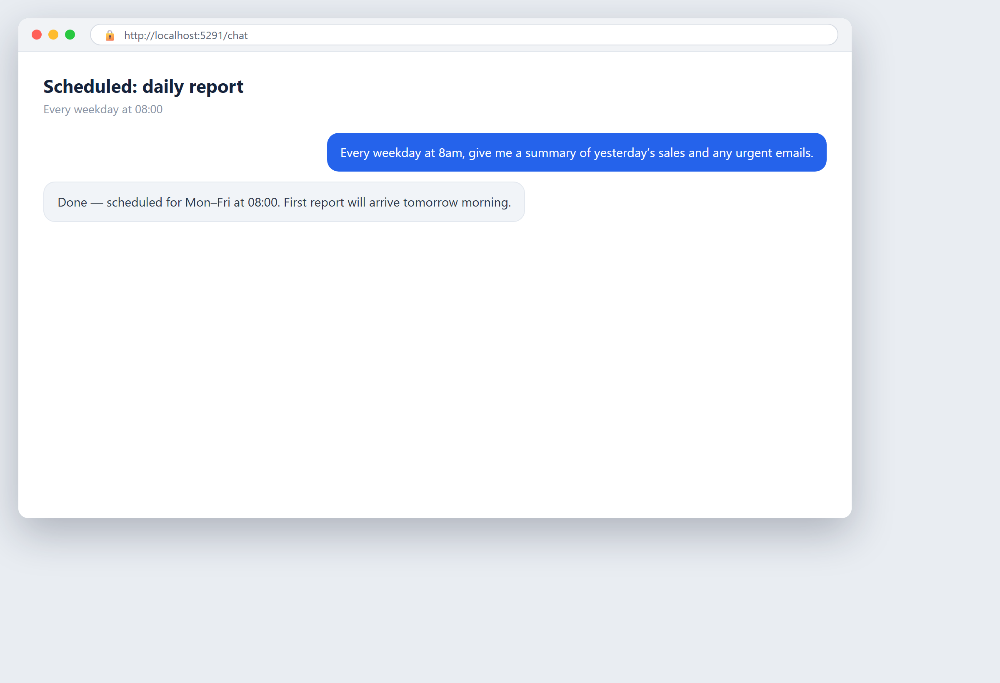
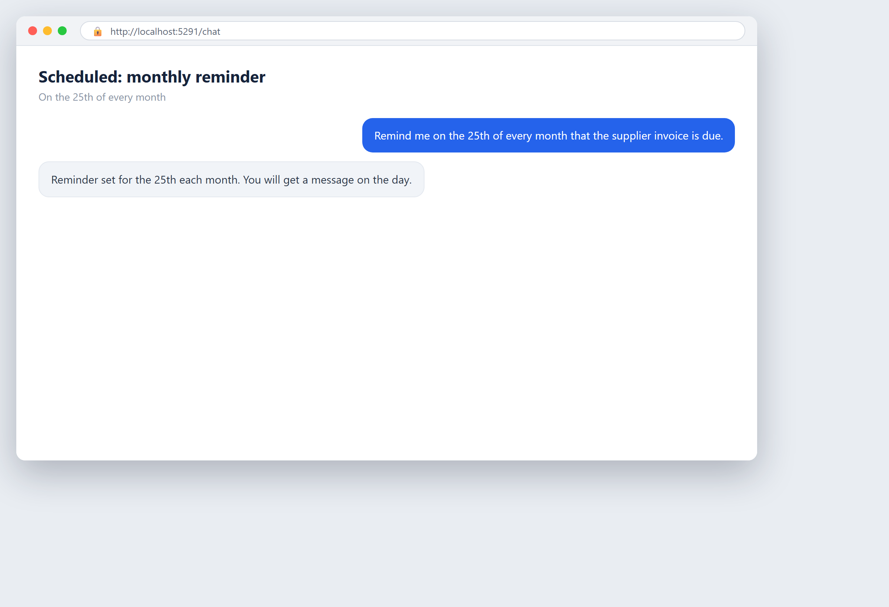

# Задачи по расписанию: работа, которая выполняется сама

Большинство инструментов ждут, пока вы их попросите. AgentBridge умеет также работать в согласованное с вами время. Вы один раз говорите, что сделать и когда, — и он делает это каждый раз без напоминаний. Это один из самых простых способов сэкономить время: задача выполняется, а результат уже вас ждёт.

### Отчёт, который пишется сам каждое утро

*Задача по расписанию, настроенная на выполнение каждое утро*

**Что вы просите:** `Каждый будний день в 8 утра дай мне сводку вчерашних продаж и срочных писем.`

Агент каждое утро сам формирует отчёт, и он уже ждёт вас. Вы один раз согласовали время; он никогда не забывает.

> Это повторяющаяся задача. AgentBridge запускает её в согласованное время и доставляет результат в ваш чат, на почту или на телефон.

*Совет: повторяющуюся задачу можно в любой момент изменить или остановить, сказав об этом агенту.*

---

### Ваша неделя, подведённая автоматически

*Еженедельный итог, запланированный на каждую пятницу*

**Что вы просите:** `Каждую пятницу в 17:00 подведи итоги этой недели по продажам и перечисли, что нужно сделать на следующей неделе.`

Агент сам готовит еженедельный итог и отправляет его, прежде чем вы уйдёте. Следующая неделя начинается с чёткого плана.

> Еженедельная повторяющаяся задача. AgentBridge следит за временем, а вы принимаете решения.

---

### Никогда не пропустить срок

*Повторяющееся напоминание, установленное на ежемесячный срок*

**Что вы просите:** `Напомни мне 25-го числа каждого месяца, что пора оплатить счёт поставщика.`

Агент напоминает вам в нужный день каждый месяц. Вы настроили это один раз и перестали волноваться о дате.

> Ежемесячное повторяющееся напоминание, которое приходит так, как вам удобно — в чат, на почту или на телефон.

---

### Следить за страницей на изменения

*Ежедневное наблюдение, которое предупреждает об изменениях*

**Что вы просите:** `Каждый день проверяй страницу с ценами конкурента и сообщай мне, если что-то изменится.`

Агент проверяет страницу по расписанию и пишет вам только тогда, когда что-то действительно изменилось. Никакого шума, только новости.

> Ежедневное наблюдение по расписанию. Оно работает само и сообщает только когда есть о чём сообщить.

## Главные выводы

- Вы можете один настроить задачу и позволить AgentBridge выполнять её, говорить с ним или связываться с ним по телефону и через Telegram.
- Результат — та же готовая работа, что вы видите на картинках, доставленная туда, где вы находитесь.
- Вы остаётесь у руля: вы выбираете время, место и то, кто может этим пользоваться.
