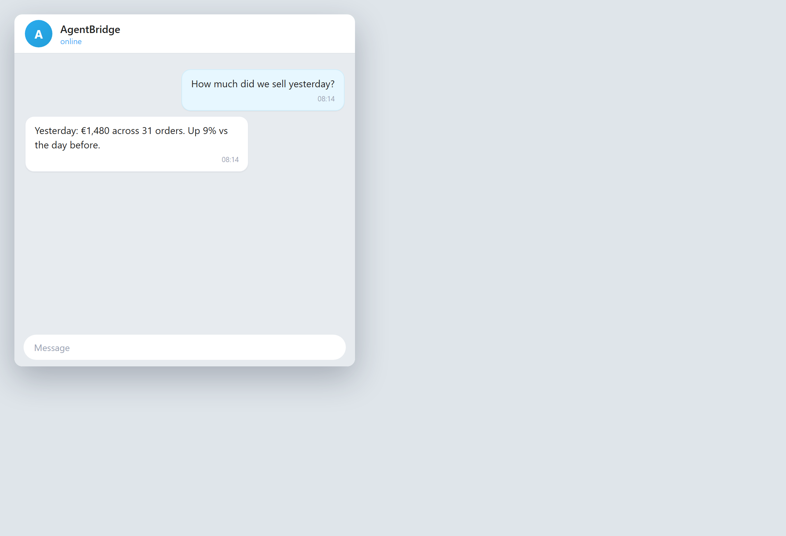
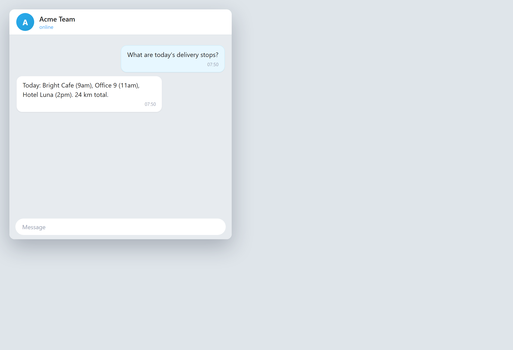

# Работа в дороге с Telegram

Если вы уже каждый день пользуетесь Telegram, ваш помощник может присоединиться к вам там. Вы задаёте вопрос в том же чате, где общаетесь с командой, а агент отвечает, присылает файлы и держит всех в курсе. Не нужно осваивать новое приложение.

### Ваш помощник в Telegram

*Разговор с агентом внутри Telegram*

**Что вы просите:** `(telegram) Сколько мы продали вчера?`

Агент отвечает в вашем чате Telegram, как коллега. Задали вопрос — получили ответ — идёте дальше.

*Совет: доступ к Telegram работает по «белому списку», поэтому говорить с ним могут только те люди, которых выбрали вы.*

---

### Получите документ на телефон

*Документ, доставленный в чат Telegram*

**Что вы просите:** `(telegram) Пришли мне счёт, который ты сделал для Bright Cafe.`

Агент отправляет файл прямо в ваш чат Telegram. Откройте его, перешлите или скачайте — прямо с телефона.

*Совет: можно попросить любой документ, который вы делали раньше, и он будет вам отправлен.*

---

### Помощник в группе вашей команды

*Агент отвечает в групповом чате команды*

**Что вы просите:** `(telegram group) Какие сегодня точки доставки?`

Агент заходит в группу и отвечает на вопросы команды по общей информации, так что никому не приходится быть ходячей энциклопедией.

*Совет: вы решаете, кого пускать в группу и чем агент может делиться.*

## Главные выводы

- Вы один раз задаёте задачу — и AgentBridge выполняет её, говорит с вами или доступен по телефону и Telegram.
- Результат — та же готовая работа, что вы видите на картинках, доставленная туда, где вы находитесь.
- Вы остаётесь у штурвала: сами выбираете время, место и то, кому разрешено этим пользоваться.
