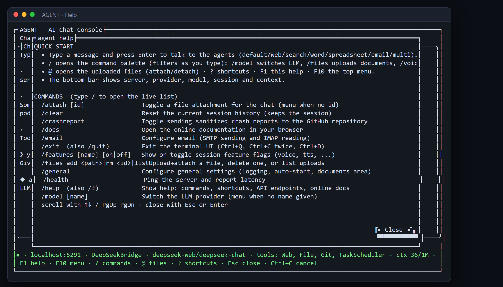
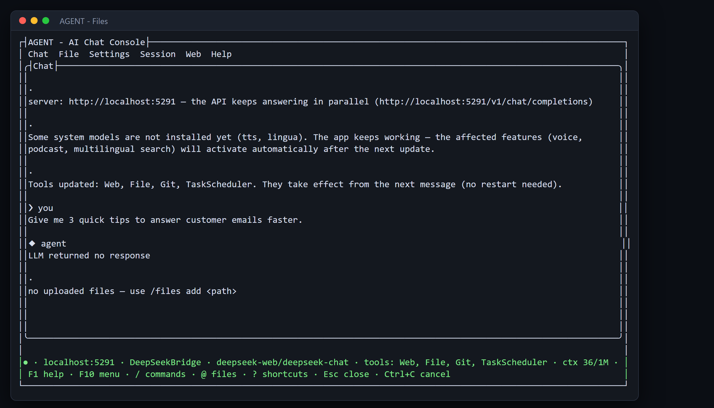

# Знакомство с AgentBridge: ваш офисный помощник

Всё, что в этой книге описывается как автоматизация, можно делать одним инструментом: AgentBridge. Это ИИ-помощник для малого бизнеса, который работает на вашем собственном компьютере. Вы говорите с ним простыми словами, а он выполняет работу — документы, таблицы, электронную почту, поиск информации и многое другое. В этой короткой главе показаны первые шаги, чтобы примеры дальше в книге были понятны.

### Ваш первый разговор

*Окно терминала AgentBridge, готовое к вашему первому сообщению*

**Что вы просите:** `Привет! Чем ты можешь помочь мне в моём офисе?`

Агент отвечает простыми словами и перечисляет, что умеет: писать документы, строить таблицы, читать и отправлять почту, искать в интернете, делать презентации и не только. Вы продолжаете говорить с ним как с человеком. Всё происходит в этом одном окне.

*Совет: ничего не нужно запоминать. Нажмите F1 в любой момент для справки, а нижняя строка всегда показывает, что сейчас активно.*

---

### Включите нужные инструменты

*Список инструментов: отметьте, чем агент может пользоваться*

**Что вы просите:** `/tools`

Появляется простой список. Вы перемещаетесь стрелками и отмечаете инструмент пробелом. Ваш выбор запоминается, поэтому в следующий раз инструмент уже будет на месте. Основные инструменты (файлы, история, планирование) всегда включены.

*Совет: спешите? Наберите название готового набора, например /tools spreadsheet-files, и он включится одним шагом.*

---

### Выберите, какой ИИ вам отвечает

*Окно настройки модели: выберите поставщика ИИ и модель*

**Что вы просите:** `/model`

Вы видите своих поставщиков и активную модель. Выберите другую — и весь разговор продолжится с ней. Ваши документы, инструменты и история остаются ровно там, где были, — меняется только отвечающий ИИ.

*Совет: локальная модель хранит ваши данные на вашем же компьютере. Облачная модель обычно умнее. Вы решаете для каждого разговора.*

---

### Все команды в одном месте

*Экран справки перечисляет каждую команду с пояснением в одну строку*

**Что вы просите:** `F1`

Экран справки показывает команды и то, что делает каждая: /files для загрузки файлов, /model для смены ИИ, /email для настройки почты и другие. Он закрывается одной клавишей. Никаких инструкций, никакого гугления.

*Совет: при вводе / открывается живой список, который фильтруется по мере набора, так что полный экран справки часто вообще не нужен.*

---

### Дайте агенту документ на прочтение

*Палитра @: выберите загруженный файл, чтобы прикрепить его к сообщению*

**Что вы просите:** `@  (затем выберите файл)`

Файл прикрепляется к вашему сообщению. Агент читает его и отвечает, опираясь на его реальное содержание — пересказывает, проверяет или создаёт на его основе что-то новое. С вашего компьютера не уходит ничего, кроме того, что вы сами решаете отправить ИИ.

*Совет: можно прикрепить несколько файлов сразу. Агент хранит их на время разговора, так что вы сможете задавать уточняющие вопросы.*

## Главные выводы

- Вы можете один настроить задачу и позволить AgentBridge выполнять её, говорить с ним или связываться с ним по телефону и через Telegram.
- Результат — та же готовая работа, что вы видите на картинках, доставленная туда, где вы находитесь.
- Вы остаётесь у руля: вы выбираете время, место и то, кто может этим пользоваться.
