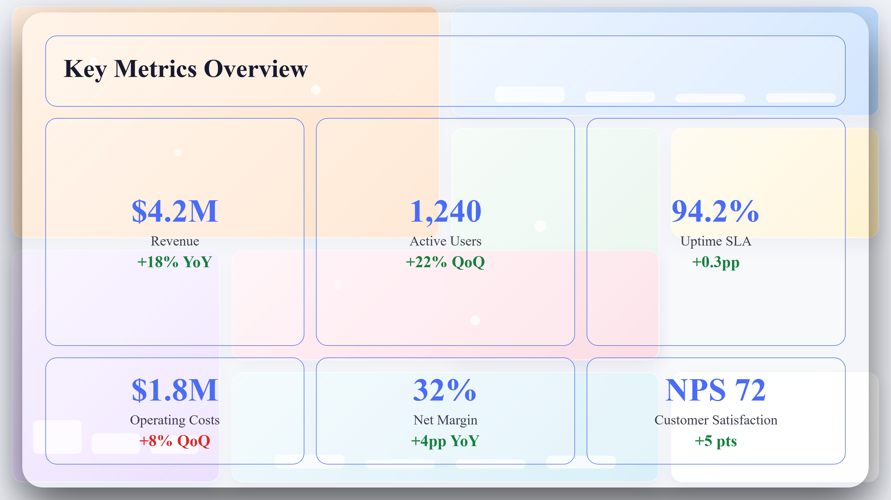
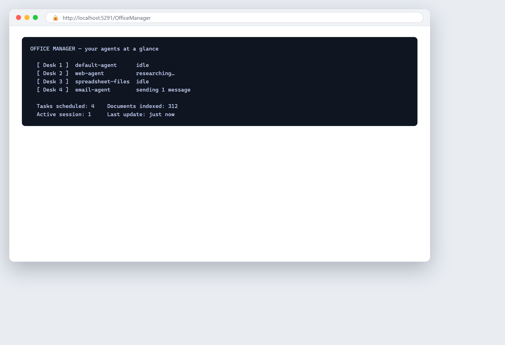

# Глава 30 — ИТ и лидерство

## Простыми словами

ИТ и лидерство — две половины одной работы: держать бизнес идущим и править его в верном направлении. ИТ держит системы, данные и сеть работающими и безопасными. Лидерство превращает всё это в решения — куда вложиться, что чинить первым, какой риск принять. ИИ помогает обеим половинам. Он отвечает на рутинные ИТ-вопросы, следит за угрозами, строит отчёты и раскладывает варианты, чтобы лидер мог выбрать хорошо.

Думайте об ИТ как о водопроводе и безопасности здания, а о лидерстве — как о людях, решающих, куда здание поедет дальше. Когда водопровод течёт, это чувствуют все. Когда охранную ворота оставили открытой, все раскрыты. А когда лидерам приходится решать без ясной картины, они гадают. ИИ быстрее латает течи, следит за воротами и даёт лидерам ясную картину, с которой решать.

Эта глава о четырёх работах: внутренняя поддержка (помогать сотрудникам с их техникой), кибербезопасность (оборона от атаки), управленческие отчёты (превращать данные в ясную картину) и поддержка решений (раскладывать варианты для лидера). Каждая — место, где малый бизнес может идти ровнее, оставаться в безопасности и решать лучше.

Одна честная идея сначала: ИИ в ИТ и лидерстве — *второй пилот*, а не *капитан*. Он отвечает, следит, обобщает и предлагает. Человек всё ещё принимает решение — закрыть ли систему, какому поставщику доверять, какой риск принять. Чем больше решение, тем важнее человеческое суждение. Методика судить, окупается ли что-либо из этого, живёт в [Главе 16 — Цели, затраты и возврат на инвестиции](ch16-goals-costs-and-return-on-investment.md); эта глава показывает, что автоматизировать и как. Увидеть, где ИТ и лидерство сидят на карте «влияние и усилия» для всего вашего бизнеса, смотрите [Главу 12 — Где ИИ может помочь вашему бизнесу](ch12-where-ai-can-help-your-business.md).

## Немного истории

**1980–1990-е: служба помощи.** ИТ-поддержка началась как help desk — телефонный номер, куда сотрудники звонили, когда что-то ломалось. Человек заводил проблему, чинил что мог, остальное эскалировал. Это работало, но было медленно, и одни и те же простые вопросы — забытые пароли, неприятности с принтером — съедали большую часть дня.

**1990–2000-е: панели и бизнес-аналитика.** Компании начали стягивать данные в панели и инструменты бизнес-аналитики — программное обеспечение, превращающее сырые числа в графики и резюме. Впервые менеджер мог увидеть продажи, затраты и результативность на одном экране. Но построение этих отчётов всё ещё требовало аналитика, и видеть можно было только то, для чего отчёт был построен.

**2000-е: автоматизированный мониторинг безопасности.** Когда атаки выросли, ИТ добавило автоматические инструменты безопасности — межсетевые экраны, обнаружение вторжений и системы оповещения, следящие за сетью на подозрительную активность. Они ловили больше, чем человек, но и порождали поток оповещений, большинство безобидных, и уставший аналитик должен был отделять реальную угрозу от шума.

**2010-е: машинное обучение читает угрозу.** Машинное обучение — программное обеспечение, учащееся образцам на множестве примеров, — изменило безопасность. Вместо сопоставления известных сигнатур атак ИИ выучило, как выглядит «норма» в сети, и помечало необычное. Оно прорезало шум оповещений, находя те немногие сигналы, что действительно важны.

**2020-е: большие языковые модели отвечают и советуют.** Большие языковые модели — ИИ, обученный на огромных объёмах текста, — теперь могут ответить на ИТ-вопрос сотрудника простым языком, обобщить инцидент безопасности, построить управленческий отчёт из сырых данных и разложить варианты и компромиссы для решения лидера. Это новейший шаг: ИИ, который читает, объясняет и советует по всем четырём работам разом. Пример риска поставщика IBM ниже показывает ту же идею, применённую к решению, какие поставщики безопасны.

Дуга: от телефонной службы помощи к панелям, к автоматическим оповещениям, к ИИ, читающему угрозу и отвечающему на вопрос, к ИИ, советующему решение. Каждый шаг переносил рутинную работу в программное обеспечение и оставлял людям решать и вести.

## Любопытное

### 30.5 Древнейшая проблема лидера: решать без ясной картины

Сколько существуют менеджеры, столько существует одна и та же жалоба: «Я должен решать, но не вижу ясно». Данные разбросаны по системам. Отчёт строится неделю. Панель показывает прошлый месяц, а не сегодня. Поэтому лидеры решают по чутью и надежде.

ИИ меняет это сильнее, чем почти что-либо ещё в этой книге. Он может стянуть разбросанные данные вместе, построить картину по требованию и ответить на вопрос лидера простыми словами за секунды — «Какая линейка продуктов теряет деньги?», «Где наши деньги в следующем месяце?», «Какой поставщик наибольший риск?». Лидер всё ещё решает. Но теперь он решает с ясной картиной вместо догадки. Это тихая революция в лидерстве: не ИИ принимает решение, а ИИ делает решение *информированным*. История о риске поставщика IBM ниже — ровно это, применённое к одному трудному решению, каким поставщикам мы можем доверять.

## Реальный бизнес-пример

**IBM: оценка риска третьих сторон (поставщиков) с помощью ИИ.**

Каждая компания, покупающая у внешних поставщиков, несёт *риск третьей стороны* — риск, что поставщик, от которого вы зависите, окажется ненадёжным, небезопасным или несоответствующим требованиям. Проверять каждого поставщика — медленная, тщательная работа. Частый способ проверки — подробная анкета, которую заполняет поставщик, а затем человеческий оценщик читает и выставляет баллы. Когда у вас сотни поставщиков, эта работа становится узким местом.

IBM Client Engineering опубликовала реальный кейс на эту тему, «Оценка риска третьих сторон с помощью ИИ». Клиентом был финансовый институт, проводивший **более 1 000 оценок поставщиков в год**, и каждая оценка занимала **около 45 рабочих часов** — чтение анкеты, проверка доказательств и выставление балла за риск. Это огромное количество квалифицированного времени, потраченного на одну и ту же тщательную задачу, снова и снова.

IBM использовала свою платформу watsonx.ai, чтобы помочь оценщикам. ИИ читал ответы поставщика на анкету и подтверждающие доказательства и помогал оценщику понять качество предоставленного поставщиком, чтобы человек мог сосредоточиться на суждении вместо перечитывания всего с нуля. Опубликованная оценка составила **около 20% сокращения времени оценки**, что при такой нагрузке сложилось в **примерно 10 000 сэкономленных рабочих часов** и **около $800 000 затрат на труд в год**.

Заметка о цифре «50%». Вы можете увидеть такие работы IBM по риску поставщиков цитируемыми как «около 50% сокращения времени». Это число **не** то, что сообщает опубликованный кейс IBM. Опубликованная оценка для этого кейса — около 20%, с экономией, выраженной как ~10 000 часов и ~$800k в год. Считайте «50%» непроверенным и используйте опубликованные цифры — ~20% сокращения времени, ~10 000 часов, ~$800k — как реальные, подтверждённые источники числа. (Источник: IBM Client Engineering, «Evaluating Third Party Risk with AI».)

Две вещи стоит заметить. Первое, человеческий оценщик остался хозяином. ИИ не одобрял и не отвергал поставщика; он помог человеку читать быстрее и судить лучше. Второе, экономия пришла из *чтения и проверки* части работы — медленного, тщательного чтения, в котором ИИ силён, — тогда как *решение* о поставщике осталось с человеком. Это образец, который стоит скопировать в вашей собственной работе с риском: дайте ИИ чтение, оставьте человека для суждения.

## Как это сделать

### 30.1 Внутренняя поддержка

Внутренняя поддержка значит помогать вашим собственным сотрудникам с их технологией — забытый пароль, принтер, который не работает, программное обеспечение, которое нужно настроить. Это служба помощи, и она полна одних и тех же повторяющихся вопросов. ИИ очень силён в повторяющихся вопросах.

**Помощник ИТ-службы помощи.** Чат-бот, обученный на вашей собственной базе знаний ИТ, может мгновенно отвечать на вопросы сотрудников: «Как подключиться к VPN?», «Как сбросить пароль?», «Как установить это приложение?». Это убирает рутинные тикеты, съедающие день команды поддержки, так что команда может сосредоточиться на реальных проблемах.

**Решайте простые автоматически.** Некоторым тикетам нужно простое действие — сбросить пароль, разблокировать аккаунт, переустановить приложение. ИИ может делать это автоматически или составлять действие на утверждение человеку. Рутинная работа исчезает из очереди.

**Направляйте сложные быстро.** Когда бот не может решить, он должен передать тикет нужному человеку с сохранённым контекстом — что сотрудник уже сказал и попробовал, — чтобы человек не начинал с нуля. Чистая передача — важнейшая функция.

**Стройте из ваших собственных тикетов.** Вытащите последние несколько месяцев ИТ-тикетов и найдите самые частые вопросы. Они станут базой знаний бота. Та же технология чат-бота, применённая к клиентам, а не к сотрудникам, разобрана в [Главе 27 — Забота о клиентах и поддержка](ch27-customer-care-and-support.md); здесь она повёрнута внутрь, чтобы служить вашей собственной команде.

**Держите человека для трудной проблемы.** ИИ разбирает рутину; человек разбирает аварию, странный баг, инцидент безопасности. Никогда не позволяйте боту быть единственным путём, когда что-то по-настоящему сломано. Сотрудники всегда должны иметь возможность добраться до человека.

### 30.2 Кибербезопасность

Кибербезопасность значит защищать ваши системы, данные и сеть от атаки. ИИ теперь основной инструмент на обеих сторонах этой борьбы — защитники используют его, чтобы замечать угрозы, и атакующие тоже, — поэтому важно понимать, что он может и чего не может для вас.

**ИИ замечает необычное.** ИИ учитывает, как выглядит «норма» в вашей сети — нормальный трафик, нормальные входы, нормальный доступ к данным, — и помечает то, что не так. Вход из странной страны в 3 часа ночи, внезапный поток скачиваний файлов, устройство, ведущее себя странно. Эти маленькие сигналы, замеченные разом по всей сети, — так ИИ ловит угрозу, которую человек пропустил бы.

**Прорежьте шум оповещений.** Инструменты безопасности порождают тысячи оповещений, большинство безобидных. ИИ ранжирует их, чтобы реальная угроза поднялась наверх, а шум упал. Это одна из его крупнейших ценностей: не больше оповещений, а *меньше, лучше* оповещения, с которыми маленькая команда реально справится.

**Реагируйте быстрее.** Когда ИИ помечает реальную угрозу, он может также предложить или предпринять быстрое первое действие — изолировать заражённую машину, заблокировать подозрительный адрес, — чтобы остановить распространение, пока человек расследует. Скорость важна в атаке; первые минуты решают, сколько ущерба будет нанесено.

**Полная картина безопасности — отдельная тема.** Угрозы, защиты и человеческие привычки, важнее всего, глубоко разобраны в [Главе 6 — Кибербезопасность в эпоху ИИ](ch06-cybersecurity-in-the-ai-era.md), а безопасное развёртывание — в [Главе 20 — Внедряем ИИ безопасно](ch20-implementing-ai-securely.md). Прочитайте их, прежде чем полагаться на ИИ для вашей обороны. ИИ — мощный инструмент, а не волшебный щит.

**Держите человека для большого решения.** ИИ может изолировать машину, но человек решает, закрывать ли систему, платить ли за выкуп или отказать, звонить ли властям. В реальном инциденте человеческое суждение — последняя линия обороны. Никогда не позволяйте автоматизации принимать большие решения безопасности одной.

### 30.3 Управленческие отчёты

Управленческий отчёт превращает сырые данные в ясную картину, которую лидер может прочитать и по которой действовать — прибыль и убытки, продажи по продукту, затраты по категории, позиция по деньгам. ИИ меняет то, кто строит отчёт и как быстро.

**Отчёт строит себя сам.** Вместо аналитика, вытаскивающего числа в таблицу каждую неделю, отчёт может генерироваться по расписанию из ваших живых систем и приземляться во входящие лидера. Числа всегда актуальны, и никому не нужно помнить его сделать.

**Резюме простым языком.** ИИ может прочитать числа и написать короткое резюме простыми словами: «Выручка выросла на 8% в этом месяце, за счёт продукта X; затраты выросли на 3%, в основном на доставке». Это превращает таблицу цифр в предложение, которое лидер реально может прочитать и по которому действовать. Это как иметь младшего аналитика, пишущего комментарий.

**Спрашивайте простым языком.** Некоторые инструменты позволяют лидеру спросить: «Какая линейка продуктов потеряла деньги в прошлом квартале?» — и получить ответ, не пишая формулу. Это полезно для срочных вопросов, которые раньше значили «гляну позже» и потом никогда не случались. Лидер получает ответ, пока вопрос ещё свеж.

**Не пропускайте человеческое прочтение.** Автоматический отчёт — отправная точка, а не готовый документ для решения. Прочитайте резюме, проверьте, что числа имеют смысл, и добавьте своё суждение, прежде чем действовать или делиться. ИИ может обобщать уверенно и всё равно ошибаться, если лежащие в основе данные неряшливы. Мусор на входе — уверенный мусор на выходе.

**Держите формат стабильным.** Раз согласовав компоновку отчёта, держите её согласованной. Стабильный формат легче читать из месяца в месяц и легче заметить, когда что-то выглядит не так. Меняйте его обдуманно, а не каждый раз. (Те же идеи построения отчётов, применённые к финансам, — в [Главе 25 — Администрирование и финансы](ch25-administration-and-finance.md).)

### 30.4 Поддержка решений

Поддержка решений значит использовать ИИ, чтобы разложить варианты, доказательства и компромиссы для решения, чтобы лидер мог выбрать хорошо. Он не принимает решение. Он делает решение *информированным*.

**Разложите варианты.** Для выбора вроде «Открывать ли новый регион?» или «Какого поставщика выбрать?» ИИ может собрать релевантные данные и представить варианты рядом, с плюсами, минусами и числами за каждым. Лидер видит целую картину, а не чей-то любимый вариант.

**Смоделируйте компромиссы.** ИИ может показать, что случится при разных допущениях: «Если спрос вырастет на 10%, этот вариант выигрывает; если останется плоским, тот безопаснее». Это превращает догадку в сравнение сценариев, что куда полезнее для большого решения.

**Выявите то, что вы упустили.** ИИ может указать на риск или возможность, которых занятый лидер не увидел, потому что он посмотрел на всё разом. Кейс IBM о риске поставщика выше — ровно это: ИИ, читающий ответы каждого поставщика, чтобы оценщик ясно увидел риск перед решением.

**Оставьте решение лидеру.** ИИ советует; лидер решает и владеет результатом. Лидер, слепо следующий за моделью, перестал лидировать. Используйте ИИ, чтобы информировать ваше суждение, а не заменить его. Стратегия за этими выборами — в [Главе 13 — Определяем простую ИИ-стратегию](ch13-defining-a-simple-ai-strategy.md).

**Следите за уверенной чепухой.** ИИ может представить неверный вариант с полной уверенностью. Проверяйте доказательства за его советом, особенно для большого или необычного решения. Просите модель показать её рассуждение и проверяйте его против того, что вы знаете. Доверяйте, но проверяйте.

## Этика и ответственность

ИТ и лидерство несут доверие всей компании, поэтому ответственность здесь широка.

**Держите человека в большом решении.** ИИ советует по безопасности, отчётам и стратегии. Человек принимает решение о закрытии системы, доверии поставщику или принятии риска. Чем больше решение, тем больше человек им владеет.

**Защищайте данные, которыми кормите модели.** Данные ИТ и лидерства — сетевые логи, финансы, записи о поставщиках — среди самых чувствительных, что держит компания. Держите их в безопасности и, где важно, внутри вашей собственной среды. Не скармливайте чувствительные данные публичным ИИ-инструментам, не проверив последствия для безопасности (см. [Главу 6](ch06-cybersecurity-in-the-ai-era.md) и [Главу 8 — Самохостинг: держите свои данные под контролем](ch08-self-hosting-keep-your-data-under-control.md)).

**Следите за сторонним и теневым ИИ.** Поставщики и сотрудники могут приносить ИИ-инструменты в компанию без одобрения — риск «теневого ИИ». Знайте, какой ИИ работает в вашей сети и кто его одобрил. Этот риск разобран в [Главе 9 — Сторонние сервисы и теневой ИИ](ch09-third-party-services-and-shadow-ai.md).

**Будьте честны в отчётах и советах.** ИИ-резюме может сделать плохой квартал звучащим нормально, а ИИ-совет может быть уверенно неверен. Читайте числа, проверяйте совет и докладывайте правду, особенно когда она некомфортна. Работа лидера — видеть ясно, а не утешаться.

**Помните юридический пол.** Некоторые использования ИИ в ИТ и кадрах касаются высокорисковых и прозрачностных правил Регламента ЕС об ИИ. Знайте свою роль и свои обязанности до развёртывания (см. [Главу 5 — Правила и юридическая ответственность](ch05-rules-and-legal-responsibility.md)). Соответствие — пол; ваше собственное суждение задаёт стандарт над ним.

**Используйте ИИ, чтобы укреплять доверие, а не контролировать людей.** Мониторинг и аналитика должны делать компанию безопаснее и лучше управляемой, а не становиться инструментом следить и давить на сотрудников. Используйте их, чтобы защищать и улучшать, а не чтобы полициярить.

## Ошибки, которых следует избегать

**Служба помощи только на боте.** Сотрудники с реальной проблемой, застрявшие за ботом без человеческого пути. Всегда позволяйте человеческую передачу.

**Слепо верить оповещению безопасности.** Действовать по ложному срабатыванию или, хуже, игнорировать реальную угрозу, потому что оповещение было погребено. Настраивайте систему и держите человеческого следователя.

**Позволить автоматизации принимать большое решение безопасности.** Закрывать, платить или эскалировать без человека. Держите человеческое решение в инциденте.

**Пропускать человеческое прочтение отчётов.** Действовать по ИИ-резюме, не проверив числа. Сначала прочитайте сами.

**Уверенная чепуха в совете.** Следовать ИИ-совету, который неверен, но хорошо сформулирован. Проверяйте доказательства за ним.

**Слепая вера в модель для больших решений.** Лидер, который перестал лидировать и просто следует панели. Решение владеет лидер.

**Скармливать чувствительные данные публичному ИИ.** Сетевые логи, финансы и записи о поставщиках в небезопасные инструменты. Сначала проверьте безопасность и приватность.

**Теневой ИИ работает без контроля.** Сотрудники и поставщики используют неодобренные ИИ-инструменты. Знайте, что работает и кто одобрил.

**Автоматизировать сломанный процесс.** Если ваша ИТ-поддержка или отчётность — беспорядок, ИИ сделает более быстрый беспорядок. Сначала почините процесс.

**Нет исходной точки.** Не измерить время тикета, частоту инцидентов или время отчёта до, поэтому нельзя доказать выигрыш. Сначала измерьте (см. [Главу 22 — Измеряем результаты и ROI](ch22-measuring-results-and-roi.md)).

**Цитировать цифру поставщика как свою.** Использовать лучший случай поставщика вместо вашего собственного измеренного результата. Используйте свои числа.

## Практическое упражнение

### 30.7 Упражнение: спланируйте одну автоматизацию в ИТ или лидерстве

Выберите одну работу и спланируйте её ИИ-помощь от конца до конца, с встроенным человеческим решением.

**Шаг 1 — Выберите работу.** Выберите одну: внутренняя поддержка, кибербезопасность, управленческие отчёты или поддержка решений. Одну, а не все.

**Шаг 2 — Определите цель и метрику.** Быстрее решение тикетов? Меньше пропущенных угроз? Быстрее отчёты? Лучше решения? Выберите одно число для измерения.

**Шаг 3 — Измерьте исходную точку.** Что это число сейчас? Среднее время тикета, пропущенные инциденты, дни на построение отчёта, оборот решения. Запишите.

**Шаг 4 — Найдите дорогую цель.** Определите самую болезненную единственную точку — тип тикета, съедающий больше всего времени, угрозу, что проскакивает, отчёт, что всегда опаздывает, решение, которое вы продолжаете брать неверно. Цельтесь в это первым.

**Шаг 5 — Отметьте каждый шаг.** Для каждого шага отметьте: **ИИ делает** (ответить, пометить, обобщить, разложить варианты), **человек проверяет** (проверить оповещение, прочитать отчёт) или **человек решает** (закрыть систему, выбрать поставщика, принять риск). Каждое большое решение должно быть человеческим.

**Шаг 6 — Проверьте данные и закон.** Решите, какие данные нужны ИИ, держите их в безопасности и проверьте, касается ли использование высокорисковых или прозрачностных правил Регламента об ИИ (см. [Главу 5](ch05-rules-and-legal-responsibility.md)).

**Шаг 7 — Соедините системы.** Решите, какие системы ИИ должен видеть — тикеты, логи, финансы, записи о поставщиках, — и как вы их подключите (см. [Главу 19 — Подключаем ИИ к системам, которыми вы уже пользуетесь](ch19-connecting-ai-to-systems-you-already-use.md)).

**Шаг 8 — Запустите маленько и измерьте.** Прогоните на одной команде, одной системе или одном отчёте сначала. Сравните метрику с исходной точкой. Масштабируйте только то, что докажет, что работает.

Сделайте одну работу хорошо. Анализ дорогой цели в шаге 4 ценен сам по себе — он показывает, где ваша работа в ИТ и лидерстве реально теряет больше всего времени или несёт наибольший риск, что полезно ещё до покупки любого инструмента.

## Контрольный список

### 30.8 Контрольный список ИТ и лидерства

Прежде чем автоматизировать любую задачу ИТ или лидерства, проверьте это.

- [ ] **Вы измерили исходную точку** — время тикета, частоту инцидентов, время отчёта, оборот решения.
- [ ] **Вы целились в самую дорогую точку сначала**, а не в самую лёгкую.
- [ ] **Человек принимает каждое большое решение** — закрытие системы, доверие поставщику, принятие риска.
- [ ] **Бот службы помощи передаёт человеку** с полным контекстом.
- [ ] **Оповещения безопасности настроены**, чтобы реальная угроза поднималась, а шум падал.
- [ ] **Человек расследует каждый реальный инцидент безопасности.**
- [ ] **Управленческие отчёты читаются человеком**, прежде чем вы действуете или делитесь ими.
- [ ] **Вы проверяете доказательства за ИИ-советом**, особенно для больших решений.
- [ ] **Чувствительные данные держатся в безопасности**, а не отправляются в публичные ИИ-сервисы.
- [ ] **Вы знаете, какой ИИ работает в вашей сети** и кто его одобрил (никакого теневого ИИ).
- [ ] **Вы проверили Регламент об ИИ** на любые высокорисковые или прозрачностные обязанности.
- [ ] **Вы чините сломанный процесс перед автоматизацией.**
- [ ] **Вы докладываете свои собственные измеренные числа**, а не лучший случай поставщика.

Если клетка пуста, риск — вашим системам, вашим данным или вашим решениям — всё ещё ваш. Заполните её, прежде чем подпустить ИИ к штурвалу.

## Главные выводы

- ИИ в ИТ и лидерстве — второй пилот: он отвечает на вопросы поддержки, замечает угрозы, строит отчёты и раскладывает варианты, а человек держит каждое большое решение.
- Кейс IBM о риске поставщика (IBM Client Engineering, «Evaluating Third Party Risk with AI») помог финансовому институту с 1 000+ оценок в год по ~45 часов каждая, с опубликованной оценкой ~20% сокращения времени, ~10 000 часов и ~$800k сэкономленных в год — цифра «около 50%» не то, что сообщает опубликованный источник.
- Экономия приходит от того, что ИИ делает медленное чтение и проверку, а человек держит суждение; тот же образец работает по поддержке, безопасности, отчётам и решениям.
- Держите чувствительные данные в безопасности, знайте, какой ИИ работает в вашей сети, и проверяйте высокорисковые и прозрачностные правила Регламента об ИИ перед развёртыванием.
- Измерьте свою собственную исходную точку, держите человека в каждом большом решении и считайте закон полом, а ваше собственное суждение — стандартом над ним.

<!-- BEGIN agentbridge-examples -->

## Попробуйте с AgentBridge

Вот как та же задача выглядит с AgentBridge. Каждая рамка показывает готовый результат и ту единственную строку, которую вы набираете, чтобы его получить.

### Аккуратные заметки со встречи

*Опрятный протокол встречи с решениями и действиями*

**Что вы просите:** `Преврати эти черновые заметки в чистый протокол встречи со списком решений и пунктами к действию: [вставьте заметки]`

Агент превращает ваши неряшливые заметки в структурированный протокол: что обсуждалось, что решено, и список действий с ответственными. Вы можете отправить их прямо команде.

*Совет: вставляйте заметки как есть — агент разберёт порядок и формулировки.*

---

### Квартальный обзор совета

*Слайд квартального обзора*

**Что вы просите:** `Собери колоду квартального обзора: результаты, достижения, проблемы и план на следующий квартал.`

Агент собирает колоду обзора с результатами, победами, проблемами и планом — разложенную так, чтобы встреча шла быстро.

*Совет: приложите ваш лист KPI, и агент вставит графики в слайды.*

---

### Видьте всех ваших агентов разом

*Представление OfficeManager о ваших агентах*

**Что вы просите:** `(browser) Открой представление OfficeManager.`

OfficeManager показывает ваших агентов на одной простой странице, чтобы вы видели, что запущено и где что стоит.

*Совет: быстрый способ приглядывать за более чем одним помощником разом.*

---

### Брифинг, который можно послушать

*Аудио-брифинг, готовый к воспроизведению*

**Что вы просите:** `Преврати сводку этой недели в короткий аудио-брифинг, который я могу послушать по дороге на работу.`

Агент превращает письменную сводку в ясный аудио-брифинг, так что ваша дорога на работу становится полезным временем.

*Совет: запланируйте еженедельную сводку и её аудио-версию вместе.*

<!-- END agentbridge-examples -->
